# PROJECT_DOCUMENTATION.md

# WoofBnB

## PROJECT DOCUMENTATION

**Version:** 1.0

**Document Type:** Business Requirements & Product Documentation

**Prepared By:** Senior Business Analyst

**Status:** Draft (MVP)

**Project:** WoofBnB

**Product Category:** Location-Based Marketplace Platform

**Technology Stack**

- React + Vite
- TailwindCSS
- React Query
- Context API
- Express.js
- MongoDB
- GeoJSON
- Google Maps (Production)
- Leaflet (Development)

---

# Confidentiality

This document contains proprietary business and technical information regarding the WoofBnB platform. It is intended for stakeholders, product owners, solution architects, designers, developers, QA engineers, and implementation teams.

---

# Revision History

| Version | Date               | Author           | Description                     |
| ------- | ------------------ | ---------------- | ------------------------------- |
| 0.1     | Initial Draft      | Business Analyst | Project documentation initiated |
| 0.5     | Internal Review    | Product Team     | Requirements refinement         |
| 1.0     | Stakeholder Review | Business Analyst | MVP Documentation Complete      |

---

# Document Approval

| Role                | Name    | Status            |
| ------------------- | ------- | ----------------- |
| Product Owner       | Pending | Awaiting Approval |
| Technical Architect | Pending | Awaiting Approval |
| Engineering Lead    | Pending | Awaiting Approval |
| UX Lead             | Pending | Awaiting Approval |

---

# Table of Contents

1. Cover Page
2. Revision History
3. Executive Summary
4. Product Vision
5. Problem Statement
6. Business Goals
7. Business Requirements (BRD)
8. Functional Requirements (FRD)
9. Non Functional Requirements
10. Stakeholders
11. User Personas
12. User Stories
13. Use Cases
14. Acceptance Criteria
15. Business Rules
16. Complete User Journey
17. Information Architecture
18. Navigation Structure
19. Application Workflow
20. Search Workflow
21. Geolocation Workflow
22. Map Workflow
23. State Management Flow
24. Frontend Architecture
25. Backend Architecture
26. Database Design
27. API Specifications
28. Folder Structure
29. UI Guidelines
30. UX Principles
31. Accessibility
32. Error Handling
33. Validation Rules
34. Security Considerations
35. Performance Considerations
36. Scalability Considerations
37. Risks
38. Assumptions
39. Constraints
40. Future Roadmap
41. Release Strategy
42. Testing Strategy
43. Deployment Strategy
44. Success Metrics
45. KPIs
46. Requirement Traceability Matrix
47. Glossary
48. Appendix

---

# 3. Executive Summary

## Overview

WoofBnB is a location-aware marketplace designed to connect pet owners with trusted, verified pet sitters within their vicinity. Inspired by the intuitive discovery experience of Airbnb, the real-time responsiveness of Uber, and the geographical exploration capabilities of Google Maps, WoofBnB aims to become India's leading destination for pet care discovery.

The platform addresses a fragmented and trust-deficient pet sitting market by enabling users to quickly discover nearby caregivers based on either their current location or a manually selected city.

Unlike traditional directory-based solutions, WoofBnB prioritizes geographic relevance, verified profiles, and an interactive map-first experience to facilitate informed decision-making.

The Minimum Viable Product (MVP) focuses on delivering the core discovery journey, allowing users to:

- Automatically detect their current location.
- Search for pet sitters by city.
- Browse nearby verified pet sitters.
- Explore sitters via an interactive map.
- Register as a pet sitter.

Future releases will introduce authentication, bookings, reviews, payments, messaging, calendars, and advanced administrative capabilities.

---

## Business Opportunity

India's pet ownership market has experienced substantial growth, creating increased demand for trusted pet care services. Despite this growth, users often rely on fragmented sources such as social media, messaging groups, or personal referrals, making it difficult to identify reliable caregivers.

WoofBnB seeks to bridge this gap by establishing a scalable digital marketplace centered on trust, location intelligence, and ease of use.

---

## Product Objectives

The primary objectives are:

- Build user trust through verified sitter profiles.
- Enable fast, location-based discovery.
- Deliver a premium user experience across devices.
- Support scalable marketplace growth.
- Minimize search friction.
- Establish a foundation for future booking and payment services.

---

## Success Definition

The MVP will be considered successful when users can:

- Open the application.
- Share their location.
- View nearby pet sitters within seconds.
- Search another city effortlessly.
- Explore sitters on an interactive map.
- Register as a new pet sitter.

---

# 4. Product Vision

## Vision Statement

> **"To become India's most trusted platform for discovering verified local pet sitters through intelligent location technology, exceptional user experience, and a transparent marketplace built on trust."**

---

## Product Mission

WoofBnB exists to make finding reliable pet care as effortless as booking accommodation or requesting a ride.

The platform empowers pet owners to make confident decisions through verified profiles, geographic proximity, and intuitive search experiences.

---

## Strategic Pillars

| Pillar                | Description                                                                           |
| --------------------- | ------------------------------------------------------------------------------------- |
| Trust                 | Every sitter profile should inspire confidence through verification and transparency. |
| Simplicity            | Minimize user effort from search initiation to sitter discovery.                      |
| Location Intelligence | Deliver highly relevant nearby results using precise geospatial technologies.         |
| Premium Experience    | Provide polished, responsive, and visually engaging interactions.                     |
| Scalability           | Architect the platform to accommodate future marketplace expansion.                   |

---

## Product Principles

1. Mobile-first experience.
2. Fast interactions with minimal latency.
3. Clean, intuitive interfaces.
4. Privacy-respecting location services.
5. Progressive enhancement for future features.
6. Consistent design language.
7. Accessibility by default.
8. Modular architecture for rapid iteration.

---

# 5. Problem Statement

## Current Challenges

Pet owners often struggle to locate trustworthy pet sitters nearby due to:

- Fragmented information sources.
- Lack of verified caregiver identities.
- Poor location-based search capabilities.
- Inconsistent user experiences across existing platforms.
- Limited transparency regarding availability and proximity.

These issues create friction during an emotionally sensitive decision-making process, where trust and convenience are paramount.

---

## Problem Analysis

| Challenge                  | Impact                  |
| -------------------------- | ----------------------- |
| No centralized marketplace | Reduced discoverability |
| Manual searching           | High effort             |
| Unknown sitter credibility | Low trust               |
| Absence of geolocation     | Poor relevance          |
| Outdated listings          | User frustration        |
| Slow search experiences    | Increased abandonment   |

---

## Opportunity Statement

By combining geospatial search, verified identities, intuitive interfaces, and scalable architecture, WoofBnB can significantly improve the process of discovering trusted pet care providers.

---

# 6. Business Goals

## Primary Goals

| ID     | Goal                                                           |
| ------ | -------------------------------------------------------------- |
| BG-001 | Become India's most trusted pet sitter marketplace.            |
| BG-002 | Reduce discovery time to under 10 seconds.                     |
| BG-003 | Achieve high user confidence through profile verification.     |
| BG-004 | Deliver an exceptional mobile-first experience.                |
| BG-005 | Build a scalable architecture supporting nationwide expansion. |

---

## Business Objectives

### BG-001 — Trust

**Success Criteria**

- Verified sitter profiles.
- Transparent profile information.
- Consistent user experience.

---

### BG-002 — Discovery

Users should locate nearby sitters within seconds using GPS or city search.

---

### BG-003 — Growth

Support onboarding of pet sitters across multiple cities without architectural changes.

---

### BG-004 — Engagement

Increase repeat searches through a fast, enjoyable browsing experience.

---

### BG-005 — Platform Foundation

Provide an extensible architecture supporting future capabilities including:

- Authentication
- Bookings
- Payments
- Messaging
- Reviews
- Favorites
- Notifications
- Analytics

---

# Decision Log DL-001

**Decision:** Implement a map-first discovery experience.

**Rationale:** Geographic proximity is the strongest decision factor for pet owners searching for nearby sitters. Presenting results visually on an interactive map improves comprehension, reduces cognitive load, and shortens the path to selecting a suitable sitter.

---

# Decision Log DL-002

**Decision:** Support two independent search flows—current location and city search.

**Rationale:** Users may search while traveling, planning ahead, or arranging care in another city. Providing both flows increases flexibility and broadens the platform's usefulness without significantly increasing implementation complexity.

---

# 7. Business Requirements (BRD)

## 7.1 Business Requirements Overview

The Business Requirements Document (BRD) defines the high-level business capabilities that WoofBnB must provide to achieve its strategic objectives. These requirements are technology-agnostic and focus on business value rather than implementation.

---

## Business Requirement Categories

| Category              | Description                   |
| --------------------- | ----------------------------- |
| User Discovery        | Finding nearby pet sitters    |
| Marketplace           | Connecting owners and sitters |
| Trust                 | Verification and transparency |
| Location Intelligence | GPS & city search             |
| User Experience       | Responsive premium UI         |
| Platform Scalability  | Growth and expansion          |
| Performance           | Fast search & response        |

---

## Business Requirements

### User Discovery

| ID         | Requirement                                                             | Priority |
| ---------- | ----------------------------------------------------------------------- | -------- |
| **BR-001** | The platform shall allow users to discover nearby verified pet sitters. | Must     |
| **BR-002** | Users shall be able to search using their current location.             | Must     |
| **BR-003** | Users shall be able to search any city manually.                        | Must     |
| **BR-004** | Nearby sitters shall be ordered by distance.                            | Must     |
| **BR-005** | Search results shall update dynamically without page refresh.           | Must     |

---

### Trust & Safety

| ID     | Requirement                                             | Priority |
| ------ | ------------------------------------------------------- | -------- |
| BR-006 | Every sitter profile shall contain verification status. | Must     |
| BR-007 | Only approved sitters shall appear in search results.   | Must     |
| BR-008 | Users shall clearly distinguish verified profiles.      | Must     |
| BR-009 | Platform shall support future identity verification.    | Should   |

---

### Marketplace

| ID     | Requirement                                               | Priority |
| ------ | --------------------------------------------------------- | -------- |
| BR-010 | Pet sitters shall register through an onboarding process. | Must     |
| BR-011 | Marketplace shall support thousands of sitter profiles.   | Must     |
| BR-012 | Platform shall support future booking workflows.          | Should   |
| BR-013 | Platform shall support future payments.                   | Future   |
| BR-014 | Platform shall support future messaging.                  | Future   |

---

### Location Intelligence

| ID     | Requirement                               |
| ------ | ----------------------------------------- |
| BR-015 | Detect browser location.                  |
| BR-016 | Support geocoding search.                 |
| BR-017 | Execute nearby search using coordinates.  |
| BR-018 | Display geographic search results on map. |
| BR-019 | Support future Google Maps migration.     |

---

### User Experience

| ID     | Requirement                      |
| ------ | -------------------------------- |
| BR-020 | Responsive design across devices |
| BR-021 | Premium visual interface         |
| BR-022 | Minimal search friction          |
| BR-023 | Interactive map exploration      |
| BR-024 | Sticky map during scrolling      |
| BR-025 | Card-map synchronization         |

---

### Scalability

| ID     | Requirement                  |
| ------ | ---------------------------- |
| BR-026 | Support nationwide expansion |
| BR-027 | Modular architecture         |
| BR-028 | Feature-based frontend       |
| BR-029 | Layered backend              |
| BR-030 | Cloud deployment readiness   |

---

# Decision Log DL-003

**Decision**

Separate business requirements from functional requirements.

**Reason**

Business goals remain stable over time, while implementation details evolve. This separation minimizes documentation churn and improves traceability.

---

# 8. Functional Requirements (FRD)

Functional requirements define exactly **how the system behaves**.

---

## Search Module

### FR-001

The system shall request browser geolocation permission when the application loads.

Priority

Must

---

### FR-002

If permission is granted:

- Obtain latitude
- Obtain longitude
- Store coordinates
- Execute Nearby API

---

### FR-003

Display nearby pet sitters ordered by distance.

---

### FR-004

Center the interactive map on the detected coordinates.

---

### FR-005

Display user location marker.

---

### FR-006

Display sitter markers.

---

### FR-007

Selecting a marker shall:

- highlight sitter card
- scroll card into view
- animate marker

---

### FR-008

Selecting a sitter card shall:

- highlight marker
- center map
- open map popup

---

### FR-009

Changing city shall:

- perform geocoding
- update coordinates
- execute nearby search
- update markers
- update cards
- move map

---

## Landing Page

| ID     | Requirement              |
| ------ | ------------------------ |
| FR-010 | Display Hero section     |
| FR-011 | Display search component |
| FR-012 | Display nearby sitters   |
| FR-013 | Display interactive map  |
| FR-014 | Display registration CTA |

---

## Registration

| ID     | Requirement            |
| ------ | ---------------------- |
| FR-015 | Register sitter        |
| FR-016 | Validate form          |
| FR-017 | Store GeoJSON location |
| FR-018 | Store address          |
| FR-019 | Store contact details  |

---

## API

| ID     | Requirement           |
| ------ | --------------------- |
| FR-020 | Search nearby sitters |
| FR-021 | Geospatial search     |
| FR-022 | Pagination            |
| FR-023 | Sorting               |
| FR-024 | Error handling        |
| FR-025 | Validation            |

---

## Map

| ID     | Requirement                |
| ------ | -------------------------- |
| FR-026 | Sticky map                 |
| FR-027 | Smooth zoom                |
| FR-028 | Marker clustering (future) |
| FR-029 | Custom marker icons        |
| FR-030 | Responsive resizing        |

---

## Future Functional Requirements

| ID     | Requirement    |
| ------ | -------------- |
| FR-031 | Authentication |
| FR-032 | Bookings       |
| FR-033 | Reviews        |
| FR-034 | Ratings        |
| FR-035 | Favorites      |
| FR-036 | Notifications  |
| FR-037 | Calendar       |
| FR-038 | Payments       |
| FR-039 | Chat           |
| FR-040 | Availability   |

---

# Functional Requirement Relationships

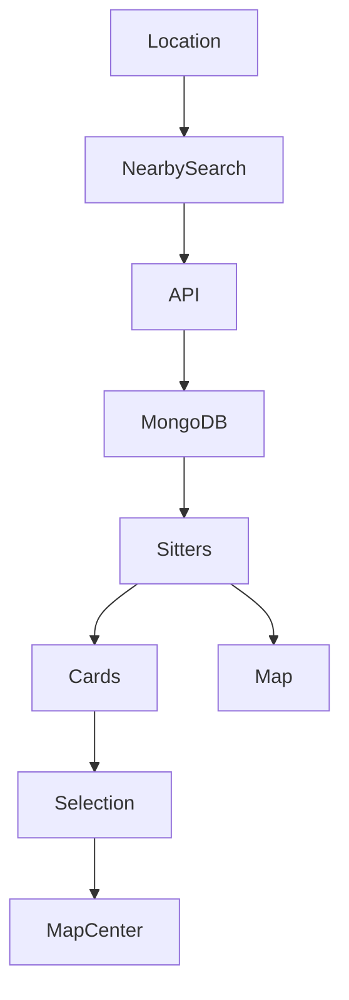

---

# Decision Log DL-004

**Decision**

The map and list should remain synchronized.

**Reason**

Research from Airbnb, Booking.com, and Google Maps demonstrates that synchronized visual and textual representations improve user confidence, reduce search effort, and encourage exploration. Synchronization minimizes context switching and creates a more intuitive browsing experience.

---

# 9. Non-Functional Requirements (NFR)

---

## Performance

| ID      | Requirement                    |
| ------- | ------------------------------ |
| NFR-001 | First Contentful Paint < 2 sec |
| NFR-002 | Nearby search < 1 sec          |
| NFR-003 | API average response < 500 ms  |
| NFR-004 | Map interaction < 100 ms       |
| NFR-005 | Lazy load assets               |

---

## Availability

| ID      | Requirement             |
| ------- | ----------------------- |
| NFR-006 | 99.9% uptime            |
| NFR-007 | Graceful API failure    |
| NFR-008 | Retry failed requests   |
| NFR-009 | Offline error messaging |

---

## Scalability

| ID      | Requirement          |
| ------- | -------------------- |
| NFR-010 | Support 100K sitters |
| NFR-011 | Horizontal scaling   |
| NFR-012 | Stateless APIs       |
| NFR-013 | CDN support          |

---

## Security

| ID      | Requirement               |
| ------- | ------------------------- |
| NFR-014 | HTTPS only                |
| NFR-015 | Input validation          |
| NFR-016 | XSS protection            |
| NFR-017 | CSRF mitigation           |
| NFR-018 | Rate limiting             |
| NFR-019 | Secure headers            |
| NFR-020 | Password hashing (future) |

---

## Maintainability

| ID      | Requirement             |
| ------- | ----------------------- |
| NFR-021 | Repository Pattern      |
| NFR-022 | Service Layer           |
| NFR-023 | Modular React           |
| NFR-024 | Type-safe validation    |
| NFR-025 | Unit test coverage ≥80% |

---

## Accessibility

| ID      | Requirement                 |
| ------- | --------------------------- |
| NFR-026 | WCAG 2.2 AA compliance      |
| NFR-027 | Keyboard navigation         |
| NFR-028 | Screen reader compatibility |
| NFR-029 | Sufficient color contrast   |
| NFR-030 | Visible focus indicators    |

---

# 10. Business Rules

Business rules define constraints and policies that govern application behavior.

| Rule ID       | Business Rule                                                                                                             |
| ------------- | ------------------------------------------------------------------------------------------------------------------------- |
| **BRULE-001** | Only verified pet sitters are displayed in public search results.                                                         |
| **BRULE-002** | Distance calculations use GeoJSON coordinates with MongoDB 2dsphere indexes.                                              |
| **BRULE-003** | Current location search requires explicit user permission.                                                                |
| **BRULE-004** | Manual city search must function even when location permission is denied.                                                 |
| **BRULE-005** | Pet sitter records must include valid geographic coordinates before publication.                                          |
| **BRULE-006** | Search results are sorted primarily by distance and secondarily by profile completeness.                                  |
| **BRULE-007** | Selecting a map marker updates the corresponding sitter card.                                                             |
| **BRULE-008** | Selecting a sitter card recenters the map and highlights the associated marker.                                           |
| **BRULE-009** | All forms must pass client-side and server-side validation before persistence.                                            |
| **BRULE-010** | No personally identifiable contact information is displayed until future booking/authentication features are implemented. |

---

# Requirement Traceability Matrix (Initial)

| Business Requirement | Functional Requirement(s) | Non-Functional Requirement(s) |
| -------------------- | ------------------------- | ----------------------------- |
| BR-001               | FR-001–FR-009             | NFR-001, NFR-002              |
| BR-002               | FR-001–FR-005             | NFR-014                       |
| BR-003               | FR-009                    | NFR-003                       |
| BR-006               | FR-015–FR-019             | NFR-015, NFR-016              |
| BR-015               | FR-001–FR-009             | NFR-003, NFR-010              |
| BR-023               | FR-026–FR-030             | NFR-001, NFR-026              |
| BR-029               | FR-020–FR-025             | NFR-021–NFR-025               |

---

# 10. Stakeholders

## 10.1 Stakeholder Overview

The success of WoofBnB depends on alignment between business, operational, technical, and end-user stakeholders. Each stakeholder has distinct objectives and varying influence on product decisions.

| Stakeholder                       | Role                  | Responsibilities                                    | Influence | Interest |
| --------------------------------- | --------------------- | --------------------------------------------------- | --------- | -------- |
| Product Owner                     | Product Strategy      | Prioritize features, approve scope                  | High      | High     |
| Business Analyst                  | Requirements          | Document business and product requirements          | High      | High     |
| UX Designer                       | User Experience       | User flows, wireframes, accessibility               | High      | High     |
| Solution Architect                | Architecture          | System design and scalability                       | High      | High     |
| Frontend Engineers                | UI Development        | Build React application                             | High      | High     |
| Backend Engineers                 | API Development       | Implement services and integrations                 | High      | High     |
| QA Engineers                      | Quality Assurance     | Validate functional and non-functional requirements | Medium    | High     |
| DevOps Engineer                   | Deployment            | CI/CD, monitoring, infrastructure                   | Medium    | Medium   |
| Pet Owners                        | Primary Users         | Search and discover sitters                         | High      | High     |
| Pet Sitters                       | Marketplace Providers | Register and manage profiles                        | High      | High     |
| Customer Support _(Future)_       | Support Operations    | Resolve customer issues                             | Medium    | Medium   |
| Platform Administrator _(Future)_ | Governance            | Approvals, moderation, reporting                    | High      | Medium   |

---

# 11. User Personas

## Persona 1 — Pet Owner

### Persona ID

**PERS-001**

| Attribute       | Details           |
| --------------- | ----------------- |
| Name            | Priya Sharma      |
| Age             | 31                |
| Occupation      | Software Engineer |
| Location        | Bengaluru         |
| Pet             | Golden Retriever  |
| Technical Skill | High              |

### Goals

- Find a trusted sitter quickly.
- View nearby options.
- Compare sitters visually.
- Minimize travel distance.
- Feel confident before contacting a sitter.

### Pain Points

- No trusted recommendations.
- Difficult to compare nearby sitters.
- Poor search experiences.
- Unclear pricing.
- No verification indicators.

### Success Criteria

- Find a suitable sitter within 2 minutes.
- View nearby options instantly.
- Understand sitter quality at a glance.

---

## Persona 2 — Pet Sitter

### Persona ID

**PERS-002**

| Attribute       | Details                 |
| --------------- | ----------------------- |
| Name            | Rahul Verma             |
| Age             | 29                      |
| Occupation      | Professional Pet Sitter |
| Location        | Pune                    |
| Technical Skill | Medium                  |

### Goals

- Register easily.
- Increase visibility.
- Receive future bookings.
- Build reputation.

### Pain Points

- Limited online presence.
- Difficult to attract local customers.
- Lack of trust mechanisms.

### Success Criteria

- Complete registration in under 5 minutes.
- Appear in nearby searches.
- Build verified profile.

---

## Future Personas

### PERS-003

Administrator

Responsibilities

- Verify sitters
- Manage reports
- Suspend fraudulent users
- Review analytics

---

### PERS-004

Support Executive

Responsibilities

- Handle disputes
- Customer support
- Registration assistance

---

# Persona Journey Map

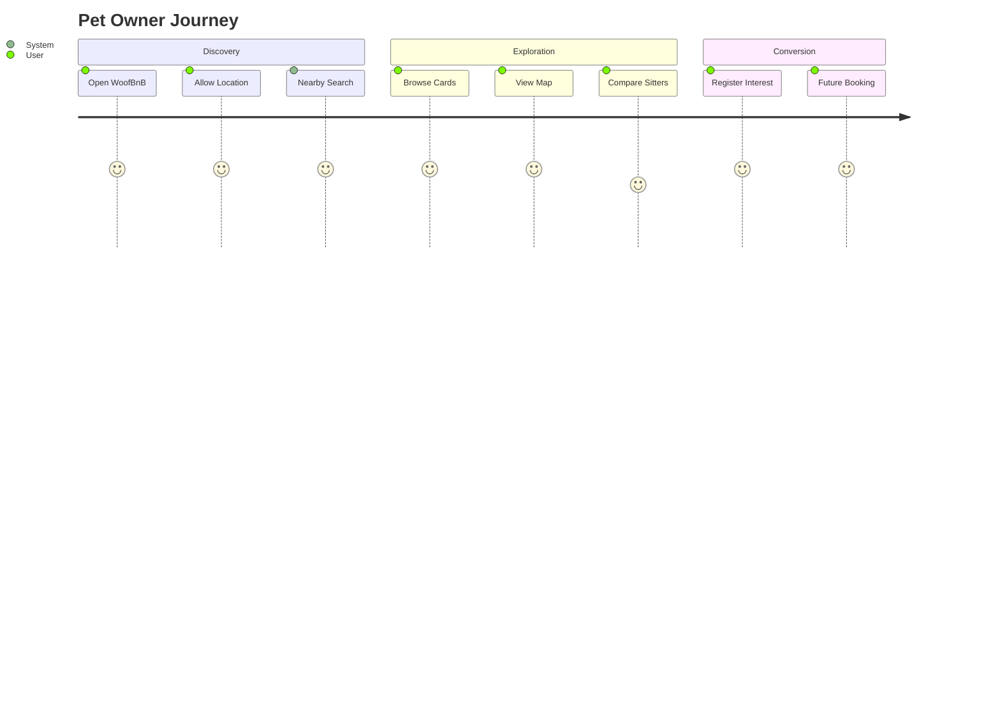

---

# 12. Epic Breakdown

## Epic 1 — Location Discovery

**EP-001**

Goal

Enable users to discover nearby pet sitters.

Stories

US-001

US-002

US-003

US-004

US-005

---

## Epic 2 — Search Experience

**EP-002**

Goal

Allow users to search anywhere.

Stories

US-006

US-007

US-008

US-009

---

## Epic 3 — Interactive Map

**EP-003**

Goal

Synchronize map and search results.

Stories

US-010

US-011

US-012

US-013

---

## Epic 4 — Registration

**EP-004**

Goal

Enable sitter onboarding.

Stories

US-014

US-015

US-016

US-017

---

# 13. User Stories

---

## EP-001 — Location Discovery

### US-001

**As a** pet owner

**I want** the application to detect my current location

**So that** nearby pet sitters are displayed automatically.

Priority

High

Business Value

Very High

Linked Requirements

BR-002

FR-001

FR-002

---

### Acceptance Criteria

AC-001

- Browser requests permission.
- GPS coordinates retrieved.
- Nearby API executes.
- Sitters displayed.
- Map centered.

---

### US-002

As a pet owner

I want nearby sitters sorted by distance

So that I can quickly choose the closest option.

Acceptance Criteria

AC-002

- Sorted ascending
- Distance visible
- Updates after new search

---

### US-003

As a pet owner

I want nearby sitters displayed on an interactive map

So that I understand geographic proximity.

---

### US-004

As a pet owner

I want my own location shown

So that I know where I am relative to sitters.

---

### US-005

As a pet owner

I want search results to update instantly

So that I don't reload the page.

---

## EP-002 — Search

### US-006

As a user

I want to search by city

So that I can plan pet care before travelling.

---

### AC-006

- Accept city input
- Geocode city
- Execute nearby search
- Recenter map

---

### US-007

As a user

I want autocomplete suggestions _(future enhancement)_

So that city searches become faster.

---

### US-008

As a user

I want invalid locations handled gracefully

So that I receive useful feedback.

---

### US-009

As a user

I want previous search preserved during navigation

So that I don't repeat searches.

---

## EP-003 — Interactive Map

### US-010

As a user

I want sitter markers

So that I can visually compare locations.

---

### US-011

As a user

I want clicking a marker to highlight the sitter card

So that both interfaces remain synchronized.

---

### US-012

As a user

I want clicking a card to move the map

So that I can inspect the selected sitter.

---

### US-013

As a user

I want the selected sitter card pinned to the top

So that I don't lose context.

---

## EP-004 — Registration

### US-014

As a pet sitter

I want to register

So that customers can find me.

---

### US-015

As a sitter

I want my service area saved accurately

So nearby searches include my profile.

---

### US-016

As a sitter

I want validation before submission

So incorrect information is prevented.

---

### US-017

As a sitter

I want confirmation after successful registration

So I know my application was received.

---

# User Story Traceability

| Story  | Business Requirement | Functional Requirement |
| ------ | -------------------- | ---------------------- |
| US-001 | BR-002               | FR-001                 |
| US-002 | BR-004               | FR-003                 |
| US-003 | BR-018               | FR-006                 |
| US-006 | BR-016               | FR-009                 |
| US-011 | BR-025               | FR-007                 |
| US-012 | BR-025               | FR-008                 |
| US-014 | BR-010               | FR-015                 |

---

# 14. Use Cases

## UC-001 — Discover Nearby Pet Sitters

**Primary Actor:** Pet Owner

**Preconditions:**

- User accesses the application.
- Browser supports geolocation.

**Main Flow:**

1. User opens WoofBnB.
2. Browser requests location permission.
3. User grants permission.
4. Coordinates are retrieved.
5. Nearby API is called.
6. Results are returned.
7. Map centers on user.
8. Pet sitter cards are displayed.

**Alternative Flows:**

- Permission denied → Prompt user to search by city.
- Location unavailable → Show retry option.
- No sitters found → Display empty state with guidance.

**Postconditions:**

- Results are visible.
- User may continue exploring or search another city.

---

## UC-002 — Search by City

**Primary Actor:** Pet Owner

**Preconditions:**

- User enters a city name.

**Main Flow:**

1. User types city.
2. Geocoder converts text to coordinates.
3. Nearby search executes.
4. Map recenters.
5. Cards update.

---

## UC-003 — Register as Pet Sitter

**Primary Actor:** Pet Sitter

**Main Flow:**

1. Open registration page.
2. Enter personal information.
3. Provide service location.
4. Submit form.
5. System validates input.
6. Store sitter profile.
7. Show confirmation.

---

# 15. Acceptance Criteria Summary

| AC ID  | Description                                     |
| ------ | ----------------------------------------------- |
| AC-001 | Detect current location and load nearby sitters |
| AC-002 | Sort results by distance                        |
| AC-003 | Display user marker                             |
| AC-004 | Display sitter markers                          |
| AC-005 | Synchronize cards and map                       |
| AC-006 | Support city search                             |
| AC-007 | Validate registration form                      |
| AC-008 | Store GeoJSON location                          |
| AC-009 | Gracefully handle errors                        |
| AC-010 | Responsive across supported devices             |

---

# 16. Complete User Journey

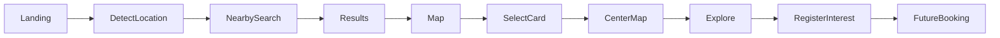

---

# Cross-Functional Swimlane

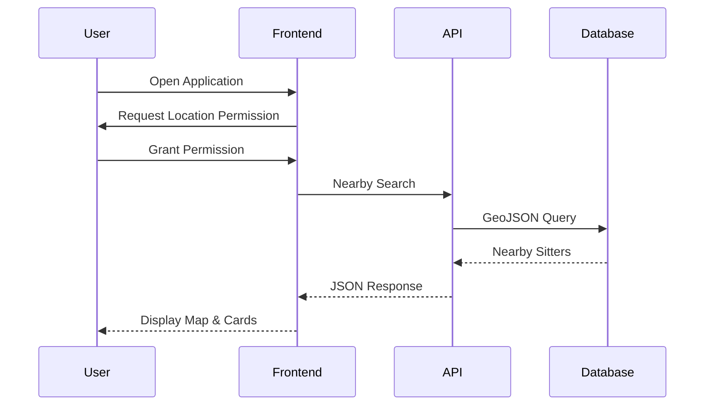

---

# Decision Log DL-005

**Decision:** Model the product using epics, user stories, use cases, and acceptance criteria.

**Rationale:** This structure provides end-to-end traceability from business objectives to implementation and testing, ensuring designers, developers, QA engineers, and AI-assisted development tools can work from a shared, unambiguous specification.

# 17. Information Architecture

## 17.1 Overview

The information architecture (IA) defines how content, functionality, and navigation are organized to provide a logical, intuitive experience for users. For the MVP, the emphasis is on **fast discovery**, **minimal navigation depth**, and **location-first interactions**.

### IA Principles

- Discovery before registration.
- Map and list remain synchronized.
- Progressive disclosure of information.
- Minimal cognitive load.
- Mobile-first hierarchy.
- Future-ready for booking and account management.

---

## Site Map

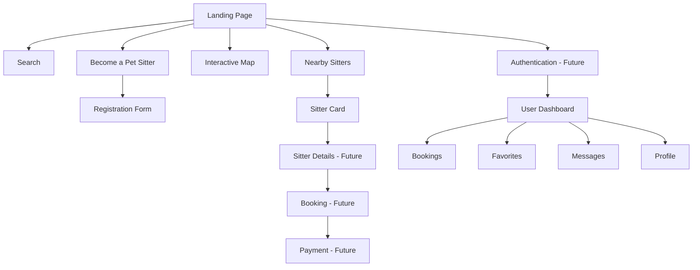

---

## Content Hierarchy

| Level | Content                   |
| ----- | ------------------------- |
| L1    | Landing Page              |
| L2    | Search Experience         |
| L2    | Nearby Sitters            |
| L2    | Interactive Map           |
| L2    | Registration              |
| L3    | Sitter Profile _(Future)_ |
| L3    | Booking _(Future)_        |
| L3    | Reviews _(Future)_        |

---

## Information Architecture Decisions

| Decision                         | Reason                             |
| -------------------------------- | ---------------------------------- |
| Flat navigation                  | Faster discovery                   |
| Homepage-first search            | Minimize clicks                    |
| Registration separated           | Reduce distractions for pet owners |
| Map integrated into landing page | Continuous exploration             |
| Future account area isolated     | Easier feature expansion           |

---

# Decision Log DL-006

**Decision:** Avoid deep navigation during MVP.

**Reason:** User research for marketplace products consistently shows that reducing navigation depth improves task completion and lowers abandonment for first-time visitors.

---

# 18. Navigation Structure

## MVP Navigation

### Desktop

```
-------------------------------------------------------

Logo

Search

Become a Pet Sitter

-------------------------------------------------------

Hero Section

Nearby Sitters

Interactive Map

Footer

-------------------------------------------------------
```

---

### Mobile

```
-------------------

Logo

Hamburger Menu

-------------------

Hero

Search

Nearby Sitters

Map

CTA

Footer

-------------------
```

---

## Navigation Rules

| Rule ID | Description                             |
| ------- | --------------------------------------- |
| NAV-001 | Logo always returns to Home             |
| NAV-002 | Search is always accessible             |
| NAV-003 | Registration CTA visible above the fold |
| NAV-004 | Map remains visible on desktop          |
| NAV-005 | Responsive navigation on mobile         |

---

## Future Navigation

```
Home

Search

Bookings

Favorites

Messages

Profile

Settings

Admin

Analytics
```

---

# 19. Application Workflow

## Overview

The application is centered around a **location-driven discovery loop**, where location changes trigger synchronized updates to the list and map.

### High-Level Workflow

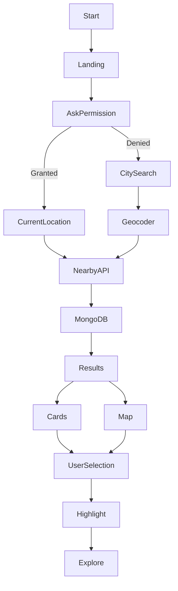

---

## Workflow States

| State       | Description                  |
| ----------- | ---------------------------- |
| Initial     | Landing page loaded          |
| Permission  | Browser requests geolocation |
| Search      | Coordinates determined       |
| Fetch       | Nearby API executes          |
| Display     | Cards and map render         |
| Interaction | User explores results        |

---

# 20. Search Workflow

WoofBnB supports **two independent search mechanisms**, each converging into the same nearby search service.

---

## Flow 1 — Current Location

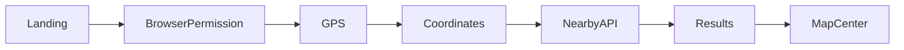

---

## Flow 2 — City Search

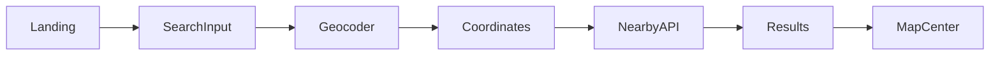

---

## Search Rules

| Rule   | Description                                         |
| ------ | --------------------------------------------------- |
| SW-001 | GPS search has priority when permission is granted  |
| SW-002 | Manual search always overrides current location     |
| SW-003 | New search clears previous results before rendering |
| SW-004 | Search state is preserved during navigation         |
| SW-005 | Empty results display informative guidance          |

---

## Search Sequence Diagram

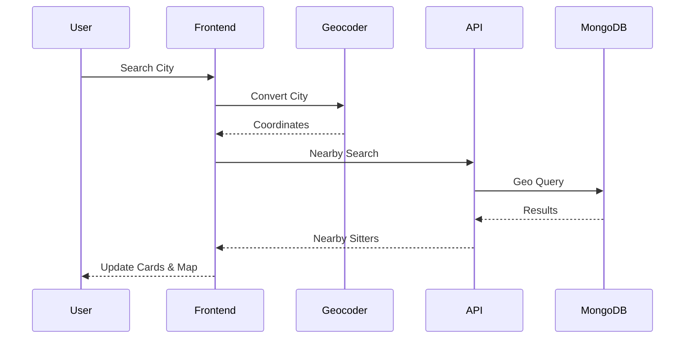

---

# 21. Geolocation Workflow

## Objective

Provide seamless location detection while respecting user privacy and browser permissions.

---

## Geolocation Flow

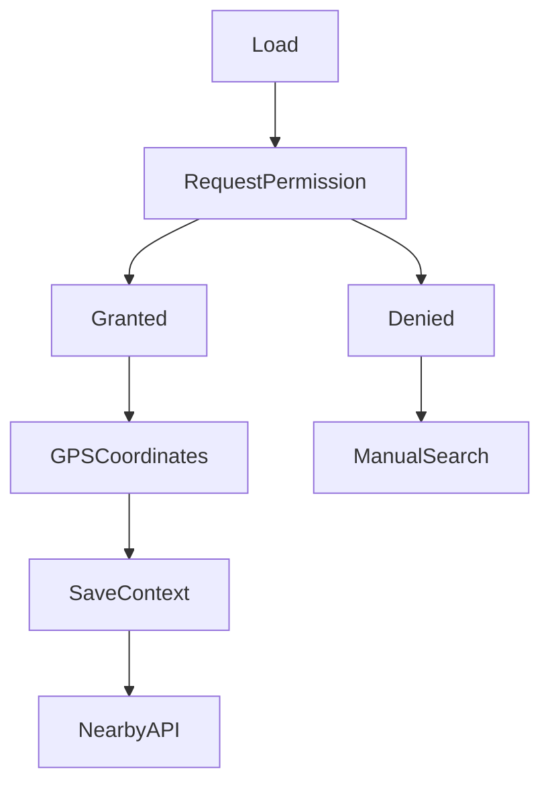

---

## Permission Handling Matrix

| Scenario            | System Behavior     |
| ------------------- | ------------------- |
| Permission Granted  | Execute Nearby API  |
| Permission Denied   | Display city search |
| GPS Timeout         | Retry prompt        |
| GPS Unsupported     | Manual search only  |
| Invalid Coordinates | Show retry message  |

---

## Decision Log DL-007

**Decision:** Manual city search remains fully functional without location permission.

**Reason:** Users may intentionally decline geolocation access for privacy or may be searching for services in another city. This ensures the platform remains useful regardless of browser permission choices.

---

# 22. Interactive Map Workflow

## Objectives

- Visual discovery
- Geographic awareness
- Synchronization
- Reduced cognitive effort

---

## Map State Diagram

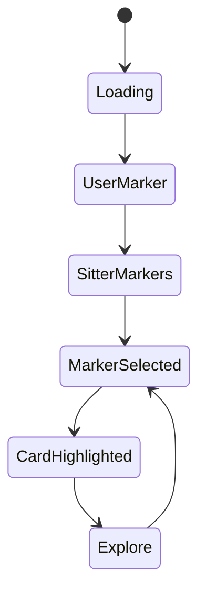

---

## Map Synchronization Flow

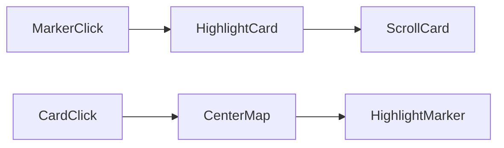

---

## Map Business Rules

| Rule    | Description                             |
| ------- | --------------------------------------- |
| MAP-001 | User marker displayed after GPS success |
| MAP-002 | Selected marker uses active styling     |
| MAP-003 | Selected card scrolls into view         |
| MAP-004 | Map recenters smoothly                  |
| MAP-005 | Cards remain synchronized               |

---

## Future Map Enhancements

- Marker clustering
- Heat maps
- Availability overlays
- Radius search visualization
- Traffic estimation
- Route navigation
- Walking distance
- Google Places integration

---

# 23. State Management Flow

## Overview

The frontend adopts a **feature-based architecture** using **React Query** for server state and **Context API** for lightweight global UI state.

### State Categories

| State Type            | Technology   | Purpose                                 |
| --------------------- | ------------ | --------------------------------------- |
| Server State          | React Query  | API responses, caching, synchronization |
| Global UI State       | Context API  | Selected sitter, location, filters      |
| Local Component State | React Hooks  | Forms, modal visibility, input values   |
| URL State _(Future)_  | React Router | Shareable search URLs                   |

---

## State Flow Diagram

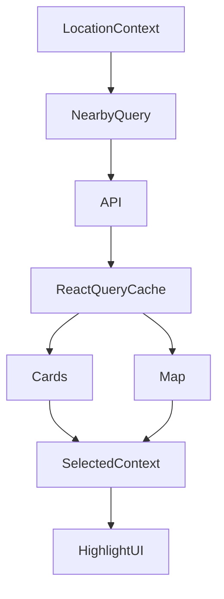

---

## Global Context Objects

### Location Context

```text
Current Coordinates

Permission Status

Selected City

Search Source

Loading Status
```

---

### Search Context

```text
Search Radius

Search Term

Current Results

Pagination

Sorting
```

---

### UI Context

```text
Selected Sitter

Highlighted Marker

Sidebar State

Map Center

Map Zoom
```

---

## State Lifecycle


---

## Decision Log DL-008

**Decision:** Separate server state from UI state using React Query and Context API.

**Rationale:** API responses and UI interactions have different lifecycles. React Query provides caching, background refetching, and synchronization for server data, while Context API keeps transient UI state lightweight and avoids unnecessary complexity from a global state library for the MVP.

---

# UX Workflow Summary

````mermaid
flowchart TD

Landing

--> Search

Search

--> NearbyResults

NearbyResults

--> Map

Map

--> Explore

Explore

--> SelectSitter

SelectSitter

--> RegisterInterest

RegisterInterest

--> FutureBooking


---

# 24. Frontend Architecture

## 24.1 Architectural Vision

The WoofBnB frontend follows a **Feature-Based Modular Architecture** built on React and Vite. This structure promotes scalability, maintainability, and team autonomy by organizing code around business capabilities rather than technical layers.

### Architectural Principles

* Feature-first organization
* Clear separation of concerns
* Reusable UI components
* Predictable data flow
* API abstraction
* Lazy loading where appropriate
* Mobile-first responsiveness
* Testability

---

## Frontend Technology Stack

| Layer             | Technology      | Purpose                               |
| ----------------- | --------------- | ------------------------------------- |
| Framework         | React 19        | Component-based UI                    |
| Build Tool        | Vite            | Fast development and optimized builds |
| Styling           | Tailwind CSS    | Utility-first styling                 |
| Server State      | React Query     | API caching and synchronization       |
| Global State      | Context API     | Lightweight application state         |
| Forms             | React Hook Form | Form state management                 |
| Validation        | Zod             | Runtime schema validation             |
| HTTP Client       | Axios           | API communication                     |
| Maps (MVP)        | Leaflet         | Interactive mapping                   |
| Maps (Production) | Google Maps     | Enhanced mapping capabilities         |

---

## High-Level Frontend Architecture

```mermaid
graph TD

A[Pages]

A --> B[Features]

B --> C[Components]

B --> D[Hooks]

B --> E[API Layer]

E --> F[Axios Client]

F --> G[Backend API]

B --> H[Context]

B --> I[Utilities]
````

---

## Feature-Based Module Structure

Each feature owns its:

- Components
- Hooks
- Services
- Validation
- Types
- Tests
- Assets

Example Features:

- Search
- Nearby Sitters
- Map
- Registration
- Location
- Shared UI

---

## Frontend Module Responsibilities

| Module     | Responsibility          |
| ---------- | ----------------------- |
| Pages      | Route composition       |
| Features   | Business functionality  |
| Components | Shared UI               |
| Hooks      | Encapsulated logic      |
| Context    | Global UI state         |
| API        | HTTP communication      |
| Utils      | Helper functions        |
| Assets     | Images, icons, branding |

---

# Frontend Rendering Flow

```mermaid
flowchart TD

Page

--> Feature

Feature

--> Hook

Hook

--> API

API

--> Backend

Backend

--> ReactQuery

ReactQuery

--> UI

UI

--> User
```

---

# Component Hierarchy

```text
App

│

├── Layout

│

├── Navbar

│

├── Hero

│

├── Search Section

│ ├── Current Location Button

│ ├── City Search

│ └── Search Status

│

├── Nearby Section

│ ├── Filters (Future)

│ ├── Pet Sitter List

│ ├── Pet Sitter Card

│ └── Empty State

│

├── Interactive Map

│ ├── User Marker

│ ├── Sitter Marker

│ └── Popup

│

├── Registration CTA

│

└── Footer
```

---

# Architectural Decision Record (ADR-001)

**Decision**

Adopt Feature-Based Architecture instead of Layer-Based folders.

**Reason**

As the platform evolves to include bookings, messaging, payments, reviews, and dashboards, organizing by business capability minimizes coupling, improves discoverability, and allows multiple teams to work independently.

---

# 25. Backend Architecture

## Overview

The backend follows a **Layered Clean Architecture** emphasizing separation of concerns, maintainability, and scalability.

---

## Backend Layers

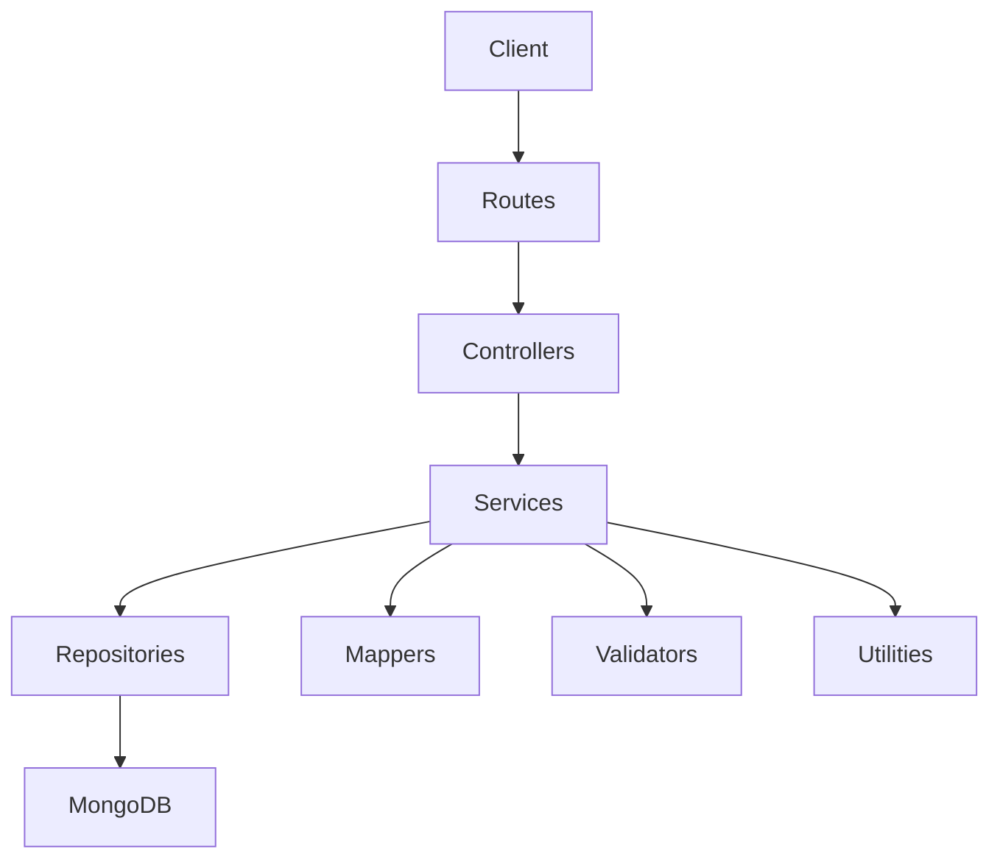

---

## Layer Responsibilities

### Routes

- HTTP endpoints
- Authentication middleware _(future)_
- Validation middleware
- Route versioning

---

### Controllers

Responsibilities:

- Parse requests
- Call services
- Return responses
- Error propagation

No business logic.

---

### Services

Responsibilities:

- Business rules
- Search logic
- Validation orchestration
- Geospatial calculations
- Transaction coordination

---

### Repositories

Responsibilities:

- Database queries
- Aggregations
- GeoJSON operations
- Pagination
- Sorting

---

### Mappers

Responsibilities:

- Convert database models to DTOs
- Hide internal schema
- Normalize API responses

---

### Middleware

Responsibilities:

- Error handling
- Validation
- Logging
- Rate limiting
- Security headers

---

# Backend Request Lifecycle

```mermaid
sequenceDiagram

Client->>Route

Route->>Controller

Controller->>Service

Service->>Repository

Repository->>MongoDB

MongoDB-->>Repository

Repository-->>Service

Service-->>Controller

Controller-->>Client
```

---

# ADR-002

**Decision**

Adopt Repository + Service Layer.

**Reason**

Separating persistence from business logic improves testability, enables future migration to alternative databases, and simplifies unit testing.

---

# 26. Database Design

## Database

MongoDB

---

## Primary Collection

PetSitters

---

## Entity Overview

| Entity         | Purpose             |
| -------------- | ------------------- |
| PetSitter      | Marketplace profile |
| Future User    | Authentication      |
| Future Booking | Reservations        |
| Future Review  | Ratings             |
| Future Payment | Payments            |

---

## PetSitter Document

| Field              | Type          | Required |
| ------------------ | ------------- | -------- |
| id                 | ObjectId      | Yes      |
| fullName           | String        | Yes      |
| email              | String        | Yes      |
| phone              | String        | Yes      |
| bio                | String        | Yes      |
| address            | String        | Yes      |
| city               | String        | Yes      |
| state              | String        | Yes      |
| pincode            | String        | Yes      |
| location           | GeoJSON Point | Yes      |
| verificationStatus | Enum          | Yes      |
| createdAt          | Date          | Yes      |
| updatedAt          | Date          | Yes      |

---

## GeoJSON Structure

```json
{
"type":"Point",
"coordinates":[longitude,latitude]
}
```

---

## Index Strategy

| Index              | Purpose        |
| ------------------ | -------------- |
| email              | Unique         |
| location           | 2dsphere       |
| city               | Filtering      |
| verificationStatus | Fast filtering |
| createdAt          | Sorting        |

---

## Geo Query

Nearby Search

↓

GeoJSON Point

↓

2dsphere Index

↓

Distance Calculation

↓

Sorted Results

---

## Database Relationships

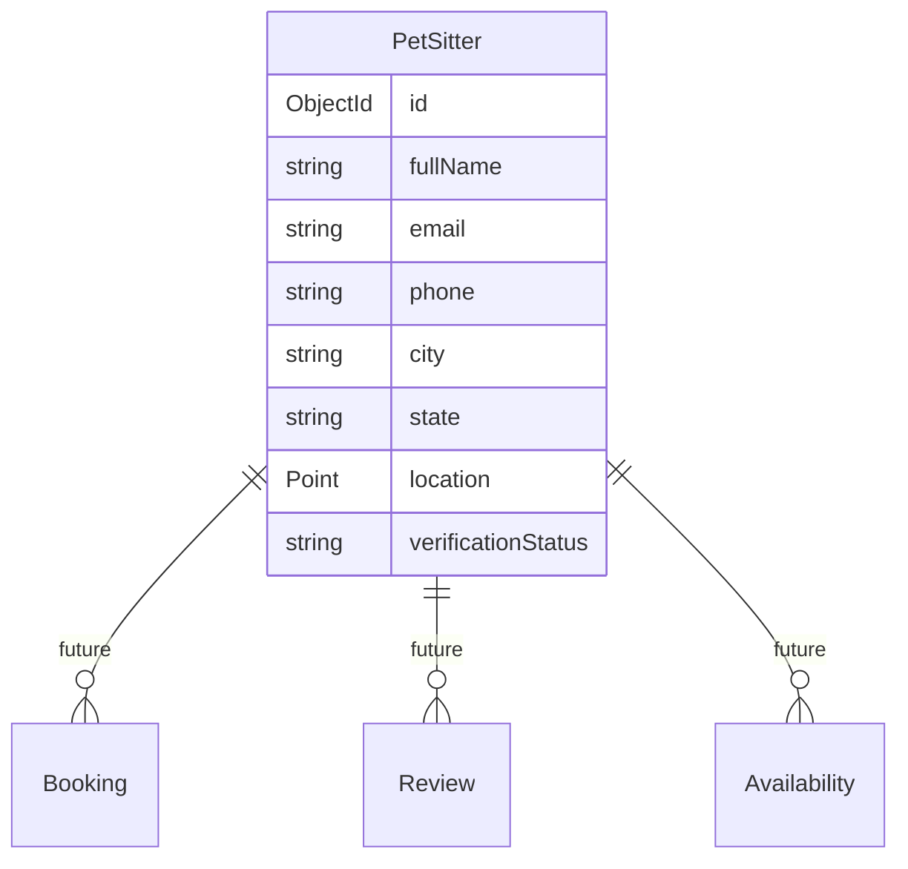

---

# ADR-003

**Decision**

Use MongoDB GeoJSON.

**Reason**

Native geospatial queries provide excellent performance while avoiding external geospatial databases.

---

# Nearby Search Flow

```mermaid
flowchart TD

Coordinates

-->

GeoJSON

-->

Mongo Query

-->

2dsphere Index

-->

Nearby Sitters

-->

Distance Sort
```

---

# 27. API Architecture

## API Principles

- RESTful
- Stateless
- Versioned
- Predictable
- Consistent error model
- JSON only

---

## Endpoint Categories

| Module                | Endpoint Group    |
| --------------------- | ----------------- |
| Search                | /nearby           |
| Registration          | /sitters          |
| Geocoding             | External Provider |
| Health                | /health           |
| Future Authentication | /auth             |
| Future Booking        | /bookings         |

---

## Response Standards

Successful

```json
{
  "success": true,
  "data": {},
  "message": "Success"
}
```

Error

```json
{
  "success": false,
  "message": "Validation failed",
  "errors": []
}
```

---

# API Request Lifecycle

```mermaid
flowchart LR

Client

-->

Express

-->

Controller

-->

Service

-->

Repository

-->

MongoDB

-->

Repository

-->

Service

-->

Controller

-->

JSON Response
```

---

# ADR-004

**Decision**

Keep API responses consistent across all endpoints.

**Reason**

A uniform response envelope simplifies frontend integration, reduces conditional handling, and improves developer experience.

---

# 28. Recommended Folder Structure

## Frontend

```text
src/

pages/

features/

search/

map/

nearby/

registration/

components/

hooks/

context/

api/

assets/

utils/

types/

constants/

styles/

routes/
```

---

## Backend

```text
src/

routes/

controllers/

services/

repositories/

models/

mappers/

middlewares/

validators/

config/

utils/

errors/

constants/

database/
```

---

# Repository Pattern Overview

```mermaid
graph LR

Controller

-->

Service

-->

Repository

-->

MongoDB
```

---

# Mapper Pattern

```mermaid
flowchart LR

Mongo Document

-->

Mapper

-->

DTO

-->

API Response
```

---

# Decision Log Summary

| ADR     | Decision                   | Benefit                                 |
| ------- | -------------------------- | --------------------------------------- |
| ADR-001 | Feature-Based React        | Scalable frontend organization          |
| ADR-002 | Repository + Service Layer | Separation of concerns                  |
| ADR-003 | MongoDB GeoJSON            | Efficient geospatial queries            |
| ADR-004 | Consistent API responses   | Simplified client integration           |
| ADR-005 | React Query + Context API  | Clear separation of server and UI state |

---

# Technology Dependency Diagram

```mermaid
graph TD

React

--> ReactQuery

React

--> ContextAPI

React

--> TailwindCSS

React

--> Axios

Axios

--> Express

Express

--> ServiceLayer

ServiceLayer

--> Repository

Repository

--> MongoDB

MongoDB

--> GeoJSON

GeoJSON

--> 2dsphere

Leaflet

--> GoogleMaps
```

---

# 29. API Specifications

## 29.1 API Overview

The WoofBnB backend exposes a RESTful API designed around predictable resource-oriented endpoints. All APIs return JSON, follow consistent response envelopes, and support future versioning.

### API Design Principles

- RESTful resource naming
- Stateless communication
- Versioned endpoints
- Predictable status codes
- Standardized error responses
- Secure by default
- Idempotent where applicable
- Extensible for future modules

---

## Base URL

### Development

```text
http://localhost:5000/api/v1
```

### Production

```text
https://api.woofbnb.com/api/v1
```

---

# API Versioning Strategy

| Version | Status  | Description                                |
| ------- | ------- | ------------------------------------------ |
| v1      | MVP     | Location discovery and sitter registration |
| v2      | Planned | Authentication, bookings, reviews          |
| v3      | Future  | Payments, messaging, analytics             |

---

# Authentication Strategy

| Module        | MVP    | Future    |
| ------------- | ------ | --------- |
| Nearby Search | Public | Public    |
| Registration  | Public | Protected |
| Booking       | N/A    | JWT       |
| Payments      | N/A    | JWT       |
| Reviews       | N/A    | JWT       |

---

# Standard Headers

## Request

```http
Content-Type: application/json
Accept: application/json
```

Future Auth Header

```http
Authorization: Bearer <JWT_TOKEN>
```

---

# Standard Success Response

```json
{
  "success": true,
  "message": "Request completed successfully.",
  "data": {},
  "meta": {
    "timestamp": "2026-08-05T10:00:00Z"
  }
}
```

---

# Standard Error Response

```json
{
  "success": false,
  "message": "Validation failed.",
  "errors": [
    {
      "field": "email",
      "message": "Invalid email address."
    }
  ],
  "meta": {
    "timestamp": "2026-08-05T10:00:00Z"
  }
}
```

---

# API-001 — Health Check

## Purpose

Verify API availability.

---

### Endpoint

```http
GET /health
```

---

### Success Response

```json
{
  "success": true,
  "status": "healthy",
  "version": "1.0.0"
}
```

---

### Status Codes

| Code | Meaning |
| ---- | ------- |
| 200  | Healthy |

---

# API-002 — Nearby Pet Sitters

## Endpoint

```http
GET /sitters/nearby
```

---

## Purpose

Return nearby verified pet sitters using GeoJSON coordinates.

---

## Query Parameters

| Parameter | Type   | Required | Description                            |
| --------- | ------ | -------- | -------------------------------------- |
| latitude  | Number | Yes      | User latitude                          |
| longitude | Number | Yes      | User longitude                         |
| radius    | Number | No       | Search radius in meters (default 5000) |
| page      | Number | No       | Pagination                             |
| limit     | Number | No       | Items per page                         |
| sort      | String | No       | distance, rating (future)              |

---

### Example Request

```http
GET /sitters/nearby?latitude=12.9716&longitude=77.5946&radius=5000
```

---

## Success Response

```json
{
  "success": true,
  "message": "Nearby sitters found.",
  "data": [
    {
      "id": "64f8...",
      "name": "Priya Sharma",
      "distance": 0.8,
      "verified": true,
      "city": "Bengaluru",
      "location": {
        "lat": 12.9724,
        "lng": 77.5938
      }
    }
  ]
}
```

---

### Validation Rules

| Rule ID | Description             |
| ------- | ----------------------- |
| VAL-001 | Latitude required       |
| VAL-002 | Longitude required      |
| VAL-003 | Radius must be positive |
| VAL-004 | Limit maximum 100       |
| VAL-005 | Page minimum 1          |

---

### Status Codes

| Code | Meaning          |
| ---- | ---------------- |
| 200  | Success          |
| 400  | Validation Error |
| 404  | No Sitters Found |
| 429  | Rate Limited     |
| 500  | Server Error     |

---

# API-003 — Register Pet Sitter

## Endpoint

```http
POST /sitters
```

---

## Purpose

Register a new pet sitter.

---

### Request Body

```json
{
  "fullName": "Rahul Verma",
  "email": "rahul@example.com",
  "phone": "9876543210",
  "bio": "Experienced dog walker",
  "address": "Koramangala",
  "city": "Bengaluru",
  "state": "Karnataka",
  "pincode": "560034",
  "location": {
    "type": "Point",
    "coordinates": [77.5946, 12.9716]
  }
}
```

---

## Validation Rules

| Rule    | Description            |
| ------- | ---------------------- |
| VAL-006 | Full name required     |
| VAL-007 | Email format valid     |
| VAL-008 | Phone number valid     |
| VAL-009 | Address required       |
| VAL-010 | GeoJSON Point required |

---

## Success Response

```json
{
  "success": true,
  "message": "Registration submitted successfully.",
  "data": {
    "id": "64f8..."
  }
}
```

---

### Status Codes

| Code | Meaning           |
| ---- | ----------------- |
| 201  | Created           |
| 400  | Validation Failed |
| 409  | Duplicate Email   |
| 500  | Internal Error    |

---

# API-004 — Retrieve Pet Sitter

```http
GET /sitters/{id}
```

---

## Purpose

Return detailed information for a specific pet sitter.

---

### Path Parameters

| Parameter | Description           |
| --------- | --------------------- |
| id        | Pet sitter identifier |

---

### Response

```json
{
  "success": true,
  "data": {
    "id": "...",
    "fullName": "...",
    "bio": "...",
    "verified": true,
    "city": "Bengaluru"
  }
}
```

---

# API-005 — Update Pet Sitter _(Future)_

```http
PUT /sitters/{id}
```

Purpose

Update sitter profile.

---

# API-006 — Delete Pet Sitter _(Admin Future)_

```http
DELETE /sitters/{id}
```

---

# API Error Catalog

| Error Code | Meaning               | HTTP |
| ---------- | --------------------- | ---- |
| ERR-001    | Validation Failed     | 400  |
| ERR-002    | Unauthorized          | 401  |
| ERR-003    | Forbidden             | 403  |
| ERR-004    | Resource Not Found    | 404  |
| ERR-005    | Duplicate Resource    | 409  |
| ERR-006    | Too Many Requests     | 429  |
| ERR-007    | Internal Server Error | 500  |

---

# Request Validation Matrix

| Field     | Type   | Required | Validation           |
| --------- | ------ | -------- | -------------------- |
| fullName  | String | Yes      | 3–100 chars          |
| email     | Email  | Yes      | RFC compliant        |
| phone     | String | Yes      | Indian mobile format |
| bio       | String | Yes      | Max 1000 chars       |
| city      | String | Yes      | Alphabetic           |
| pincode   | String | Yes      | 6 digits             |
| latitude  | Number | Yes      | -90 to 90            |
| longitude | Number | Yes      | -180 to 180          |

---

# Pagination Standard

Request

```http
?page=1&limit=20
```

Response

```json
{
  "meta": {
    "page": 1,
    "limit": 20,
    "total": 84,
    "pages": 5
  }
}
```

---

# Filtering (Future)

```http
GET /sitters?verified=true
```

```http
GET /sitters?petType=Dog
```

```http
GET /sitters?rating=4
```

```http
GET /sitters?available=true
```

---

# Sorting (Future)

```http
?sort=distance
```

```http
?sort=rating
```

```http
?sort=newest
```

---

# API Sequence

```mermaid
sequenceDiagram

participant User
participant React
participant Express
participant Service
participant Repository
participant MongoDB

User->>React: Search Nearby
React->>Express: GET /nearby
Express->>Service: Search
Service->>Repository: Geo Query
Repository->>MongoDB: 2dsphere Search
MongoDB-->>Repository: Nearby Sitters
Repository-->>Service: DTO
Service-->>Express: Response
Express-->>React: JSON
React-->>User: Render Cards + Map
```

---

# OpenAPI Endpoint Summary

| API ID  | Method | Endpoint        | Description              |
| ------- | ------ | --------------- | ------------------------ |
| API-001 | GET    | /health         | Health check             |
| API-002 | GET    | /sitters/nearby | Nearby search            |
| API-003 | POST   | /sitters        | Register sitter          |
| API-004 | GET    | /sitters/{id}   | Retrieve sitter          |
| API-005 | PUT    | /sitters/{id}   | Update sitter _(Future)_ |
| API-006 | DELETE | /sitters/{id}   | Delete sitter _(Future)_ |

---

# Future API Modules

## Authentication

| Endpoint                   | Purpose           |
| -------------------------- | ----------------- |
| POST /auth/register        | User registration |
| POST /auth/login           | Login             |
| POST /auth/logout          | Logout            |
| POST /auth/refresh         | Refresh token     |
| POST /auth/forgot-password | Password reset    |

---

## Booking

| Endpoint              | Purpose        |
| --------------------- | -------------- |
| POST /bookings        | Create booking |
| GET /bookings         | List bookings  |
| PUT /bookings/{id}    | Update booking |
| DELETE /bookings/{id} | Cancel booking |

---

## Reviews

| Endpoint             | Purpose       |
| -------------------- | ------------- |
| POST /reviews        | Create review |
| GET /reviews         | List reviews  |
| DELETE /reviews/{id} | Remove review |

---

## Payments

| Endpoint                     | Purpose            |
| ---------------------------- | ------------------ |
| POST /payments/create-intent | Payment initiation |
| POST /payments/webhook       | Payment callback   |
| GET /payments/history        | Payment history    |

---

# Architectural Decision Record (ADR-006)

**Decision:** Adopt consistent REST resource naming and standardized response envelopes.

**Rationale:** A predictable API contract reduces frontend complexity, simplifies automated testing, improves onboarding for new developers, and enables future OpenAPI/Swagger generation with minimal changes.

---

# API Requirement Traceability

| API ID  | Functional Requirements | Business Requirements  |
| ------- | ----------------------- | ---------------------- |
| API-001 | FR-024                  | BR-030                 |
| API-002 | FR-020–FR-023           | BR-001, BR-002, BR-015 |
| API-003 | FR-015–FR-019           | BR-010                 |
| API-004 | FR-020                  | BR-006                 |
| API-005 | FR-015                  | BR-010                 |
| API-006 | FR-024                  | BR-007                 |

---

# 30. UI Guidelines

## 30.1 UI Vision

WoofBnB should communicate **trust, warmth, professionalism, and simplicity**. The visual experience should combine the clarity of **Google Maps**, the marketplace confidence of **Airbnb**, and the responsiveness of modern SaaS products.

### Design Goals

- Premium first impression
- Trust-oriented visuals
- Minimal visual clutter
- Fast recognition over recall
- Mobile-first responsiveness
- Consistent interaction patterns

---

## Design Language

| Principle   | Description                                                      |
| ----------- | ---------------------------------------------------------------- |
| Clean       | Ample white space with clear visual hierarchy                    |
| Friendly    | Rounded corners and approachable imagery                         |
| Trustworthy | Verified badges, consistent iconography, transparent information |
| Modern      | Subtle shadows, smooth transitions, restrained animations        |
| Responsive  | Consistent experience across screen sizes                        |

---

## Color Palette

| Role           | Suggested Color         | Usage                          |
| -------------- | ----------------------- | ------------------------------ |
| Primary        | Emerald Green (#10B981) | Primary CTA, highlights        |
| Secondary      | Sky Blue (#3B82F6)      | Interactive map elements       |
| Success        | Green                   | Confirmation states            |
| Warning        | Amber                   | Validation warnings            |
| Error          | Red                     | Errors and destructive actions |
| Background     | White / Light Gray      | Primary surfaces               |
| Text Primary   | Slate 900               | Headings                       |
| Text Secondary | Slate 600               | Supporting content             |

---

## Typography

| Element | Font Weight | Size |
| ------- | ----------- | ---- |
| H1      | Bold        | 48px |
| H2      | Bold        | 36px |
| H3      | Semi-Bold   | 28px |
| H4      | Semi-Bold   | 22px |
| Body    | Regular     | 16px |
| Caption | Regular     | 14px |

---

## Spacing System

Adopt an **8-point spacing grid**.

| Token | Value |
| ----- | ----- |
| XS    | 4px   |
| SM    | 8px   |
| MD    | 16px  |
| LG    | 24px  |
| XL    | 32px  |
| XXL   | 48px  |
| XXXL  | 64px  |

---

## Component Library

### Buttons

| Variant   | Usage                           |
| --------- | ------------------------------- |
| Primary   | Main actions (Search, Register) |
| Secondary | Supporting actions              |
| Outline   | Low-emphasis actions            |
| Text      | Inline navigation               |
| Icon      | Map controls, favorites         |

### Cards

Each pet sitter card should display:

- Profile photo
- Name
- Verification badge
- Distance
- Location
- Short bio
- Call-to-action

### Inputs

All form controls should support:

- Label
- Placeholder
- Helper text
- Validation message
- Success state
- Error state
- Disabled state

---

# Design Tokens

| Token         | Value             |
| ------------- | ----------------- |
| Border Radius | 12px              |
| Card Radius   | 16px              |
| Button Radius | 10px              |
| Shadow        | Medium elevation  |
| Transition    | 200ms ease-in-out |

---

# Decision Log DL-009

**Decision:** Standardize on a design token system.

**Reason:** Design tokens ensure visual consistency across components, simplify theming, and improve collaboration between designers and developers.

---

# 31. UX Principles

## Core UX Principles

### UX-001 — Discoverability

Primary actions must be immediately visible without requiring exploration.

---

### UX-002 — Progressive Disclosure

Display only essential information initially while allowing users to reveal additional details as needed.

---

### UX-003 — Recognition Over Recall

Use recognizable icons, labels, and visual cues to reduce memory burden.

---

### UX-004 — Feedback

Every user action must provide immediate visual feedback.

Examples:

- Loading indicators
- Success notifications
- Error messages
- Hover effects
- Selected states

---

### UX-005 — Consistency

Interaction patterns must remain consistent throughout the application.

---

### UX-006 — Trust

Use verified badges, profile completeness indicators, and transparent messaging to reinforce confidence.

---

## UX Journey Priorities

1. Fast discovery
2. Minimal typing
3. Clear map interaction
4. Responsive feedback
5. Low cognitive load

---

# 32. Accessibility

## Accessibility Goal

WoofBnB shall conform to **WCAG 2.2 AA**.

---

## Accessibility Requirements

| ID       | Requirement                                           |
| -------- | ----------------------------------------------------- |
| A11Y-001 | All functionality accessible via keyboard             |
| A11Y-002 | Visible focus indicators                              |
| A11Y-003 | Semantic HTML elements                                |
| A11Y-004 | Appropriate ARIA labels where necessary               |
| A11Y-005 | Color contrast ≥ 4.5:1                                |
| A11Y-006 | Images include descriptive alt text                   |
| A11Y-007 | Forms expose labels and validation messages           |
| A11Y-008 | Interactive elements have accessible names            |
| A11Y-009 | Screen reader compatibility                           |
| A11Y-010 | Zoom support up to 200% without loss of functionality |

---

## Accessibility Checklist

- Keyboard-only navigation
- Screen reader testing
- Focus management
- Error announcement
- Form accessibility
- Responsive text scaling
- Motion reduction support

---

# 33. Error Handling Strategy

## Principles

Errors should be:

- Actionable
- Human-readable
- Non-technical
- Recoverable where possible

---

## Error Categories

| Category      | Example                |
| ------------- | ---------------------- |
| Validation    | Invalid email          |
| Network       | API unavailable        |
| Permission    | Location denied        |
| Server        | Internal error         |
| Business Rule | Duplicate registration |

---

## User-Facing Error Messages

| Scenario            | Message                                                                                       |
| ------------------- | --------------------------------------------------------------------------------------------- |
| Location denied     | "Location access was declined. You can search by city instead."                               |
| No sitters found    | "No pet sitters were found nearby. Try increasing the search area or searching another city." |
| Registration failed | "We couldn't complete your registration. Please review the highlighted fields."               |
| Server unavailable  | "Our services are temporarily unavailable. Please try again shortly."                         |

---

## Error Recovery

| Error         | Recovery          |
| ------------- | ----------------- |
| API timeout   | Automatic retry   |
| GPS timeout   | Retry prompt      |
| Empty results | Suggested actions |
| Validation    | Inline guidance   |
| Network       | Retry button      |

---

# 34. Validation Rules

## General Validation

| Rule ID | Description                                |
| ------- | ------------------------------------------ |
| VAL-011 | Required fields must not be empty          |
| VAL-012 | Trim leading and trailing whitespace       |
| VAL-013 | Reject invalid characters where applicable |
| VAL-014 | Enforce maximum lengths                    |
| VAL-015 | Validate formats before submission         |

---

## Registration Validation

| Field       | Rule                    |
| ----------- | ----------------------- |
| Full Name   | 3–100 characters        |
| Email       | Valid email format      |
| Phone       | Indian mobile format    |
| Bio         | Maximum 1000 characters |
| Address     | Required                |
| City        | Required                |
| State       | Required                |
| Pincode     | 6 digits                |
| Coordinates | Valid GeoJSON Point     |

---

## Search Validation

- Valid latitude range (-90 to 90)
- Valid longitude range (-180 to 180)
- Positive search radius
- Reasonable pagination limits

---

# Decision Log DL-010

**Decision:** Apply identical validation rules on both client and server.

**Reason:** Client-side validation provides immediate feedback, while server-side validation ensures data integrity and protects against malformed or malicious requests.

---

# 35. Security Considerations

## Security Objectives

- Protect user data
- Prevent unauthorized access
- Mitigate common web vulnerabilities
- Support future authentication and authorization

---

## Security Requirements

| ID      | Requirement                                     |
| ------- | ----------------------------------------------- |
| SEC-001 | Enforce HTTPS in production                     |
| SEC-002 | Validate and sanitize all inputs                |
| SEC-003 | Use parameterized database queries              |
| SEC-004 | Configure secure HTTP headers                   |
| SEC-005 | Enable rate limiting                            |
| SEC-006 | Log security-relevant events                    |
| SEC-007 | Restrict CORS to approved origins               |
| SEC-008 | Store secrets outside source code               |
| SEC-009 | Implement JWT authentication (future)           |
| SEC-010 | Encrypt sensitive data at rest where applicable |

---

## OWASP Mitigation

| Risk                      | Mitigation                                         |
| ------------------------- | -------------------------------------------------- |
| Injection                 | Input validation and ORM safeguards                |
| Broken Authentication     | JWT with refresh tokens (future)                   |
| Sensitive Data Exposure   | HTTPS and secure configuration                     |
| XSS                       | Output encoding and sanitization                   |
| CSRF                      | Token-based protection for authenticated endpoints |
| Security Misconfiguration | Hardened deployment configuration                  |
| Rate Abuse                | API throttling                                     |

---

# 36. Performance Considerations

## Performance Targets

| Metric                   | Target           |
| ------------------------ | ---------------- |
| First Contentful Paint   | < 2 s            |
| Largest Contentful Paint | < 2.5 s          |
| Time to Interactive      | < 3 s            |
| Nearby Search API        | < 500 ms average |
| Map Interaction          | < 100 ms         |

---

## Optimization Strategies

### Frontend

- Route-based code splitting
- Lazy loading
- Image optimization
- React Query caching
- Memoization where appropriate
- Deferred loading of non-critical assets

### Backend

- Efficient GeoJSON queries
- Database indexing
- Response compression
- Pagination
- DTO mapping
- Connection pooling

### Maps

- Marker virtualization (future)
- Marker clustering (future)
- Incremental rendering for large datasets

---

# 37. Scalability Considerations

## Scalability Objectives

The platform should scale from the MVP to nationwide operations without significant architectural changes.

---

## Scaling Strategy

### Application Layer

- Stateless services
- Horizontal scaling
- Containerization
- Load balancing

### Database Layer

- GeoJSON indexing
- Read replicas (future)
- Sharding (future)
- Optimized query plans

### Infrastructure Layer

- CDN for static assets
- Object storage for images
- Managed database services
- Centralized logging and monitoring

---

## Growth Milestones

| Phase      | Capacity           |
| ---------- | ------------------ |
| MVP        | 5,000 sitters      |
| Phase 2    | 50,000 sitters     |
| Phase 3    | 250,000 sitters    |
| Nationwide | 1,000,000+ sitters |

---

## Scalability Decision Log (ADR-007)

**Decision:** Build for horizontal scalability from the outset rather than optimizing prematurely for complex distributed systems.

**Rationale:** The proposed layered architecture, stateless APIs, and GeoJSON indexing provide sufficient scalability for projected MVP and near-term growth while avoiding unnecessary operational complexity.

---

# Quality Attribute Summary

| Attribute       | Target                                                 |
| --------------- | ------------------------------------------------------ |
| Availability    | 99.9% uptime                                           |
| Accessibility   | WCAG 2.2 AA                                            |
| Security        | OWASP-aligned controls                                 |
| Performance     | Sub-second search responses                            |
| Scalability     | Nationwide expansion                                   |
| Maintainability | Modular architecture with clear separation of concerns |
| Reliability     | Graceful degradation and recovery                      |

---

# 38. Risks

## Risk Management Approach

Project risks are continuously identified, assessed, monitored, and mitigated throughout the product lifecycle. Risks are categorized by probability and business impact.

---

## Risk Register

| Risk ID  | Risk                                  | Probability | Impact | Mitigation                                                 |
| -------- | ------------------------------------- | ----------- | ------ | ---------------------------------------------------------- |
| RISK-001 | Users deny location permission        | High        | Medium | Support manual city search                                 |
| RISK-002 | Inaccurate geocoding                  | Medium      | Medium | Allow manual refinement and alternative searches           |
| RISK-003 | Poor quality sitter registrations     | Medium      | High   | Verification workflow and profile moderation               |
| RISK-004 | Slow geospatial queries as data grows | Medium      | High   | Optimize GeoJSON indexes and monitor query performance     |
| RISK-005 | Third-party map provider changes      | Low         | High   | Abstract map provider behind a service layer               |
| RISK-006 | Low initial marketplace liquidity     | High        | High   | Targeted city launches and sitter onboarding campaigns     |
| RISK-007 | Security vulnerabilities              | Medium      | High   | OWASP-aligned controls and security reviews                |
| RISK-008 | API dependency outages                | Medium      | Medium | Retries, graceful degradation, monitoring                  |
| RISK-009 | Mobile performance degradation        | Medium      | Medium | Performance budgets and continuous optimization            |
| RISK-010 | Regulatory or privacy changes         | Low         | High   | Periodic compliance reviews and configurable consent flows |

---

## Risk Matrix

| Impact \ Probability | Low                | Medium                       | High     |
| -------------------- | ------------------ | ---------------------------- | -------- |
| High                 | RISK-005, RISK-010 | RISK-004, RISK-007           | RISK-006 |
| Medium               | —                  | RISK-002, RISK-008, RISK-009 | RISK-001 |
| Low                  | —                  | —                            | —        |

---

# 39. Assumptions

The MVP is based on the following assumptions:

| ID      | Assumption                                                                           |
| ------- | ------------------------------------------------------------------------------------ |
| ASM-001 | Users will grant browser location permission in most cases.                          |
| ASM-002 | Accurate geocoding services are available.                                           |
| ASM-003 | Internet connectivity is available during searches.                                  |
| ASM-004 | Google Maps migration can occur without major UI redesign.                           |
| ASM-005 | GeoJSON indexing provides sufficient performance for projected MVP growth.           |
| ASM-006 | Initial onboarding produces an adequate number of verified sitters in launch cities. |
| ASM-007 | React and Node.js remain the strategic technology stack.                             |

---

# 40. Constraints

| ID      | Constraint                                                               |
| ------- | ------------------------------------------------------------------------ |
| CON-001 | MVP excludes authentication.                                             |
| CON-002 | MVP excludes bookings and payments.                                      |
| CON-003 | MVP uses Leaflet during development.                                     |
| CON-004 | Google Maps migration occurs after MVP validation.                       |
| CON-005 | Only verified sitters appear in search results.                          |
| CON-006 | Browser geolocation availability depends on user device and permissions. |

---

# 41. Future Roadmap

## Product Evolution

### Phase 1 — MVP (Current)

- Landing page
- GPS search
- City search
- Nearby sitters
- Interactive map
- Pet sitter registration
- Responsive experience

---

### Phase 2 — Marketplace Foundation

- Authentication
- User profiles
- Saved favorites
- Availability management
- Advanced search filters
- Profile enhancements

---

### Phase 3 — Marketplace Transactions

- Booking workflow
- Calendar management
- Payments
- Messaging
- Notifications
- Reviews and ratings

---

### Phase 4 — Operations & Intelligence

- Administrator dashboard
- Moderator tools
- Customer support console
- Analytics and reporting
- Recommendation engine
- Fraud detection
- AI-assisted search improvements

---

## Roadmap Timeline (Illustrative)

```mermaid
gantt
title WoofBnB Product Roadmap

dateFormat YYYY-MM-DD

section MVP
Discovery Experience :done, 2026-01-01,2026-03-31

section Marketplace
Authentication :2026-04-01,60d
Profiles :2026-04-15,60d

section Transactions
Bookings :2026-06-15,75d
Payments :2026-07-15,60d
Messaging :2026-08-01,60d

section Operations
Admin Portal :2026-10-01,75d
Analytics :2026-11-01,60d
```

---

# 42. Release Strategy

## Release Principles

- Incremental delivery
- Feature flag support where appropriate
- Backward compatibility
- Controlled production rollout
- Continuous monitoring after deployment

---

## Release Plan

| Release              | Scope                           |
| -------------------- | ------------------------------- |
| Alpha                | Internal stakeholders           |
| Beta                 | Limited city launch             |
| Release Candidate    | Production readiness validation |
| General Availability | Public launch                   |
| Continuous Releases  | Incremental feature delivery    |

---

## Exit Criteria

A release may proceed when:

- All Must-have requirements are complete.
- Critical defects are resolved.
- Acceptance criteria are satisfied.
- Performance targets are met.
- Security review is completed.
- Stakeholder approval is obtained.

---

# 43. Testing Strategy

## Testing Levels

| Level                 | Purpose                             |
| --------------------- | ----------------------------------- |
| Unit Testing          | Validate isolated business logic    |
| Integration Testing   | Verify service and API interactions |
| End-to-End Testing    | Validate complete user journeys     |
| Performance Testing   | Measure responsiveness under load   |
| Security Testing      | Identify vulnerabilities            |
| Accessibility Testing | Verify WCAG compliance              |
| Regression Testing    | Prevent unintended changes          |

---

## Core Test Scenarios

### Discovery

- GPS search
- Manual city search
- Empty search results
- Location permission denied
- Invalid city input

### Registration

- Successful registration
- Validation failures
- Duplicate email
- Invalid coordinates

### Map

- Marker rendering
- Card synchronization
- Map recentering
- Responsive layouts

---

## Test Automation Goals

| Area                   | Target        |
| ---------------------- | ------------- |
| Unit Coverage          | ≥ 80%         |
| Critical API Coverage  | 100%          |
| End-to-End Happy Paths | 100%          |
| Accessibility Audit    | Every release |

---

# 44. Deployment Strategy

## Environments

| Environment | Purpose               |
| ----------- | --------------------- |
| Local       | Development           |
| Development | Team integration      |
| QA          | Functional validation |
| Staging     | Production simulation |
| Production  | Live users            |

---

## CI/CD Pipeline

```mermaid
flowchart LR

Developer
--> SourceControl
--> Build
--> AutomatedTests
--> SecurityScan
--> Staging
--> Approval
--> Production
--> Monitoring
```

---

## Deployment Principles

- Zero-downtime deployments
- Automated rollback capability
- Environment-specific configuration
- Infrastructure as Code (future)
- Centralized logging and monitoring

---

# 45. Success Metrics

## Product Success Indicators

| Metric                        | Target                             |
| ----------------------------- | ---------------------------------- |
| Nearby search completion      | ≥ 95%                              |
| Average search time           | < 10 seconds                       |
| Registration completion       | ≥ 80%                              |
| Mobile Lighthouse Performance | ≥ 90                               |
| User satisfaction             | ≥ 4.5 / 5                          |
| Verified sitter onboarding    | Continuous month-over-month growth |

---

# 46. Key Performance Indicators (KPIs)

## Acquisition

- New visitors
- New sitter registrations
- Geographic expansion

## Engagement

- Searches per user
- Average session duration
- Map interaction rate
- Search refinement rate

## Conversion

- Registration completion rate
- Future booking conversion
- Repeat user percentage

## Operational

- API response time
- Error rate
- Availability
- Performance budget compliance

---

# 47. Complete Requirement Traceability Matrix (Summary)

| Business Requirement | Functional Requirement | Acceptance Criteria | Test Coverage         |
| -------------------- | ---------------------- | ------------------- | --------------------- |
| BR-001               | FR-020–FR-023          | AC-001, AC-002      | API, Integration, E2E |
| BR-002               | FR-001–FR-009          | AC-001              | Unit, Integration     |
| BR-003               | FR-009                 | AC-006              | Unit, E2E             |
| BR-006               | FR-015–FR-019          | AC-007              | Unit, Integration     |
| BR-010               | FR-015–FR-019          | AC-007–AC-010       | Integration, E2E      |
| BR-023               | FR-026–FR-030          | AC-005              | UI, E2E               |

---

# 48. Glossary

| Term                       | Definition                                                                |
| -------------------------- | ------------------------------------------------------------------------- |
| GeoJSON                    | Geographic data format used for storing coordinates.                      |
| 2dsphere Index             | MongoDB index optimized for geospatial queries.                           |
| Nearby Search              | Radius-based search using latitude and longitude.                         |
| Geocoding                  | Conversion of location text into coordinates.                             |
| DTO                        | Data Transfer Object returned by APIs.                                    |
| Repository Pattern         | Data access abstraction layer.                                            |
| Service Layer              | Business logic layer.                                                     |
| Feature-Based Architecture | Frontend organization by business capability rather than technical layer. |
| React Query                | Server-state management library.                                          |
| Context API                | Lightweight global UI state management.                                   |

---

# 49. Appendix

## Reference Standards

- WCAG 2.2 AA
- REST Architectural Style
- JSON API Conventions
- MongoDB GeoJSON Specification
- OWASP Web Security Principles
- Semantic Versioning

---

## Architectural Decision Records (Summary)

| ADR     | Decision                         |
| ------- | -------------------------------- |
| ADR-001 | Feature-Based React Architecture |
| ADR-002 | Repository + Service Layer       |
| ADR-003 | MongoDB GeoJSON                  |
| ADR-004 | Standardized API Responses       |
| ADR-005 | React Query + Context API        |
| ADR-006 | RESTful Versioned API            |
| ADR-007 | Horizontal Scalability Strategy  |

---

# Implementation Readiness Checklist

| Area                             | Status      |
| -------------------------------- | ----------- |
| Product Vision                   | ✅ Complete |
| Business Requirements            | ✅ Complete |
| Functional Requirements          | ✅ Complete |
| Non-Functional Requirements      | ✅ Complete |
| User Personas                    | ✅ Complete |
| User Stories                     | ✅ Complete |
| Use Cases                        | ✅ Complete |
| Acceptance Criteria              | ✅ Complete |
| Workflows                        | ✅ Complete |
| Information Architecture         | ✅ Complete |
| Frontend Architecture            | ✅ Complete |
| Backend Architecture             | ✅ Complete |
| Database Design                  | ✅ Complete |
| API Specifications               | ✅ Complete |
| UI & UX Standards                | ✅ Complete |
| Accessibility                    | ✅ Complete |
| Security Considerations          | ✅ Complete |
| Performance & Scalability        | ✅ Complete |
| Testing Strategy                 | ✅ Complete |
| Deployment Strategy              | ✅ Complete |
| Success Metrics & KPIs           | ✅ Complete |
| Risks, Assumptions & Constraints | ✅ Complete |

---

# Final Sign-off

**Document Name:** `PROJECT_DOCUMENTATION.md`

**Version:** 1.0

**Prepared By:** Senior Business Analyst

**Status:** Ready for Product Review

**Intended Audience:**

- Product Owners
- Business Stakeholders
- UX/UI Designers
- Solution Architects
- Frontend Engineers
- Backend Engineers
- QA Engineers
- DevOps Engineers
- AI-assisted development platforms (including Lovable)

---

## Executive Summary

This documentation provides a comprehensive foundation for the WoofBnB MVP, covering business objectives, functional and non-functional requirements, architecture, workflows, API contracts, quality attributes, operational readiness, and governance. It is intended to serve as the single source of truth for planning and implementation.

### Recommendation

One enhancement would strengthen this package further before development begins:

- **Split the documentation into separate artifacts** (e.g., BRD, PRD, Architecture, API Specification, UX Specification, and Testing Strategy) while maintaining cross-references. This makes versioning, reviews, and parallel work by engineering, design, and QA teams much more manageable than maintaining a single monolithic document.

With that refinement, this documentation would closely match the level of detail and organization typically expected for enterprise SaaS projects.
