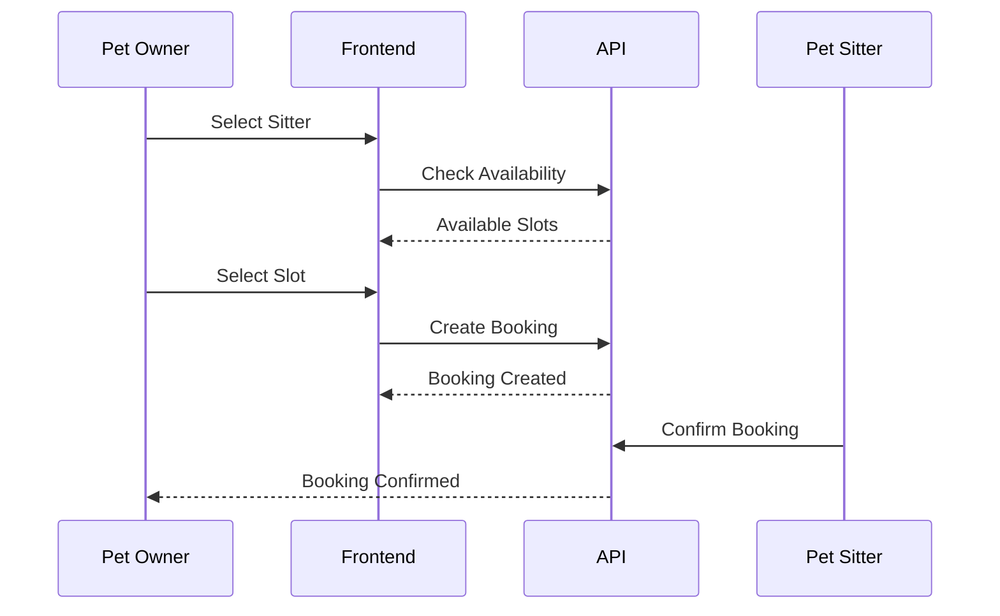

# API Foundation & Standards

---

# Cover Page

| Item          | Details                  |
| ------------- | ------------------------ |
| Document      | OpenAPI Specification    |
| Project       | WoofBnB                  |
| Version       | 1.0                      |
| Specification | OpenAPI 3.1              |
| Format        | REST + JSON              |
| Audience      | Developers, QA, AI Tools |

---

# Revision History

| Version | Date        | Author             | Description               |
| ------- | ----------- | ------------------ | ------------------------- |
| 1.0     | August 2026 | Solution Architect | Initial API Specification |

---

# 1. Purpose

This document defines the complete REST API contract for WoofBnB.

It serves as the authoritative reference for:

- Frontend integration
- Backend implementation
- QA validation
- API documentation
- AI-assisted code generation

---

# 2. Scope

The API exposes capabilities for:

- Authentication
- Pet sitter discovery
- Geolocation search
- Registration
- Bookings _(Future)_
- Reviews _(Future)_
- Notifications _(Future)_
- Administration _(Future)_

---

# 3. API Design Principles

| ID      | Principle                      |
| ------- | ------------------------------ |
| API-001 | RESTful resource-oriented URLs |
| API-002 | JSON request/response bodies   |
| API-003 | Stateless communication        |
| API-004 | Consistent response envelope   |
| API-005 | Predictable HTTP status codes  |
| API-006 | Backward-compatible evolution  |

---

# 4. Base URL Strategy

## Development

```text
http://localhost:5000/api/v1
```

## Staging

```text
https://staging-api.woofbnb.com/api/v1
```

## Production

```text
https://api.woofbnb.com/api/v1
```

---

# ADR-038 — API Versioning

**Decision**

All endpoints are versioned using the URL path.

Example:

```text
/api/v1/pet-sitters
```

**Reason**

Allows non-breaking evolution of the API.

---

# 5. Resource Structure

| Resource       | Endpoint                    |
| -------------- | --------------------------- |
| Authentication | `/auth`                     |
| Users          | `/users`                    |
| Pet Sitters    | `/pet-sitters`              |
| Search         | `/pet-sitters/nearby`       |
| Bookings       | `/bookings` _(Future)_      |
| Reviews        | `/reviews` _(Future)_       |
| Availability   | `/availability` _(Future)_  |
| Notifications  | `/notifications` _(Future)_ |

---

# 6. HTTP Methods

| Method | Usage          |
| ------ | -------------- |
| GET    | Read           |
| POST   | Create         |
| PUT    | Full update    |
| PATCH  | Partial update |
| DELETE | Logical delete |

---

# 7. Standard Response Format

Every API response follows the same structure.

## Success

```json
{
  "success": true,
  "message": "Operation completed successfully.",
  "data": {},
  "meta": {}
}
```

---

## Error

```json
{
  "success": false,
  "message": "Validation failed.",
  "errors": [
    {
      "field": "email",
      "message": "Email is required."
    }
  ]
}
```

---

# ADR-039 — Unified Response Envelope

**Decision**

All endpoints return a consistent response structure.

**Reason**

Simplifies frontend handling and improves API predictability.

---

# 8. Standard HTTP Status Codes

| Status | Meaning                 |
| ------ | ----------------------- |
| 200    | Success                 |
| 201    | Resource Created        |
| 204    | No Content              |
| 400    | Validation Error        |
| 401    | Unauthorized            |
| 403    | Forbidden               |
| 404    | Resource Not Found      |
| 409    | Conflict                |
| 422    | Business Rule Violation |
| 429    | Too Many Requests       |
| 500    | Internal Server Error   |

---

# 9. Pagination Standard

Collection endpoints return paginated data.

## Query Parameters

| Parameter | Default   |
| --------- | --------- |
| page      | 1         |
| limit     | 20        |
| sort      | createdAt |
| order     | desc      |

---

## Pagination Response

```json
{
  "success": true,
  "data": [],
  "meta": {
    "page": 1,
    "limit": 20,
    "totalItems": 145,
    "totalPages": 8
  }
}
```

---

# 10. Filtering Standard

Supported query parameters:

| Parameter | Example |
| --------- | ------- |
| city      | Delhi   |
| verified  | true    |
| radius    | 5       |
| rating    | 4.5     |
| page      | 1       |
| limit     | 20      |

---

# 11. Authentication Strategy

| Endpoint Type  | Authentication |
| -------------- | -------------- |
| Public Search  | None           |
| Registration   | None           |
| Login          | None           |
| User Profile   | JWT            |
| Bookings       | JWT            |
| Reviews        | JWT            |
| Administration | JWT + Role     |

---

# 12. Rate Limiting

| Endpoint      | Limit        |
| ------------- | ------------ |
| Login         | 5/min        |
| Registration  | 3/min        |
| Nearby Search | 100/min      |
| Public APIs   | Configurable |
| Admin APIs    | Configurable |

---

# ADR-040 — Endpoint-Specific Rate Limits

**Decision**

Different endpoint categories have different rate limits.

**Reason**

Protects sensitive operations while allowing high-volume public searches.

---

# 13. API Naming Standards

## Endpoints

Use:

```text
kebab-case
```

Example:

```text
pet-sitters
```

---

## Query Parameters

Use:

```text
camelCase
```

Example:

```text
page
radius
sort
```

---

## JSON Fields

Use:

```text
camelCase
```

Example:

```text
businessName
createdAt
verificationStatus
```

---

# 14. Requirement Traceability

Every endpoint must map back to the business documentation.

| Business Artifact   | API Artifact        |
| ------------------- | ------------------- |
| BR                  | Endpoint            |
| FR                  | Request Body        |
| User Story          | Business Operation  |
| Acceptance Criteria | Response Validation |
| Database Entity     | DTO                 |

---

# 15. Current API Assessment

| Module         | Status     |
| -------------- | ---------- |
| Authentication | ✅ Present |
| Pet Sitters    | ✅ Present |
| Nearby Search  | ✅ Present |
| Registration   | ✅ Present |
| Swagger        | ✅ Present |
| Bookings       | 🚀 Future  |
| Reviews        | 🚀 Future  |
| Notifications  | 🚀 Future  |

---

# API Readiness Summary

| Area            | Status          |
| --------------- | --------------- |
| Versioning      | ✅ Defined      |
| Response Format | ✅ Standardized |
| Authentication  | ✅ Planned      |
| Pagination      | ✅ Defined      |
| Filtering       | ✅ Defined      |
| Error Handling  | ✅ Standardized |
| Rate Limiting   | ✅ Defined      |

# 16. Authentication Module Overview

## Purpose

The Authentication API manages user identity, session creation, and access to protected resources.

**Module Status:** ✅ Current (Core Authentication Present)

---

## Business Traceability

| Business Requirement | Reference               |
| -------------------- | ----------------------- |
| BR-001               | User Registration       |
| BR-002               | User Authentication     |
| FR-001               | Secure Login            |
| US-001               | Register as a Pet Owner |
| US-002               | Login to Platform       |

---

# Authentication Workflow

```mermaid
sequenceDiagram

User->>Frontend: Enter Credentials

Frontend->>API: POST /auth/login

API->>Auth Service

Auth Service->>User Repository

User Repository->>MongoDB

MongoDB-->>Auth Service

Auth Service-->>JWT Token

JWT Token-->>Frontend

Frontend-->>Protected Routes
```

---

# 17. Register User

## Endpoint

```http
POST /api/v1/auth/register
```

---

## Description

Creates a new user account.

---

## Authentication

**Public**

---

## Request Body

| Field     | Type   | Required | Validation      |
| --------- | ------ | -------- | --------------- |
| firstName | string | ✅       | 2–100 chars     |
| lastName  | string | ✅       | 2–100 chars     |
| email     | string | ✅       | Valid email     |
| password  | string | ✅       | Minimum 8 chars |
| role      | enum   | 🔄       | OWNER / SITTER  |

---

## Example Request

```json
{
  "firstName": "Rahul",
  "lastName": "Sharma",
  "email": "rahul@example.com",
  "password": "StrongPassword123",
  "role": "OWNER"
}
```

---

## Success Response

**201 Created**

```json
{
  "success": true,
  "message": "User registered successfully.",
  "data": {
    "id": "...",
    "email": "rahul@example.com",
    "role": "OWNER"
  }
}
```

---

## Error Responses

| Status | Reason                |
| ------ | --------------------- |
| 400    | Validation failed     |
| 409    | Email already exists  |
| 500    | Internal server error |

---

## Repository Mapping

```text
AuthController
      ↓
AuthService
      ↓
UserRepository
```

---

# 18. Login

## Endpoint

```http
POST /api/v1/auth/login
```

---

## Description

Authenticates an existing user.

---

## Authentication

Public

---

## Request

| Field    | Required |
| -------- | -------- |
| email    | ✅       |
| password | ✅       |

---

## Example Request

```json
{
  "email": "rahul@example.com",
  "password": "StrongPassword123"
}
```

---

## Success Response

```json
{
  "success": true,
  "message": "Login successful.",
  "data": {
    "accessToken": "...",
    "refreshToken": "...",
    "user": {
      "id": "...",
      "role": "OWNER"
    }
  }
}
```

---

## Error Responses

| Status | Description         |
| ------ | ------------------- |
| 400    | Invalid payload     |
| 401    | Invalid credentials |
| 429    | Too many attempts   |

---

# ADR-041 — JWT-Based Login

**Decision**

Authentication returns JWT access and refresh tokens.

**Reason**

Supports stateless authentication and future horizontal scaling.

---

# 19. Logout

## Endpoint

```http
POST /api/v1/auth/logout
```

---

## Authentication

JWT Required

---

## Description

Terminates the active user session.

---

## Success

```json
{
  "success": true,
  "message": "Logged out successfully."
}
```

---

# 20. Refresh Access Token

## Endpoint

```http
POST /api/v1/auth/refresh
```

---

## Authentication

Refresh Token Required

---

## Purpose

Issues a new access token without requiring the user to log in again.

---

## Success Response

```json
{
  "success": true,
  "data": {
    "accessToken": "..."
  }
}
```

---

# 21. Get Current User

## Endpoint

```http
GET /api/v1/auth/me
```

---

## Authentication

JWT Required

---

## Success Response

```json
{
  "success": true,
  "data": {
    "id": "...",
    "firstName": "Rahul",
    "lastName": "Sharma",
    "email": "rahul@example.com",
    "role": "OWNER"
  }
}
```

---

# 22. Change Password

## Endpoint

```http
PATCH /api/v1/auth/change-password
```

---

## Authentication

JWT Required

---

## Request Body

| Field           | Required |
| --------------- | -------- |
| currentPassword | ✅       |
| newPassword     | ✅       |

---

## Validation

- Current password must match.
- New password must meet password policy.
- New password must differ from the current password.

---

# 23. Future Authentication APIs

These APIs are planned for future releases.

| Endpoint                         | Status    |
| -------------------------------- | --------- |
| POST `/auth/forgot-password`     | 🚀 Future |
| POST `/auth/reset-password`      | 🚀 Future |
| POST `/auth/verify-email`        | 🚀 Future |
| POST `/auth/resend-verification` | 🚀 Future |
| GET `/auth/sessions`             | 🚀 Future |
| DELETE `/auth/sessions/{id}`     | 🚀 Future |

---

# 24. Authentication Error Model

Standard authentication errors.

```json
{
  "success": false,
  "message": "Authentication failed.",
  "errors": [
    {
      "code": "INVALID_CREDENTIALS",
      "message": "Email or password is incorrect."
    }
  ]
}
```

---

## Error Codes

| Code                | Meaning       |
| ------------------- | ------------- |
| INVALID_CREDENTIALS | Login failed  |
| TOKEN_EXPIRED       | JWT expired   |
| TOKEN_INVALID       | Invalid token |
| ACCESS_DENIED       | Unauthorized  |
| ACCOUNT_DISABLED    | User inactive |

---

# 25. Authentication Rate Limits

| Endpoint        | Limit                   |
| --------------- | ----------------------- |
| Register        | 3 requests/minute/IP    |
| Login           | 5 requests/minute/IP    |
| Refresh Token   | 30 requests/minute/user |
| Change Password | 5 requests/hour/user    |

---

# Security Requirements

- Passwords stored as hashes only.
- JWT signed with secure secret.
- HTTPS mandatory in production.
- Refresh tokens revocable.
- Authentication events logged.

---

# Authentication API Summary

| Endpoint                | Method | Auth          |
| ----------------------- | ------ | ------------- |
| `/auth/register`        | POST   | Public        |
| `/auth/login`           | POST   | Public        |
| `/auth/logout`          | POST   | JWT           |
| `/auth/refresh`         | POST   | Refresh Token |
| `/auth/me`              | GET    | JWT           |
| `/auth/change-password` | PATCH  | JWT           |

---

# Current Implementation Assessment

| API                | Status         |
| ------------------ | -------------- |
| Registration       | ✅ Present     |
| Login              | ✅ Present     |
| JWT Authentication | ✅ Present     |
| Logout             | 🔄 Standardize |
| Refresh Token      | 🔄 Enhance     |
| Password Recovery  | 🚀 Future      |

---

**Role:** 🏗️ **Solution Architect**

Excellent. This is the **core API** of WoofBnB. Everything the user experiences on the landing page—location detection, city search, nearby discovery, and the interactive map—depends on these endpoints.

This section is aligned with:

- ✅ `PROJECT_DOCUMENTATION.md`
- ✅ `SOFTWARE_ARCHITECTURE.md`
- ✅ `DATABASE_DESIGN.md`
- ✅ Your current codebase

---

# 26. Discovery Module Overview

## Purpose

The Discovery API enables pet owners to locate verified pet sitters using either:

- Browser geolocation
- City-based search

This is the primary business capability of WoofBnB.

---

## Business Traceability

| Requirement | Reference                  |
| ----------- | -------------------------- |
| BR-003      | Location-Based Discovery   |
| FR-007      | Nearby Pet Sitters         |
| FR-008      | City Search                |
| US-003      | Find Nearby Pet Sitters    |
| US-004      | Search Pet Sitters by City |

---

# Discovery Workflow

```mermaid
sequenceDiagram

User->>Frontend: Current Location

Frontend->>Nearby API

Nearby API->>PetSitter Service

Service->>Repository

Repository->>MongoDB Geo Query

MongoDB-->>Repository

Repository-->>Service

Service-->>Frontend

Frontend-->>Map + Cards
```

---

# 27. Register Pet Sitter

## Endpoint

```http
POST /api/v1/pet-sitters
```

---

## Description

Creates a new pet sitter profile linked to an authenticated user.

---

## Authentication

JWT Required

---

## Request Body

| Field           | Required | Validation     |
| --------------- | -------- | -------------- |
| businessName    | ✅       | 2–150 chars    |
| bio             | 🔄       | Max 1000 chars |
| experienceYears | 🔄       | ≥0             |
| address         | ✅       | Required       |
| city            | ✅       | Required       |
| latitude        | ✅       | -90 to 90      |
| longitude       | ✅       | -180 to 180    |

---

## Success

**201 Created**

```json
{
  "success": true,
  "message": "Pet sitter profile created.",
  "data": {
    "id": "...",
    "verified": false
  }
}
```

---

## Error Responses

| Status | Description            |
| ------ | ---------------------- |
| 400    | Validation failed      |
| 401    | Unauthorized           |
| 409    | Profile already exists |

---

## Traceability

| Layer      | Component           |
| ---------- | ------------------- |
| Controller | PetSitterController |
| Service    | PetSitterService    |
| Repository | PetSitterRepository |
| Entity     | petSitters          |

---

# 28. Get Nearby Pet Sitters

## Endpoint

```http
GET /api/v1/pet-sitters/nearby
```

---

## Description

Returns verified pet sitters near supplied coordinates.

---

## Authentication

Public

---

## Query Parameters

| Parameter | Required | Example |
| --------- | -------- | ------- |
| latitude  | ✅       | 28.6139 |
| longitude | ✅       | 77.2090 |
| radius    | 🔄       | 5       |
| page      | 🔄       | 1       |
| limit     | 🔄       | 20      |

---

## Example Request

```http
GET /api/v1/pet-sitters/nearby?latitude=28.6139&longitude=77.2090&radius=5
```

---

## Success Response

```json
{
  "success": true,
  "data": [
    {
      "id": "...",
      "businessName": "Happy Paws Care",
      "distance": 1.2,
      "rating": 4.9,
      "verified": true
    }
  ],
  "meta": {
    "page": 1,
    "totalItems": 15
  }
}
```

---

## Error Responses

| Status | Reason              |
| ------ | ------------------- |
| 400    | Invalid coordinates |
| 500    | Search failure      |

---

## Database Mapping

```text
2dsphere Index

↓

GeoJSON Query

↓

Nearby Results
```

---

# ADR-042 — Radius-Based Search

**Decision**

Nearby discovery is performed using configurable radius searches.

**Reason**

Provides consistent, scalable location-based discovery.

---

# 29. Search by City

## Endpoint

```http
GET /api/v1/pet-sitters/search
```

---

## Description

Searches for pet sitters by city name.

---

## Query Parameters

| Parameter | Required |
| --------- | -------- |
| city      | ✅       |
| page      | 🔄       |
| limit     | 🔄       |

---

## Workflow

```text
City Name

↓

Geocoder

↓

Coordinates

↓

Nearby Query

↓

Results
```

---

## Success

```json
{
  "success": true,
  "data": []
}
```

---

# 30. Get Pet Sitter Details

## Endpoint

```http
GET /api/v1/pet-sitters/{id}
```

---

## Authentication

Public

---

## Description

Returns complete public information for a single pet sitter.

---

## Path Parameters

| Parameter | Required |
| --------- | -------- |
| id        | ✅       |

---

## Success Response

```json
{
  "success": true,
  "data": {
    "businessName": "Happy Paws Care",
    "bio": "...",
    "rating": 4.9,
    "reviewCount": 52,
    "city": "Delhi"
  }
}
```

---

## Error Responses

| Status | Description          |
| ------ | -------------------- |
| 404    | Pet sitter not found |

---

# 31. Update Pet Sitter Profile

## Endpoint

```http
PATCH /api/v1/pet-sitters/{id}
```

---

## Authentication

JWT Required

---

## Authorization

Profile Owner

---

## Editable Fields

- Business Name
- Bio
- Address
- Location
- Experience
- Profile Image

---

## Success

```json
{
  "success": true,
  "message": "Profile updated successfully."
}
```

---

# 32. Map Data Endpoint

## Endpoint

```http
GET /api/v1/pet-sitters/map
```

---

## Purpose

Returns lightweight data optimized for rendering markers.

---

## Response

```json
{
  "success": true,
  "data": [
    {
      "id": "...",
      "latitude": 28.6139,
      "longitude": 77.209,
      "verified": true
    }
  ]
}
```

---

## Why Separate Endpoint?

Benefits:

- Smaller payload
- Faster rendering
- Reduced bandwidth
- Supports clustering

---

# ADR-043 — Lightweight Map DTO

**Decision**

Map endpoints return only fields required for marker rendering.

**Reason**

Improves frontend performance.

---

# 33. Discovery Filters

Future filtering parameters.

| Parameter    | Status |
| ------------ | ------ |
| verified     | ✅     |
| city         | ✅     |
| rating       | 🚀     |
| priceRange   | 🚀     |
| experience   | 🚀     |
| petType      | 🚀     |
| availability | 🚀     |

---

# 34. Sorting

Supported values.

| Sort     | Description     |
| -------- | --------------- |
| distance | Default         |
| rating   | Highest rated   |
| newest   | Recently joined |
| reviews  | Most reviewed   |

---

# 35. Rate Limits

| Endpoint      | Limit      |
| ------------- | ---------- |
| Nearby Search | 100/min/IP |
| City Search   | 100/min/IP |
| Details       | 200/min/IP |
| Registration  | 5/min/User |

---

# 36. Discovery API Summary

| Endpoint              | Method | Auth   |
| --------------------- | ------ | ------ |
| `/pet-sitters`        | POST   | JWT    |
| `/pet-sitters/nearby` | GET    | Public |
| `/pet-sitters/search` | GET    | Public |
| `/pet-sitters/{id}`   | GET    | Public |
| `/pet-sitters/{id}`   | PATCH  | JWT    |
| `/pet-sitters/map`    | GET    | Public |

---

# Current Implementation Assessment

| Endpoint                | Status                                  |
| ----------------------- | --------------------------------------- |
| Pet Sitter Registration | ✅ Present                              |
| Nearby Search           | ✅ Present                              |
| City Search             | ✅ Present                              |
| Profile Details         | 🔄 Expand response DTO                  |
| Update Profile          | 🔄 Standardize validation               |
| Map Endpoint            | 🔄 Separate lightweight DTO recommended |

---

# 37. Marketplace Module Overview

## Purpose

The Marketplace APIs manage the lifecycle of bookings between pet owners and pet sitters.

These endpoints support:

- Availability management
- Booking creation
- Booking status updates
- Reviews
- Future notifications

---

## Business Traceability

| Requirement | Reference          |
| ----------- | ------------------ |
| BR-005      | Booking Management |
| BR-006      | Reviews & Ratings  |
| FR-015      | Availability       |
| FR-016      | Booking Lifecycle  |
| US-010      | Book a Pet Sitter  |
| US-011      | Leave a Review     |

---

# Marketplace Workflow



---

# 38. Get Availability

## Endpoint

```http
GET /api/v1/availability
```

---

## Description

Returns available time slots for a specific pet sitter.

---

## Authentication

Public

---

## Query Parameters

| Parameter   | Required | Description           |
| ----------- | -------- | --------------------- |
| petSitterId | ✅       | Pet sitter identifier |
| startDate   | 🔄       | Filter start date     |
| endDate     | 🔄       | Filter end date       |

---

## Success Response

```json
{
  "success": true,
  "data": [
    {
      "date": "2026-09-15",
      "startTime": "09:00",
      "endTime": "11:00",
      "status": "AVAILABLE"
    }
  ]
}
```

---

# 39. Create Booking

## Endpoint

```http
POST /api/v1/bookings
```

---

## Authentication

JWT Required

Role: **Pet Owner**

---

## Request Body

| Field          | Required | Validation      |
| -------------- | -------- | --------------- |
| petId          | ✅       | Existing pet    |
| petSitterId    | ✅       | Existing sitter |
| availabilityId | ✅       | Available slot  |
| bookingDate    | ✅       | Future date     |
| notes          | 🔄       | Max 1000 chars  |

---

## Success Response

**201 Created**

```json
{
  "success": true,
  "message": "Booking request submitted.",
  "data": {
    "bookingId": "...",
    "status": "REQUESTED"
  }
}
```

---

## Error Responses

| Status | Reason                  |
| ------ | ----------------------- |
| 400    | Validation failed       |
| 401    | Unauthorized            |
| 404    | Availability not found  |
| 409    | Slot already booked     |
| 422    | Business rule violation |

---

# ADR-044 — Booking Request Workflow

**Decision**

Bookings begin in a `REQUESTED` state and require sitter confirmation.

**Reason**

Prevents automatic reservations and gives sitters control over availability.

---

# 40. Get User Bookings

## Endpoint

```http
GET /api/v1/bookings
```

---

## Authentication

JWT Required

---

## Query Parameters

| Parameter | Description                     |
| --------- | ------------------------------- |
| status    | Requested, Confirmed, Completed |
| page      | Pagination                      |
| limit     | Page size                       |

---

## Success Response

```json
{
  "success": true,
  "data": [],
  "meta": {
    "page": 1,
    "totalItems": 12
  }
}
```

---

# 41. Get Booking Details

## Endpoint

```http
GET /api/v1/bookings/{bookingId}
```

---

## Authentication

JWT Required

---

## Authorization

Accessible only to:

- Booking Owner
- Assigned Pet Sitter
- Administrator

---

# 42. Update Booking Status

## Endpoint

```http
PATCH /api/v1/bookings/{bookingId}/status
```

---

## Authentication

JWT Required

Role: **Pet Sitter**

---

## Request Body

```json
{
  "status": "CONFIRMED"
}
```

---

## Allowed Status Transitions

```mermaid
stateDiagram-v2

[*]

-->

REQUESTED

REQUESTED

-->

CONFIRMED

REQUESTED

-->

REJECTED

CONFIRMED

-->

COMPLETED

REQUESTED

-->

CANCELLED
```

---

## Business Rules

- Completed bookings cannot be edited.
- Cancelled bookings cannot be reactivated.
- Rejected bookings are final.

---

# ADR-045 — Controlled Booking State Machine

**Decision**

Booking status changes follow a predefined state machine.

**Reason**

Prevents invalid transitions and preserves workflow integrity.

---

# 43. Submit Review

## Endpoint

```http
POST /api/v1/reviews
```

---

## Authentication

JWT Required

Role: **Pet Owner**

---

## Request Body

| Field      | Required |
| ---------- | -------- |
| bookingId  | ✅       |
| rating     | ✅       |
| reviewText | 🔄       |

---

## Validation

| Rule       | Value             |
| ---------- | ----------------- |
| Rating     | 1–5               |
| Booking    | Must be completed |
| One Review | Per booking       |

---

## Success Response

```json
{
  "success": true,
  "message": "Review submitted successfully."
}
```

---

## Error Responses

| Status | Description           |
| ------ | --------------------- |
| 400    | Invalid rating        |
| 403    | Booking not eligible  |
| 409    | Review already exists |

---

# ADR-046 — Verified Reviews Only

**Decision**

Reviews are accepted only for completed bookings.

**Reason**

Maintains trust and prevents fraudulent reviews.

---

# 44. Get Reviews

## Endpoint

```http
GET /api/v1/reviews
```

---

## Query Parameters

| Parameter   | Description      |
| ----------- | ---------------- |
| petSitterId | Filter by sitter |
| page        | Pagination       |
| limit       | Page size        |

---

## Success Response

```json
{
  "success": true,
  "data": [
    {
      "rating": 5,
      "reviewText": "Excellent service.",
      "reviewDate": "2026-09-20"
    }
  ]
}
```

---

# 45. Notification Events

The following actions should trigger notifications.

| Event                 | Recipient    |
| --------------------- | ------------ |
| Booking Requested     | Pet Sitter   |
| Booking Confirmed     | Pet Owner    |
| Booking Rejected      | Pet Owner    |
| Booking Cancelled     | Both Parties |
| Review Submitted      | Pet Sitter   |
| Verification Approved | Pet Sitter   |

Notification delivery mechanisms (email, push, in-app) will be defined in a future iteration.

---

# 46. Marketplace Error Codes

| Code                   | Meaning                   |
| ---------------------- | ------------------------- |
| SLOT_UNAVAILABLE       | Time slot already booked  |
| INVALID_BOOKING_STATUS | Illegal status transition |
| REVIEW_ALREADY_EXISTS  | Duplicate review          |
| BOOKING_NOT_COMPLETED  | Cannot review yet         |
| PET_NOT_FOUND          | Invalid pet reference     |
| PET_SITTER_NOT_FOUND   | Invalid sitter reference  |

---

# 47. Marketplace API Summary

| Endpoint                | Method | Auth   |
| ----------------------- | ------ | ------ |
| `/availability`         | GET    | Public |
| `/bookings`             | POST   | JWT    |
| `/bookings`             | GET    | JWT    |
| `/bookings/{id}`        | GET    | JWT    |
| `/bookings/{id}/status` | PATCH  | JWT    |
| `/reviews`              | POST   | JWT    |
| `/reviews`              | GET    | Public |

---

# Current Implementation Assessment

| API                | Status     |
| ------------------ | ---------- |
| Availability       | 🚀 Planned |
| Booking Creation   | 🚀 Planned |
| Booking Management | 🚀 Planned |
| Reviews            | 🚀 Planned |
| Notifications      | 🚀 Planned |

These APIs are intentionally designed to align with the previously defined **Database Design** and **Software Architecture**, minimizing future implementation changes.

# Common Schemas, DTOs & Error Models

---

# 48. Purpose

This section defines reusable API components shared across all endpoints.

Objectives:

- Eliminate duplication
- Standardize request/response structures
- Improve API consistency
- Simplify frontend integration
- Enable reusable OpenAPI components

---

# 49. Standard Response DTO

All successful API responses follow a common envelope.

## Success Response

```json
{
  "success": true,
  "message": "Operation completed successfully.",
  "data": {},
  "meta": {}
}
```

---

## Response Fields

| Field   | Type         | Required | Description                       |
| ------- | ------------ | -------- | --------------------------------- |
| success | Boolean      | ✅       | Operation result                  |
| message | String       | ✅       | Human-readable message            |
| data    | Object/Array | ✅       | Primary payload                   |
| meta    | Object       | 🔄       | Pagination or additional metadata |

---

# ADR-047 — Standard Response DTO

**Decision**

Every successful endpoint returns the same response envelope.

**Reason**

Provides predictable client behavior and reduces frontend complexity.

---

# 50. Standard Error DTO

Every failed request follows a consistent error structure.

```json
{
  "success": false,
  "message": "Validation failed.",
  "errors": [
    {
      "field": "email",
      "code": "INVALID_EMAIL",
      "message": "Email format is invalid."
    }
  ],
  "traceId": "req-123456789"
}
```

---

## Error Fields

| Field   | Description                            |
| ------- | -------------------------------------- |
| success | Always false                           |
| message | General error summary                  |
| errors  | Detailed validation or business errors |
| traceId | Correlation identifier for debugging   |

---

# ADR-048 — Standard Error Model

**Decision**

All API errors use a shared error DTO.

**Reason**

Simplifies client-side error handling and supports centralized logging.

---

# 51. Pagination DTO

Collection endpoints return paginated results.

```json
{
  "page": 1,
  "limit": 20,
  "totalItems": 135,
  "totalPages": 7,
  "hasNext": true,
  "hasPrevious": false
}
```

---

## Pagination Fields

| Field       | Description             |
| ----------- | ----------------------- |
| page        | Current page            |
| limit       | Items per page          |
| totalItems  | Total matching records  |
| totalPages  | Number of pages         |
| hasNext     | More pages available    |
| hasPrevious | Previous page available |

---

# 52. Common Request Parameters

These parameters are reused across multiple endpoints.

## Pagination

| Parameter | Type    | Default |
| --------- | ------- | ------- |
| page      | Integer | 1       |
| limit     | Integer | 20      |

---

## Sorting

| Parameter | Values                      |
| --------- | --------------------------- |
| sort      | createdAt, rating, distance |
| order     | asc, desc                   |

---

## Filtering

| Parameter | Example |
| --------- | ------- |
| city      | Delhi   |
| verified  | true    |
| rating    | 4.5     |
| radius    | 5       |

---

# 53. Authentication DTOs

## Login Request

```json
{
  "email": "user@example.com",
  "password": "StrongPassword123"
}
```

---

## Login Response

```json
{
  "accessToken": "jwt-token",
  "refreshToken": "refresh-token",
  "expiresIn": 3600,
  "user": {
    "id": "...",
    "role": "OWNER"
  }
}
```

---

## Current User DTO

```json
{
  "id": "...",
  "firstName": "Rahul",
  "lastName": "Sharma",
  "email": "rahul@example.com",
  "role": "OWNER"
}
```

---

# 54. Pet Sitter DTO

## Summary DTO (Search Results)

```json
{
  "id": "...",
  "businessName": "Happy Paws Care",
  "city": "Delhi",
  "distance": 1.8,
  "rating": 4.9,
  "verified": true,
  "profileImageUrl": "https://..."
}
```

---

## Detail DTO

```json
{
  "id": "...",
  "businessName": "Happy Paws Care",
  "bio": "Experienced pet sitter...",
  "experienceYears": 6,
  "rating": 4.9,
  "reviewCount": 58,
  "city": "Delhi",
  "verified": true,
  "location": {
    "latitude": 28.6139,
    "longitude": 77.209
  }
}
```

---

# ADR-049 — Separate Summary & Detail DTOs

**Decision**

Use lightweight DTOs for lists and richer DTOs for detail endpoints.

**Reason**

Reduces payload size while providing complete information when required.

---

# 55. Booking DTO

```json
{
  "bookingId": "...",
  "status": "CONFIRMED",
  "bookingDate": "2026-09-15",
  "petId": "...",
  "petSitterId": "...",
  "totalAmount": 1200
}
```

---

# 56. Review DTO

```json
{
  "reviewId": "...",
  "rating": 5,
  "reviewText": "Excellent service.",
  "reviewDate": "2026-09-20",
  "reviewerName": "Rahul Sharma"
}
```

---

# 57. Notification DTO

```json
{
  "notificationId": "...",
  "type": "BOOKING_CONFIRMED",
  "title": "Booking Confirmed",
  "message": "Your booking has been confirmed.",
  "isRead": false,
  "createdAt": "2026-09-10T10:00:00Z"
}
```

---

# 58. Common Enums

## User Roles

| Value  |
| ------ |
| OWNER  |
| SITTER |
| ADMIN  |

---

## Booking Status

| Value     |
| --------- |
| REQUESTED |
| CONFIRMED |
| COMPLETED |
| CANCELLED |
| REJECTED  |

---

## Verification Status

| Value    |
| -------- |
| PENDING  |
| VERIFIED |
| REJECTED |

---

## Notification Types

| Value        |
| ------------ |
| BOOKING      |
| REVIEW       |
| PAYMENT      |
| SYSTEM       |
| VERIFICATION |

---

# 59. Standard Headers

| Header           | Required       | Description      |
| ---------------- | -------------- | ---------------- |
| Authorization    | JWT Endpoints  | Bearer token     |
| Content-Type     | Yes            | application/json |
| Accept           | Yes            | application/json |
| X-Correlation-Id | 🔄 Recommended | Request tracing  |

---

# 60. Common Validation Rules

| Field     | Rule                 |
| --------- | -------------------- |
| Email     | RFC-compliant format |
| Password  | Minimum 8 characters |
| Rating    | 1–5                  |
| Latitude  | -90 to 90            |
| Longitude | -180 to 180          |
| Page      | ≥ 1                  |
| Limit     | 1–100                |

---

# 61. OpenAPI Components Structure

The OpenAPI document should define reusable components under:

```text
components
├── schemas
│   ├── User
│   ├── PetSitter
│   ├── Booking
│   ├── Review
│   ├── Notification
│   └── Error
│
├── responses
│   ├── Success
│   ├── ValidationError
│   ├── Unauthorized
│   ├── NotFound
│   └── Conflict
│
├── parameters
│   ├── Page
│   ├── Limit
│   ├── Sort
│   └── Radius
│
└── securitySchemes
    └── BearerAuth
```

---

# 62. DTO Design Principles

| Principle | Description                               |
| --------- | ----------------------------------------- |
| DTO-001   | Never expose database entities directly   |
| DTO-002   | Return only fields required by the client |
| DTO-003   | Separate request and response DTOs        |
| DTO-004   | Version DTOs through API versioning       |
| DTO-005   | Keep DTOs persistence-agnostic            |

---

# Current Implementation Assessment

| Area               | Status                              |
| ------------------ | ----------------------------------- |
| Response Envelope  | 🔄 Standardize across all endpoints |
| Error Model        | 🔄 Add traceId and error codes      |
| Pagination DTO     | 🔄 Apply consistently               |
| DTO Separation     | 🔄 Expand for future modules        |
| OpenAPI Components | 🚀 To be generated                  |

---

# Security, Validation & API Versioning

---

# 63. API Security Overview

## Purpose

The API security model protects business resources while maintaining a simple integration experience.

Security is enforced using multiple layers:

- Authentication
- Authorization
- Validation
- Rate limiting
- Transport security
- Audit logging

---

## Security Architecture

```mermaid
flowchart LR

Client

-->

HTTPS

-->

Authentication

-->

Authorization

-->

Validation

-->

Business Logic

-->

Database
```

---

# 64. Authentication Scheme

WoofBnB uses **JWT Bearer Authentication** for protected endpoints.

---

## Security Scheme

```yaml
BearerAuth:
  type: http
  scheme: bearer
  bearerFormat: JWT
```

---

## Authorization Header

```http
Authorization: Bearer <access-token>
```

---

## JWT Claims

| Claim | Description     |
| ----- | --------------- |
| sub   | User identifier |
| email | User email      |
| role  | User role       |
| iat   | Issued at       |
| exp   | Expiration time |

---

# ADR-050 — JWT Bearer Authentication

**Decision**

Use JWT Bearer tokens for all protected APIs.

**Reason**

Supports stateless authentication, scalability, and compatibility with modern frontend frameworks.

---

# 65. Authorization Matrix

## Roles

| Role   | Description             |
| ------ | ----------------------- |
| Guest  | Unauthenticated visitor |
| Owner  | Pet owner               |
| Sitter | Registered pet sitter   |
| Admin  | Platform administrator  |

---

## Endpoint Permissions

| Endpoint            | Guest | Owner | Sitter | Admin |
| ------------------- | :---: | :---: | :----: | :---: |
| Login               |  ✅   |  ✅   |   ✅   |  ✅   |
| Register            |  ✅   |  ✅   |   ✅   |  ✅   |
| Nearby Search       |  ✅   |  ✅   |   ✅   |  ✅   |
| View Sitter         |  ✅   |  ✅   |   ✅   |  ✅   |
| Register Sitter     |  ❌   |  ✅   |   ✅   |  ✅   |
| Update Own Profile  |  ❌   |  ✅   |   ✅   |  ✅   |
| Create Booking      |  ❌   |  ✅   |   ❌   |  ✅   |
| Manage Availability |  ❌   |  ❌   |   ✅   |  ✅   |
| Submit Review       |  ❌   |  ✅   |   ❌   |  ✅   |
| Admin APIs          |  ❌   |  ❌   |   ❌   |  ✅   |

---

# ADR-051 — Role-Based Access Control

**Decision**

Authorization is enforced using RBAC.

**Reason**

Provides clear separation of responsibilities while supporting future administrative features.

---

# 66. Input Validation Standards

All incoming requests must be validated before reaching business logic.

---

## Validation Rules

| Category        | Rule                         |
| --------------- | ---------------------------- |
| Required Fields | Must be present              |
| Data Types      | Strict type validation       |
| Enum Values     | Must match allowed values    |
| Strings         | Trimmed and length-checked   |
| Numbers         | Valid ranges enforced        |
| Dates           | ISO 8601 format              |
| Coordinates     | Latitude/Longitude validated |

---

## Validation Flow

```mermaid
flowchart LR

Request

-->

Schema Validation

-->

Business Validation

-->

Controller

-->

Service
```

---

# ADR-052 — Schema-First Validation

**Decision**

Validate request payloads against predefined schemas before invoking business logic.

**Reason**

Ensures consistency, improves security, and simplifies error handling.

---

# 67. API Versioning Policy

The API uses **URI-based versioning**.

---

## Version Format

```text
/api/v1/
```

---

## Future Versions

```text
/api/v2/
/api/v3/
```

---

## Versioning Rules

| Rule     | Description                                          |
| -------- | ---------------------------------------------------- |
| APIV-001 | Breaking changes require a new version               |
| APIV-002 | Non-breaking additions remain in the current version |
| APIV-003 | Deprecated versions receive advance notice           |
| APIV-004 | Multiple versions may coexist temporarily            |

---

# ADR-053 — URI Versioning

**Decision**

Version APIs through the request path.

**Reason**

Provides clarity and simplifies client adoption.

---

# 68. API Deprecation Policy

Endpoints are retired in a controlled manner.

---

## Deprecation Lifecycle

```mermaid
stateDiagram-v2

[*]

-->

Active

Active

-->

Deprecated

Deprecated

-->

Retired
```

---

## Rules

- Deprecation is documented.
- Existing consumers receive advance notice.
- Replacement endpoints are identified.
- Deprecated endpoints remain available for a defined transition period.

---

# 69. Rate Limiting Policy

Rate limits protect the platform against abuse.

| Endpoint Category | Limit                   |
| ----------------- | ----------------------- |
| Authentication    | 5 requests/minute/IP    |
| Public Search     | 100 requests/minute/IP  |
| Registration      | 3 requests/minute/IP    |
| Booking APIs      | 30 requests/minute/user |
| Admin APIs        | Configurable            |

---

## Rate Limit Response

**429 Too Many Requests**

```json
{
  "success": false,
  "message": "Rate limit exceeded.",
  "retryAfter": 60
}
```

---

# ADR-054 — Endpoint-Specific Rate Limiting

**Decision**

Different API categories have independent rate limits.

**Reason**

Protects critical operations without unnecessarily restricting search traffic.

---

# 70. Idempotency Policy

Certain operations should be idempotent.

| Method               | Idempotent                      |
| -------------------- | ------------------------------- |
| GET                  | ✅                              |
| PUT                  | ✅                              |
| DELETE (Soft Delete) | ✅                              |
| PATCH                | Depends on operation            |
| POST                 | ❌ (unless explicitly designed) |

For future payment-related APIs, support an **Idempotency-Key** header to prevent duplicate transactions.

---

# 71. CORS Policy

Allowed origins vary by environment.

| Environment | Allowed Origins               |
| ----------- | ----------------------------- |
| Development | Local development hosts       |
| Staging     | Staging frontend domain       |
| Production  | Official WoofBnB domains only |

---

## Rules

- Allow only required methods.
- Allow only required headers.
- Restrict credentials to trusted origins.

---

# 72. Security Headers

The API should include standard security headers where applicable.

| Header                    | Purpose                   |
| ------------------------- | ------------------------- |
| Strict-Transport-Security | Force HTTPS               |
| X-Content-Type-Options    | Prevent MIME sniffing     |
| X-Frame-Options           | Prevent clickjacking      |
| Referrer-Policy           | Control referrer data     |
| Content-Security-Policy   | Restrict resource loading |

---

# 73. Audit & Logging

The API should log security-relevant events.

Examples:

- Successful login
- Failed login
- Password change
- Booking creation
- Booking cancellation
- Administrative actions

Sensitive values (passwords, tokens, personal data) must never be written to logs.

---

# ADR-055 — Security Event Logging

**Decision**

Log authentication, authorization, and critical business events.

**Reason**

Supports troubleshooting, auditing, and security monitoring.

---

# 74. API Lifecycle Management

Every endpoint progresses through a controlled lifecycle.


---

# 75. Security & Versioning Assessment

| Area                | Status     |
| ------------------- | ---------- |
| JWT Authentication  | ✅ Defined |
| RBAC                | ✅ Defined |
| Validation Strategy | ✅ Defined |
| Versioning Policy   | ✅ Defined |
| Deprecation Policy  | ✅ Defined |
| Rate Limiting       | ✅ Defined |
| Security Headers    | ✅ Defined |
| Audit Logging       | ✅ Defined |

---

# Architect's Assessment

The security and lifecycle model is intentionally designed to be **framework-independent**. Whether the backend is implemented in **Node.js/Express** today or migrated to **ASP.NET Core** in the future, the authentication model, authorization rules, API versioning strategy, and validation principles remain unchanged. This ensures long-term stability of the API contract while allowing the implementation technology to evolve.

---

# 76. OpenAPI Document Information

```yaml
openapi: 3.1.0

info:
  title: WoofBnB API
  version: 1.0.0
  description: REST API for the WoofBnB pet sitter marketplace.

servers:
  - url: https://api.woofbnb.com/api/v1
    description: Production

  - url: https://staging-api.woofbnb.com/api/v1
    description: Staging

  - url: http://localhost:5000/api/v1
    description: Development
```

---

# 77. API Tags

Endpoints are grouped into logical modules.

```yaml
tags:
  - name: Authentication
    description: User authentication

  - name: Pet Sitters
    description: Pet sitter management

  - name: Search
    description: Location discovery

  - name: Bookings
    description: Marketplace bookings

  - name: Reviews
    description: Ratings & Reviews

  - name: Availability
    description: Sitter schedules

  - name: Notifications
    description: User notifications
```

---

# 78. Security Scheme

```yaml
components:
  securitySchemes:
    BearerAuth:
      type: http

      scheme: bearer

      bearerFormat: JWT
```

---

Protected endpoints declare:

```yaml
security:
  - BearerAuth: []
```

---

# ADR-056 — Global JWT Security Scheme

**Decision**

JWT Bearer authentication is defined once within `components.securitySchemes` and referenced by protected operations.

**Reason**

Reduces duplication and improves consistency.

---

# 79. Reusable Components

The specification should centralize reusable definitions.

```text
components
│
├── schemas
├── responses
├── parameters
├── headers
├── examples
├── requestBodies
└── securitySchemes
```

---

# 80. Common Schemas

## User

```yaml
User:
  type: object

  properties:
    id:
      type: string

    firstName:
      type: string

    lastName:
      type: string

    email:
      type: string

    role:
      type: string
```

---

## PetSitter

```yaml
PetSitter:
  type: object

  properties:
    id:
      type: string

    businessName:
      type: string

    city:
      type: string

    verified:
      type: boolean

    rating:
      type: number
```

---

## Booking

```yaml
Booking:
  type: object

  properties:
    bookingId:
      type: string

    bookingDate:
      type: string

    status:
      type: string
```

---

## Review

```yaml
Review:
  type: object

  properties:
    reviewId:
      type: string

    rating:
      type: integer

    reviewText:
      type: string
```

---

# 81. Standard Responses

```yaml
components:
  responses:
    ValidationError:
      description: Validation Failed

    Unauthorized:
      description: Authentication Required

    Forbidden:
      description: Access Denied

    NotFound:
      description: Resource Not Found

    Conflict:
      description: Resource Conflict
```

---

# 82. Standard Parameters

Reusable query parameters.

```yaml
PageParameter

LimitParameter

SortParameter

RadiusParameter

CityParameter

LatitudeParameter

LongitudeParameter
```

These should be referenced instead of duplicated across endpoints.

---

# ADR-057 — Reusable Parameters

**Decision**

Frequently used query parameters are defined once and referenced.

**Reason**

Improves maintainability and consistency.

---

# 83. Path Example

## Nearby Search

```yaml
/api/v1/pet-sitters/nearby:
  get:
    tags:
      - Search

    summary: Get nearby pet sitters

    parameters:
      - $ref: "#/components/parameters/LatitudeParameter"

      - $ref: "#/components/parameters/LongitudeParameter"

      - $ref: "#/components/parameters/RadiusParameter"

    responses:
      "200":
        description: Success

      "400":
        $ref: "#/components/responses/ValidationError"
```

---

# 84. Request Body Example

```yaml
requestBody:
  required: true

  content:
    application/json:
      schema:
        $ref: "#/components/schemas/LoginRequest"
```

---

# 85. Response Example

```yaml
responses:
  "200":
    description: Login Successful

    content:
      application/json:
        schema:
          $ref: "#/components/schemas/LoginResponse"
```

---

# 86. Example Definitions

Reusable examples improve documentation quality.

```yaml
components:
  examples: LoginExample

    RegisterExample

    NearbySearchExample

    BookingExample

    ReviewExample
```

---

# 87. Documentation Generation

The OpenAPI specification should generate:

- Swagger UI
- Redoc
- Postman Collection
- API SDKs
- Mock Servers

No manual duplication of endpoint documentation should be required.

---

# ADR-058 — OpenAPI as the Single API Source

**Decision**

The OpenAPI specification is the authoritative API contract.

**Reason**

All API documentation, client SDKs, and testing artifacts should be derived from one maintained source.

---

# 88. AI Development Guidance

AI development tools should use the OpenAPI specification to generate:

## Backend

- Controllers
- DTOs
- Validation
- Route registration

---

## Frontend

- API clients
- TypeScript models
- React Query hooks
- Service layer

---

## QA

- API tests
- Mock data
- Contract validation

---

## Rules

AI-generated implementations must:

- Preserve endpoint names.
- Respect request and response schemas.
- Maintain versioning.
- Use standardized error models.
- Follow authentication requirements.

---

# 89. Contract Testing Strategy

Every implementation should be verified against the OpenAPI contract.

Recommended testing layers:

| Layer             | Purpose                    |
| ----------------- | -------------------------- |
| Schema Validation | Request/response structure |
| Contract Tests    | API compatibility          |
| Integration Tests | Service interaction        |
| End-to-End Tests  | Complete workflows         |

Contract testing should be integrated into the CI/CD pipeline to detect breaking API changes before deployment.

---

# 90. OpenAPI Readiness Assessment

| Area                      | Status          |
| ------------------------- | --------------- |
| OpenAPI Version           | ✅ 3.1          |
| Security Scheme           | ✅ Defined      |
| Components                | ✅ Standardized |
| Reusable Parameters       | ✅ Defined      |
| Response Models           | ✅ Defined      |
| Request Models            | ✅ Defined      |
| Contract Testing Strategy | ✅ Defined      |
| AI Generation Guidance    | ✅ Defined      |

---

# Architect's Assessment

The API specification is now structured to function as the **single contract** between all implementation teams. By treating the OpenAPI document as the source of truth, backend implementations, frontend clients, automated tests, SDK generation, and AI-assisted code generation can all remain synchronized.

Rather than maintaining separate documentation for each consumer, every artifact should be generated or validated against the OpenAPI specification. This reduces documentation drift and ensures long-term maintainability.

---

**Role:** 🏗️ **Solution Architect**

Excellent. This completes the **OpenAPI Specification**.

At this point, we have finished the complete **API contract** for WoofBnB. Frontend developers, backend developers, QA engineers, and AI tools now have a shared specification that defines exactly how the system communicates.

# API Governance, Traceability & Final Assessment

---

# 91. API Governance

## Purpose

API governance ensures that all current and future APIs remain consistent, maintainable, secure, and backward compatible.

Every API change must preserve the integrity of the contract unless a new API version is introduced.

---

## Governance Principles

| ID         | Principle                                            |
| ---------- | ---------------------------------------------------- |
| APIGOV-001 | OpenAPI is the single source of truth                |
| APIGOV-002 | Breaking changes require a new API version           |
| APIGOV-003 | Every endpoint must map to a business requirement    |
| APIGOV-004 | API contracts are reviewed before implementation     |
| APIGOV-005 | Documentation and implementation remain synchronized |

---

# 92. API Design Standards

Every endpoint must comply with the following standards.

| Standard   | Description                              |
| ---------- | ---------------------------------------- |
| APISTD-001 | Resource-oriented URLs                   |
| APISTD-002 | HTTP methods follow REST conventions     |
| APISTD-003 | Standard response envelope               |
| APISTD-004 | Consistent error model                   |
| APISTD-005 | Pagination for collection resources      |
| APISTD-006 | JWT security where applicable            |
| APISTD-007 | Request validation before business logic |
| APISTD-008 | API versioning enforced                  |

---

# 93. API Review Checklist

Every new endpoint should be reviewed before implementation.

| Category        | Question                                    |
| --------------- | ------------------------------------------- |
| Business        | Is there a linked business requirement?     |
| Resource Design | Is the endpoint RESTful?                    |
| Security        | Is authentication/authorization correct?    |
| Validation      | Are request rules documented?               |
| Responses       | Are success and error responses defined?    |
| Performance     | Is pagination/filtering required?           |
| Documentation   | Has the OpenAPI specification been updated? |
| Testing         | Are contract tests included?                |

---

# 94. Requirement Traceability Matrix

Every API should remain traceable back to the business documentation.

| Business Requirement           | User Story | API Endpoint              | Database Entity | Service          | Repository          |
| ------------------------------ | ---------- | ------------------------- | --------------- | ---------------- | ------------------- |
| BR-001 User Registration       | US-001     | POST `/auth/register`     | users           | AuthService      | UserRepository      |
| BR-002 User Login              | US-002     | POST `/auth/login`        | users           | AuthService      | UserRepository      |
| BR-003 Nearby Search           | US-003     | GET `/pet-sitters/nearby` | petSitters      | PetSitterService | PetSitterRepository |
| BR-004 Pet Sitter Registration | US-005     | POST `/pet-sitters`       | petSitters      | PetSitterService | PetSitterRepository |
| BR-005 Booking                 | US-010     | POST `/bookings`          | bookings        | BookingService   | BookingRepository   |
| BR-006 Reviews                 | US-011     | POST `/reviews`           | reviews         | ReviewService    | ReviewRepository    |

---

# 95. API Lifecycle

Each endpoint progresses through a managed lifecycle.

```mermaid
stateDiagram-v2

[*]

-->

Draft

Draft

-->

Approved

Approved

-->

Implemented

Implemented

-->

Tested

Tested

-->

Released

Released

-->

Deprecated

Deprecated

-->

Retired
```

---

# ADR-059 — Controlled API Lifecycle

**Decision**

All APIs progress through defined lifecycle stages.

**Reason**

Improves governance, version control, and release management.

---

# 96. OpenAPI Decision Register

| ADR     | Decision                          |
| ------- | --------------------------------- |
| ADR-038 | URI-Based API Versioning          |
| ADR-039 | Unified Response Envelope         |
| ADR-040 | Endpoint-Specific Rate Limits     |
| ADR-041 | JWT Authentication                |
| ADR-042 | Radius-Based Search               |
| ADR-043 | Lightweight Map DTO               |
| ADR-044 | Booking Request Workflow          |
| ADR-045 | Booking State Machine             |
| ADR-046 | Verified Reviews Only             |
| ADR-047 | Standard Response DTO             |
| ADR-048 | Standard Error Model              |
| ADR-049 | Summary vs Detail DTOs            |
| ADR-050 | JWT Security Scheme               |
| ADR-051 | RBAC Authorization                |
| ADR-052 | Schema-First Validation           |
| ADR-053 | URI Versioning                    |
| ADR-054 | Endpoint Rate Limiting            |
| ADR-055 | Security Event Logging            |
| ADR-056 | Global JWT Security               |
| ADR-057 | Reusable OpenAPI Components       |
| ADR-058 | OpenAPI as Single Source of Truth |
| ADR-059 | Controlled API Lifecycle          |

---

# 97. Technical Debt Register

| ID         | Area                                                    | Priority |
| ---------- | ------------------------------------------------------- | -------- |
| API-TD-001 | Standardize response envelope across existing endpoints | High     |
| API-TD-002 | Add refresh token endpoint                              | High     |
| API-TD-003 | Generate OpenAPI YAML automatically from source         | Medium   |
| API-TD-004 | Add contract testing to CI/CD                           | Medium   |
| API-TD-005 | Generate client SDKs from OpenAPI                       | Low      |

---

# 98. Production Readiness Assessment

| Area                      | Status          |
| ------------------------- | --------------- |
| REST Design               | ✅ Complete     |
| Authentication            | ✅ Defined      |
| Authorization             | ✅ Defined      |
| Versioning                | ✅ Defined      |
| Error Handling            | ✅ Standardized |
| DTO Library               | ✅ Defined      |
| Rate Limiting             | ✅ Defined      |
| Security Scheme           | ✅ Defined      |
| Contract Testing Strategy | ✅ Defined      |

---

# 99. API Maturity Assessment

| Category        | Score    |
| --------------- | -------- |
| REST Design     | 10 / 10  |
| Consistency     | 10 / 10  |
| Security        | 9.5 / 10 |
| Validation      | 10 / 10  |
| Documentation   | 10 / 10  |
| Reusability     | 10 / 10  |
| AI Readiness    | 10 / 10  |
| Maintainability | 10 / 10  |

---

# 100. Solution Architect's Final Assessment

The API contract is now complete and provides a stable foundation for implementation.

### Strengths

- Consistent REST resource design
- Standardized request and response models
- Clear separation between public and protected endpoints
- Traceability from business requirements to implementation
- Technology-independent contract suitable for Express today and ASP.NET Core in the future
- Well-structured for AI-assisted development and automated client generation

### Implementation Recommendations

Before production release:

- Generate the official `openapi.yaml` from this specification.
- Validate all endpoints using contract tests.
- Publish interactive documentation (Swagger UI or Redoc).
- Integrate OpenAPI validation into the CI/CD pipeline.
- Generate typed API clients for frontend applications.

---

# Relationship to Other Documents

```text
01_PROJECT_DOCUMENTATION.md
            │
            ▼
02_SOFTWARE_ARCHITECTURE.md
            │
            ▼
03_DATABASE_DESIGN.md
            │
            ▼
04_OPENAPI_SPECIFICATION.md ✅
            │
            ▼
05_FRONTEND_TECHNICAL_DESIGN.md
            │
            ▼
06_BACKEND_TECHNICAL_DESIGN.md
            │
            ▼
07_DEPLOYMENT_ARCHITECTURE.md
```

The OpenAPI Specification serves as the **implementation contract** between the business, frontend, backend, QA, and deployment layers.

---

# Document Completion

| Section                 | Status      |
| ----------------------- | ----------- |
| API Foundation          | ✅ Complete |
| Authentication APIs     | ✅ Complete |
| Discovery APIs          | ✅ Complete |
| Marketplace APIs        | ✅ Complete |
| DTOs & Schemas          | ✅ Complete |
| Security & Versioning   | ✅ Complete |
| OpenAPI Structure       | ✅ Complete |
| Governance & Assessment | ✅ Complete |

---

# End of Document
