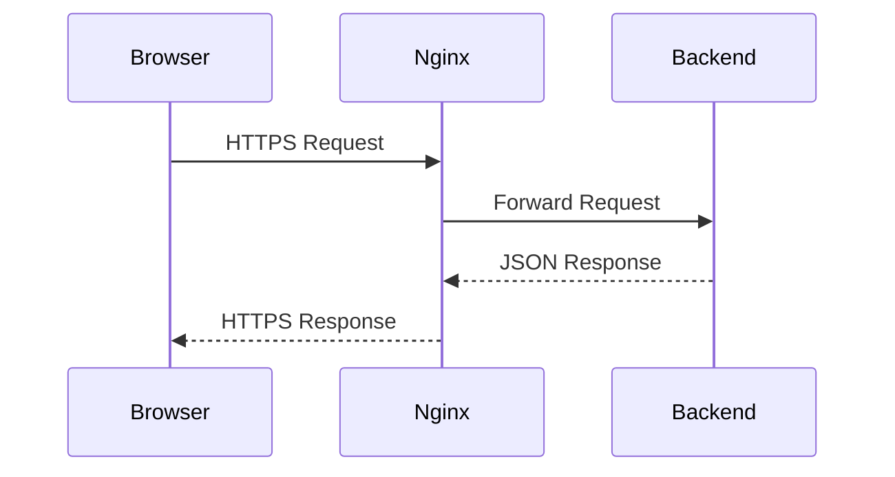
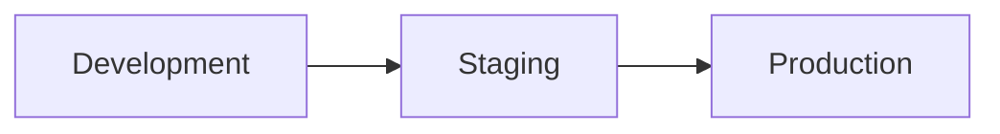
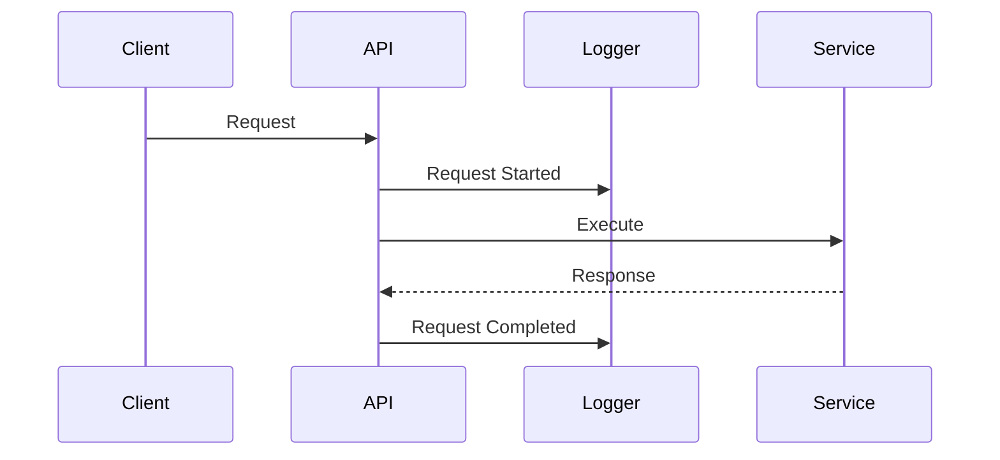

# Infrastructure Foundation & Deployment Strategy

---

# Cover Page

| Item     | Details                                                                        |
| -------- | ------------------------------------------------------------------------------ |
| Document | Deployment Architecture                                                        |
| Project  | WoofBnB                                                                        |
| Version  | 1.0                                                                            |
| Status   | Draft                                                                          |
| Owner    | Solution Architect                                                             |
| Audience | DevOps Engineers, Backend Developers, Frontend Developers, Solution Architects |

---

# Revision History

| Version | Date        | Author             | Description                     |
| ------- | ----------- | ------------------ | ------------------------------- |
| 1.0     | August 2026 | Solution Architect | Initial Deployment Architecture |

---

# 1. Purpose

This document defines the infrastructure and deployment architecture required to run WoofBnB in development, staging, and production environments.

It establishes standards for:

- Infrastructure
- Environment management
- Deployment
- Scaling
- Monitoring
- Disaster recovery
- Operational governance

---

# 2. Scope

This document covers:

- Infrastructure topology
- Hosting strategy
- Environment configuration
- Containerization
- Reverse proxy
- SSL/TLS
- CI/CD
- Monitoring
- Logging
- Backups
- Scaling
- Production releases

It does **not** define:

- Business requirements
- Database schema
- API implementation
- Frontend implementation

---

# 3. Deployment Goals

| ID     | Goal                                        |
| ------ | ------------------------------------------- |
| DG-001 | Simple MVP deployment                       |
| DG-002 | Easy production rollout                     |
| DG-003 | Low operational cost                        |
| DG-004 | Secure infrastructure                       |
| DG-005 | Horizontal scalability                      |
| DG-006 | Easy migration to cloud-native architecture |

---

# 4. Infrastructure Principles

| ID      | Principle                              |
| ------- | -------------------------------------- |
| INF-001 | Infrastructure as Code where practical |
| INF-002 | Immutable deployments                  |
| INF-003 | Configuration separated from code      |
| INF-004 | Secure by default                      |
| INF-005 | Automated deployments                  |
| INF-006 | Environment parity                     |

---

# DDR-001 — Cloud-First Deployment

**Decision**

Deploy WoofBnB to cloud infrastructure from the beginning.

**Reason**

Provides scalability, reliability, and simplifies future growth.

---

# 5. Target Environments

| Environment | Purpose                |
| ----------- | ---------------------- |
| Development | Local development      |
| Staging     | Pre-production testing |
| Production  | Live platform          |

---

## Environment Responsibilities

| Environment | Users             | Purpose                |
| ----------- | ----------------- | ---------------------- |
| Development | Developers        | Feature implementation |
| Staging     | QA & Stakeholders | Acceptance testing     |
| Production  | End Users         | Live service           |

---

# 6. High-Level Deployment Architecture

```mermaid
flowchart LR

Users

-->

CDN

-->

Nginx

-->

React Frontend

-->

Express API

-->

MongoDB Atlas
```

---

# DDR-002 — Layered Deployment

**Decision**

Separate presentation, application, and database layers.

**Reason**

Improves scalability, security, and independent deployment.

---

# 7. Technology Stack

## Frontend

| Technology | Purpose        |
| ---------- | -------------- |
| React      | UI             |
| Vite       | Build          |
| Nginx      | Static hosting |

---

## Backend

| Technology | Purpose  |
| ---------- | -------- |
| Node.js    | Runtime  |
| Express    | REST API |

---

## Database

| Technology    | Purpose          |
| ------------- | ---------------- |
| MongoDB Atlas | Managed database |

---

## Infrastructure

| Technology     | Purpose          |
| -------------- | ---------------- |
| Docker         | Containerization |
| GitHub Actions | CI/CD            |
| Nginx          | Reverse proxy    |
| Let's Encrypt  | SSL certificates |

---

# 8. Infrastructure Topology

```mermaid
flowchart TD

Internet

-->

Load Balancer

-->

Reverse Proxy

-->

Frontend

Reverse Proxy

-->

Backend

Backend

-->

MongoDB Atlas
```

---

# DDR-003 — Reverse Proxy Architecture

**Decision**

All external traffic enters through a reverse proxy.

**Reason**

Provides centralized SSL termination, routing, compression, and security controls.

---

# 9. Deployment Philosophy

Deployments should be:

- Repeatable
- Automated
- Versioned
- Reversible
- Observable

Manual production deployments should be avoided whenever practical.

---

# 10. Infrastructure Responsibilities

| Component      | Responsibility       |
| -------------- | -------------------- |
| React App      | User interface       |
| Express API    | Business logic       |
| MongoDB Atlas  | Data persistence     |
| Nginx          | Routing & SSL        |
| GitHub Actions | Automated deployment |

---

# 11. Environment Separation

Each environment must have:

- Separate database
- Separate environment variables
- Separate API endpoints
- Separate deployment pipeline
- Separate monitoring

Production resources must never be shared with development.

---

# DDR-004 — Environment Isolation

**Decision**

Development, staging, and production environments remain completely isolated.

**Reason**

Reduces deployment risk and protects production data.

---

# 12. Configuration Strategy

Configuration should be externalized.

Examples:

- Database connection strings
- JWT secrets
- Google Maps API key
- CORS origins
- Logging level

Never store secrets in source control.

---

# 13. Current Deployment Assessment

| Area            | Status         | Recommendation                                |
| --------------- | -------------- | --------------------------------------------- |
| React Frontend  | ✅ Ready       | Containerize for consistency                  |
| Express Backend | ✅ Ready       | Externalize configuration                     |
| MongoDB Atlas   | ✅ Suitable    | Enable automated backups                      |
| Docker          | 🔄 Recommended | Standardize local and production environments |
| CI/CD           | 🚀 Planned     | Automate build and deployment                 |
| Monitoring      | 🚀 Planned     | Add before production launch                  |

---

# Architect's Notes

The deployment strategy intentionally favors **simplicity for the MVP** while leaving room for future growth. A single frontend container, backend container, and managed MongoDB Atlas instance provide a cost-effective and maintainable starting point.

As traffic grows, the architecture can evolve by adding load balancing, caching, and container orchestration without changing the application architecture defined in the previous documents.

---

# 14. Containerization Strategy

WoofBnB uses **Docker** as the standard packaging mechanism.

Benefits:

- Consistent environments
- Faster onboarding
- Predictable deployments
- Infrastructure portability
- CI/CD compatibility

---

## Container Architecture

```mermaid
flowchart LR

Developer

-->

Docker Compose

-->

Frontend Container

Docker Compose

-->

Backend Container

Backend Container

-->

MongoDB Atlas
```

---

# DDR-005 — Containerized Applications

**Decision**

Frontend and backend applications are packaged as independent Docker containers.

**Reason**

Enables consistent deployments and independent scaling.

---

# 15. Container Inventory

| Container     | Purpose                     |
| ------------- | --------------------------- |
| Frontend      | React + Nginx               |
| Backend       | Node.js + Express           |
| MongoDB Atlas | Managed database (external) |

Future additions:

- Redis
- Background Worker
- Nginx Gateway
- Monitoring Stack

---

# 16. Frontend Container

Responsibilities:

- Serve static React assets
- Compress responses
- Cache static resources
- Forward API requests (if required)

The frontend container should remain stateless.

---

# 17. Backend Container

Responsibilities:

- Serve REST APIs
- Execute business logic
- Authenticate requests
- Connect to MongoDB Atlas
- Produce structured logs

The backend should not persist application data to local disk.

---

# DDR-006 — Stateless Backend

**Decision**

Backend containers remain stateless.

**Reason**

Supports horizontal scaling and simplifies deployments.

---

# 18. Local Development

Developers should start the application using a single command through Docker Compose.

Development stack:

```text
Frontend Container

↓

Backend Container

↓

MongoDB Atlas (or optional local MongoDB)
```

Local development should mirror production as closely as practical.

---

# 19. Docker Compose Responsibilities

Docker Compose manages:

- Container startup
- Networking
- Environment variables
- Volume mounting (development only)
- Service dependencies

---

## Local Development Flow

```mermaid
flowchart TD

Docker Compose

-->

Frontend

Docker Compose

-->

Backend

Backend

-->

MongoDB Atlas
```

---

# 20. Environment Variables

Configuration should never be hardcoded.

---

## Frontend Variables

| Variable        | Purpose          |
| --------------- | ---------------- |
| API Base URL    | Backend endpoint |
| Google Maps Key | Production maps  |
| Environment     | Runtime mode     |

---

## Backend Variables

| Variable       | Purpose               |
| -------------- | --------------------- |
| Port           | Server port           |
| MongoDB URI    | Database connection   |
| JWT Secret     | Authentication        |
| JWT Expiration | Token lifetime        |
| CORS Origins   | Allowed clients       |
| Log Level      | Logging configuration |

---

# DDR-007 — External Configuration

**Decision**

All runtime configuration is provided through environment variables.

**Reason**

Separates configuration from application code and simplifies deployment.

---

# 21. Secrets Management

Sensitive values include:

- JWT Secret
- MongoDB Connection String
- Google Maps API Key
- SMTP Credentials (future)
- Payment Provider Keys (future)

---

## Rules

- Never commit secrets to source control.
- Use environment-specific secret stores.
- Rotate secrets periodically.
- Grant access on a least-privilege basis.

---

# 22. Network Topology

```mermaid
flowchart LR

Frontend

-->

Backend

-->

MongoDB Atlas
```

Communication rules:

- Frontend communicates only with Backend.
- Backend communicates with MongoDB Atlas.
- MongoDB Atlas is never directly accessible from the frontend.

---

# DDR-008 — Backend as Data Gateway

**Decision**

All database access occurs through the backend.

**Reason**

Protects data integrity and enforces business rules.

---

# 23. Volume Strategy

Development:

- Source code mounted for hot reload.
- Temporary cache volumes permitted.

Production:

- No application source mounted.
- Containers are immutable.
- Persistent storage handled by managed services.

---

# 24. Image Versioning

Container images should follow semantic versioning.

Examples:

```text
woofbnb/frontend:1.0.0

woofbnb/backend:1.0.0

woofbnb/frontend:1.2.3

woofbnb/backend:2.0.0
```

Avoid using `latest` for production deployments.

---

# 25. Build Strategy

Each build should:

- Install dependencies
- Execute automated tests
- Build production assets
- Scan for vulnerabilities (future)
- Produce immutable container images

---

## Build Flow

```mermaid
flowchart LR

Source Code

-->

Build

-->

Tests

-->

Docker Image

-->

Registry
```

---

# DDR-009 — Immutable Images

**Decision**

Every deployment uses versioned immutable Docker images.

**Reason**

Ensures reproducible deployments and simplifies rollback.

---

# 26. Environment Matrix

| Capability       | Development | Staging  | Production |
| ---------------- | ----------- | -------- | ---------- |
| Debugging        | ✅          | Limited  | ❌         |
| Hot Reload       | ✅          | ❌       | ❌         |
| Detailed Logs    | ✅          | Moderate | Minimal    |
| Mock Services    | Optional    | ❌       | ❌         |
| SSL              | Optional    | ✅       | ✅         |
| Production Build | ❌          | ✅       | ✅         |

---

# 27. Container Health

Containers should expose health endpoints.

Health checks should verify:

- Application running
- Database connectivity
- Dependency availability

Unhealthy containers should be restarted automatically by the hosting platform.

---

# Current Deployment Assessment

| Area                  | Status         | Recommendation                       |
| --------------------- | -------------- | ------------------------------------ |
| Docker Strategy       | ✅ Defined     | Use multi-stage builds               |
| Environment Variables | ✅ Defined     | Validate during startup              |
| Secret Management     | ✅ Defined     | Integrate secure secret storage      |
| Container Networking  | ✅ Defined     | Restrict unnecessary communication   |
| Image Versioning      | ✅ Defined     | Tag releases with semantic versions  |
| Health Checks         | 🔄 Recommended | Add readiness and liveness endpoints |

---

# Architect's Notes

The container strategy focuses on **environment consistency** rather than infrastructure complexity. By packaging the frontend and backend independently and externalizing configuration, WoofBnB can be deployed consistently across local development, staging, and production.

This approach also prepares the application for future deployment targets such as **Azure App Service**, **Azure Container Apps**, **Azure Kubernetes Service (AKS)**, or **Docker Swarm**, without requiring architectural changes.

# 28. Network Architecture Overview

All client requests should pass through a centralized reverse proxy.

---

## Network Flow

```mermaid
flowchart LR

User

-->

DNS

-->

HTTPS

-->

Nginx Reverse Proxy

-->

React Frontend

Nginx Reverse Proxy

-->

Express Backend

Express Backend

-->

MongoDB Atlas
```

---

# DDR-010 — Reverse Proxy Gateway

**Decision**

All inbound traffic is routed through a reverse proxy before reaching application services.

**Reason**

Centralizes SSL termination, routing, compression, security headers, and request logging.

---

# 29. Reverse Proxy Responsibilities

The reverse proxy (Nginx) is responsible for:

- SSL termination
- Static file serving
- API request forwarding
- Gzip/Brotli compression
- HTTP security headers
- Request size limits
- Rate limiting (optional)
- Access logging

Application logic must never reside in the reverse proxy.

---

# 30. Request Routing Strategy

| Request     | Destination             |
| ----------- | ----------------------- |
| `/`         | React Frontend          |
| `/assets/*` | Static Assets           |
| `/api/*`    | Express Backend         |
| `/health`   | Backend Health Endpoint |

---

## Routing Flow

```mermaid
flowchart LR

Browser

-->

Nginx

Nginx

-->

React

Nginx

-->

Express API
```

---

# DDR-011 — Path-Based Routing

**Decision**

Frontend and backend are routed using URL paths.

**Reason**

Provides a simple deployment model and avoids CORS complexity when hosted under a single domain.

---

# 31. Domain Strategy

Recommended domains:

| Environment | Domain                                  |
| ----------- | --------------------------------------- |
| Development | localhost                               |
| Staging     | staging.woofbnb.in                      |
| Production  | woofbnb.in                              |
| API         | api.woofbnb.in _(optional if separate)_ |

---

## DNS Responsibilities

DNS should:

- Resolve frontend traffic.
- Support HTTPS.
- Redirect `www` to the canonical domain.
- Support future CDN integration.

---

# 32. SSL/TLS Strategy

All environments except local development should use HTTPS.

---

## SSL Requirements

| Requirement       | Status |
| ----------------- | ------ |
| HTTPS Only        | ✅     |
| TLS 1.2+          | ✅     |
| Automatic Renewal | ✅     |
| HSTS Enabled      | ✅     |

---

## Certificate Provider

Recommended:

- Let's Encrypt (MVP)
- Cloud provider managed certificates (Production)

---

# DDR-012 — HTTPS Everywhere

**Decision**

All public traffic is encrypted using HTTPS.

**Reason**

Protects user data and aligns with modern browser security standards.

---

# 33. Security Headers

The reverse proxy should inject standard HTTP security headers.

| Header                    | Purpose                       |
| ------------------------- | ----------------------------- |
| Strict-Transport-Security | Force HTTPS                   |
| X-Frame-Options           | Prevent clickjacking          |
| X-Content-Type-Options    | Prevent MIME sniffing         |
| Referrer-Policy           | Control referrer information  |
| Content-Security-Policy   | Restrict resource loading     |
| Permissions-Policy        | Restrict browser capabilities |

---

# 34. Static Asset Delivery

Frontend assets should be:

- Served directly by Nginx.
- Compressed before deployment.
- Cached aggressively.
- Versioned using build hashes.

---

## Cache Policy

| Asset      | Cache Duration |
| ---------- | -------------- |
| HTML       | No cache       |
| JavaScript | 1 year         |
| CSS        | 1 year         |
| Images     | 30 days        |
| Fonts      | 1 year         |

---

# DDR-013 — Immutable Static Assets

**Decision**

Static assets use hashed filenames and long-term caching.

**Reason**

Improves performance while ensuring users receive updated assets after deployments.

---

# 35. API Gateway Rules

The reverse proxy should:

- Forward `/api/*` requests.
- Preserve client IP headers.
- Forward correlation/request IDs.
- Enforce request size limits.
- Reject malformed requests early.

---

## API Flow



---

# 36. Network Security

Communication Rules

| Source   | Destination   | Allowed |
| -------- | ------------- | :-----: |
| Browser  | Frontend      |   ✅    |
| Browser  | Backend API   |   ✅    |
| Browser  | MongoDB Atlas |   ❌    |
| Frontend | Backend       |   ✅    |
| Backend  | MongoDB Atlas |   ✅    |

---

No client should have direct access to the database.

---

# DDR-014 — Backend Data Isolation

**Decision**

Only backend services communicate with MongoDB.

**Reason**

Protects data integrity and enforces business rules.

---

# 37. Firewall Strategy

Only required ports should be exposed.

| Port  | Purpose                    | Public |
| ----- | -------------------------- | :----: |
| 80    | HTTP (redirect to HTTPS)   |   ✅   |
| 443   | HTTPS                      |   ✅   |
| 3000  | Backend (internal/private) |   ❌   |
| 27017 | MongoDB                    |   ❌   |

---

## Rules

- Deny all unnecessary inbound traffic.
- Restrict SSH access to administrators.
- Use cloud firewall/security groups where available.

---

# 38. Request Size Limits

Protect the application against abuse.

| Request Type          | Maximum Size |
| --------------------- | -----------: |
| JSON API              |         1 MB |
| Image Upload (Future) |        10 MB |
| Multipart Form        |        10 MB |

Requests exceeding limits should return **HTTP 413 (Payload Too Large)**.

---

# 39. Future CDN Strategy

As traffic grows, static assets can be served through a CDN.

Candidate assets:

- Images
- CSS
- JavaScript bundles
- Fonts
- Icons

Benefits:

- Reduced latency
- Lower server load
- Global edge caching
- Improved Core Web Vitals

---

# DDR-015 — CDN-Ready Architecture

**Decision**

Design the frontend for future CDN integration without changing application code.

**Reason**

Supports global scalability and improved performance.

---

# 40. Network Security Checklist

Before production deployment:

- HTTPS enabled
- Valid SSL certificate installed
- Security headers configured
- Static asset caching enabled
- API routing verified
- Firewall rules applied
- Request size limits configured
- Database inaccessible from public internet
- DNS configured correctly

---

# Current Deployment Assessment

| Area                 | Status                            | Recommendation                  |
| -------------------- | --------------------------------- | ------------------------------- |
| Reverse Proxy        | ✅ Recommended                    | Use Nginx                       |
| HTTPS                | ✅ Required                       | Enable HSTS                     |
| Security Headers     | ✅ Defined                        | Validate with security scanners |
| Static Asset Caching | ✅ Defined                        | Use hashed filenames            |
| Firewall             | 🔄 Configure in cloud environment |                                 |
| CDN                  | 🚀 Future                         | Add after traffic growth        |

---

# Architect's Notes

The reverse proxy is the **entry point** to the WoofBnB platform and should remain focused on networking concerns only. By centralizing SSL termination, routing, compression, and security headers, the backend remains simpler and easier to maintain.

The networking strategy intentionally keeps the **database private**, exposes only essential services, and prepares the application for future CDN integration and cloud-native scaling without changing the application architecture.

---

# 41. CI/CD Philosophy

The deployment pipeline should be:

- Automated
- Repeatable
- Traceable
- Secure
- Reversible

No production deployment should require manual server configuration.

---

## CI/CD Flow

```mermaid
flowchart LR

Developer

-->

GitHub

-->

GitHub Actions

-->

Tests

-->

Docker Build

-->

Image Registry

-->

Deployment

-->

Production
```

---

# DDR-016 — Automated Delivery

**Decision**

All builds and deployments are executed through an automated CI/CD pipeline.

**Reason**

Reduces deployment errors and ensures consistent release quality.

---

# 42. Source Control Strategy

GitHub is the single source of truth.

---

## Branch Strategy

```text
main

↓

develop

↓

feature/search

feature/map

feature/auth
```

---

## Branch Responsibilities

| Branch     | Purpose               |
| ---------- | --------------------- |
| main       | Production-ready code |
| develop    | Integration branch    |
| feature/\* | Individual features   |
| hotfix/\*  | Production fixes      |

---

# 43. Pull Request Workflow

Every feature should follow:

```mermaid
flowchart LR

Feature Branch

-->

Pull Request

-->

Code Review

-->

Automated Checks

-->

Merge

-->

Develop
```

---

## Pull Request Requirements

- Architecture review
- Build passes
- Tests pass
- Documentation updated
- No merge conflicts

---

# DDR-017 — Protected Main Branch

**Decision**

Direct commits to `main` are prohibited.

**Reason**

Ensures all production code is reviewed and validated.

---

# 44. Continuous Integration Pipeline

Every push should trigger CI.

---

## CI Stages

| Stage                    | Purpose                      |
| ------------------------ | ---------------------------- |
| Install Dependencies     | Prepare environment          |
| Lint                     | Code quality                 |
| Unit Tests               | Verify functionality         |
| Build                    | Produce production artifacts |
| Security Scan _(Future)_ | Dependency analysis          |
| Docker Build             | Package application          |

---

## CI Workflow

```mermaid
flowchart LR

Push

-->

Install

-->

Lint

-->

Test

-->

Build

-->

Docker Image
```

---

# 45. Docker Image Publishing

Successful builds should produce versioned images.

---

## Image Repository

```text
woofbnb/frontend:1.0.0

woofbnb/backend:1.0.0
```

---

## Rules

- Tag every release.
- Never overwrite released tags.
- Avoid using `latest` in production.

---

# DDR-018 — Versioned Images

**Decision**

Each release generates immutable Docker images with semantic version tags.

**Reason**

Simplifies rollback and improves deployment traceability.

---

# 46. Deployment Pipeline

Deployment should follow environment promotion.



---

## Deployment Rules

| Environment | Trigger                  |
| ----------- | ------------------------ |
| Development | Every merge to `develop` |
| Staging     | Release candidate        |
| Production  | Approved release         |

---

# 47. Release Strategy

Recommended versioning:

```
MAJOR.MINOR.PATCH
```

Examples:

| Version | Meaning         |
| ------- | --------------- |
| 1.0.0   | Initial MVP     |
| 1.1.0   | New feature     |
| 1.1.1   | Bug fix         |
| 2.0.0   | Breaking change |

---

# DDR-019 — Semantic Versioning

**Decision**

All releases follow Semantic Versioning.

**Reason**

Provides predictable release management.

---

# 48. Rollback Strategy

Every deployment should support rollback.

---

## Rollback Flow

```mermaid
flowchart LR

Deployment

-->

Health Check

-->

Failure?

-->

Rollback

-->

Previous Version
```

---

## Rollback Triggers

- Health check failure
- Critical production bug
- Deployment failure
- Database migration issue

---

# 49. Infrastructure Automation

Deployment tasks should be automated wherever practical.

Examples:

- Build frontend
- Build backend
- Create Docker images
- Push images
- Deploy containers
- Restart services
- Verify health endpoint

Avoid manual SSH-based deployments.

---

# DDR-020 — Automated Infrastructure

**Decision**

Routine deployment tasks are automated through CI/CD.

**Reason**

Reduces operational errors and improves repeatability.

---

# 50. Database Deployment

Database schema changes must be coordinated with application releases.

For the current MongoDB MVP:

- Back up before significant changes.
- Validate indexes after deployment.
- Verify geospatial indexes remain available.

Future relational migrations should introduce formal migration tooling.

---

# 51. Deployment Validation

After deployment, verify:

- Frontend accessible
- Backend API responding
- Database connected
- Authentication working
- Nearby search operational
- Map loads correctly
- Registration flow functional

---

## Validation Flow

```mermaid
flowchart LR

Deploy

-->

Health Check

-->

Smoke Tests

-->

Release Complete
```

---

# 52. Release Approval

Production releases should require approval.

| Role          | Responsibility                |
| ------------- | ----------------------------- |
| Developer     | Prepare release               |
| Reviewer      | Approve code                  |
| QA            | Validate staging              |
| Release Owner | Approve production deployment |

For solo development, these responsibilities may be performed by the same person, but they should still be completed in sequence.

---

# 53. CI/CD Checklist

Before production deployment:

- Code reviewed
- Tests passed
- Docker images built
- Images tagged
- Environment variables verified
- Database backup completed
- Health endpoint verified
- Smoke tests executed

---

# Current Deployment Assessment

| Area                      | Status         | Recommendation                   |
| ------------------------- | -------------- | -------------------------------- |
| Git Workflow              | ✅ Defined     | Protect `main` branch            |
| CI Pipeline               | 🔄 Planned     | Implement GitHub Actions         |
| Docker Publishing         | ✅ Defined     | Use semantic version tags        |
| Release Strategy          | ✅ Defined     | Promote through environments     |
| Rollback                  | 🔄 Recommended | Automate rollback where possible |
| Infrastructure Automation | 🚀 Planned     | Expand as deployment matures     |

---

# Architect's Notes

The proposed CI/CD pipeline balances **simplicity and reliability**. It is suitable for a portfolio project and small-team MVP while following patterns used in enterprise environments.

As WoofBnB grows, this pipeline can evolve to include:

- Automated integration and end-to-end tests
- Dependency vulnerability scanning
- Container image signing
- Infrastructure as Code (Terraform/Bicep)
- Blue/Green or Canary deployments
- Progressive delivery strategies

The overall workflow remains the same, making future enhancements incremental rather than disruptive.

---

# 54. Observability Philosophy

The platform should make it easy to answer:

- Is the application healthy?
- Is it performing well?
- Are users experiencing errors?
- Which component is failing?
- How quickly can issues be diagnosed?

Observability is built on three pillars:

- Logs
- Metrics
- Health Checks

Future enhancements may include distributed tracing.

---

## Observability Architecture

```mermaid
flowchart LR

Application

-->

Logs

Application

-->

Metrics

Application

-->

Health Checks

Logs

-->

Dashboard

Metrics

-->

Dashboard

Health Checks

-->

Dashboard
```

---

# DDR-021 — Observability by Design

**Decision**

Monitoring and logging are integrated into the application from the beginning.

**Reason**

Operational visibility should be considered a core system capability, not an afterthought.

---

# 55. Logging Strategy

Every application component should produce structured logs.

---

## Log Categories

| Category         | Purpose                        |
| ---------------- | ------------------------------ |
| Application Logs | Business operations            |
| HTTP Logs        | Request lifecycle              |
| Error Logs       | Failures and exceptions        |
| Security Logs    | Authentication & authorization |
| Audit Logs       | Critical business actions      |

---

## Log Levels

| Level | Usage                   |
| ----- | ----------------------- |
| ERROR | Unexpected failures     |
| WARN  | Recoverable issues      |
| INFO  | Business events         |
| DEBUG | Development diagnostics |

Production environments should minimize DEBUG logging.

---

# DDR-022 — Structured Logging

**Decision**

All application logs follow a structured JSON format.

**Reason**

Supports centralized log aggregation and automated analysis.

---

# 56. Request Logging

Every API request should record:

| Field                 |    Required    |
| --------------------- | :------------: |
| Request ID            |       ✅       |
| Timestamp             |       ✅       |
| HTTP Method           |       ✅       |
| Endpoint              |       ✅       |
| Response Status       |       ✅       |
| Duration              |       ✅       |
| Client IP             |       ✅       |
| Authenticated User ID | When Available |

Sensitive request bodies should never be logged.

---

## Request Lifecycle



---

# 57. Error Logging

Errors should include sufficient diagnostic information without exposing sensitive data.

---

## Required Fields

| Field       | Purpose              |
| ----------- | -------------------- |
| Timestamp   | Event ordering       |
| Request ID  | Correlation          |
| Error Type  | Classification       |
| Stack Trace | Internal diagnostics |
| Endpoint    | Context              |
| User ID     | If authenticated     |

---

## Do Not Log

- Passwords
- JWT tokens
- API secrets
- Payment details
- Personal identification documents

---

# DDR-023 — Secure Logging

**Decision**

Sensitive information is excluded from application logs.

**Reason**

Protects user privacy and supports compliance.

---

# 58. Health Checks

The platform should expose a dedicated health endpoint.

---

## Health Categories

| Check        | Purpose                 |
| ------------ | ----------------------- |
| API Status   | Service availability    |
| Database     | MongoDB connectivity    |
| Memory Usage | Resource monitoring     |
| Uptime       | Operational visibility  |
| Version      | Deployment verification |

---

## Health Workflow

```mermaid
flowchart LR

Health Request

-->

Backend

-->

Dependency Checks

-->

Health Response
```

---

# DDR-024 — Health Endpoint

**Decision**

Expose a lightweight health endpoint for infrastructure monitoring.

**Reason**

Enables automated health verification and orchestration.

---

# 59. Metrics Collection

The platform should collect operational metrics.

---

## Application Metrics

| Metric                  | Purpose             |
| ----------------------- | ------------------- |
| Request Count           | Traffic analysis    |
| Error Rate              | Reliability         |
| Average Response Time   | Performance         |
| Active Users            | Usage trends        |
| Authentication Failures | Security monitoring |

---

## Infrastructure Metrics

| Metric             | Purpose               |
| ------------------ | --------------------- |
| CPU Usage          | Capacity planning     |
| Memory Usage       | Resource monitoring   |
| Disk Usage         | Infrastructure health |
| Network Traffic    | Load monitoring       |
| Container Restarts | Stability monitoring  |

---

# 60. Monitoring Dashboard

Operational dashboards should display:

- System status
- API health
- Response times
- Error rates
- Active requests
- Database connectivity
- Deployment version

Recommended future tools:

- Grafana
- Azure Monitor
- Prometheus

The monitoring solution may change, but the required metrics remain the same.

---

# DDR-025 — Centralized Monitoring

**Decision**

Operational metrics should be presented through centralized dashboards.

**Reason**

Improves incident response and operational awareness.

---

# 61. Alerting Strategy

Alerts should be actionable and prioritized.

---

## Alert Categories

| Priority | Example               |
| -------- | --------------------- |
| Critical | API unavailable       |
| High     | Database disconnected |
| Medium   | Elevated error rate   |
| Low      | High disk utilization |

---

## Example Alert Thresholds

| Metric               | Threshold  |
| -------------------- | ---------- |
| Error Rate           | > 5%       |
| API Response Time    | > 1 second |
| CPU Usage            | > 85%      |
| Memory Usage         | > 90%      |
| Health Check Failure | Immediate  |

---

# 62. Audit Logging

Business-critical operations should generate audit events.

---

## Events

| Event                   | Audit |
| ----------------------- | :---: |
| User Login              |  ✅   |
| Pet Sitter Registration |  ✅   |
| Booking Created         |  ✅   |
| Booking Cancelled       |  ✅   |
| Review Submitted        |  ✅   |
| Admin Action            |  ✅   |

Audit records should be immutable and retained according to operational policies.

---

# DDR-026 — Business Audit Trail

**Decision**

Critical business events are recorded through audit logs.

**Reason**

Supports troubleshooting, accountability, and future compliance needs.

---

# 63. Log Retention

Recommended retention periods:

| Log Type         | Retention |
| ---------------- | --------- |
| Application Logs | 30 days   |
| Error Logs       | 90 days   |
| Audit Logs       | 1 year    |
| Security Logs    | 1 year    |

Retention policies may be adjusted to meet future legal or business requirements.

---

# 64. Incident Response

Operational incidents should follow a standard workflow.

```mermaid
flowchart LR

Alert

-->

Investigation

-->

Mitigation

-->

Recovery

-->

Post-Incident Review
```

---

## Incident Priorities

| Priority | Response Goal                   |
| -------- | ------------------------------- |
| Critical | Immediate                       |
| High     | Within 1 hour                   |
| Medium   | Same business day               |
| Low      | Next planned maintenance window |

For the MVP, these targets are aspirational and should evolve with team capacity.

---

# 65. Operational Readiness Checklist

Before production launch:

- Health endpoint implemented
- Structured logging enabled
- Request IDs enabled
- Metrics collected
- Dashboard configured
- Alerting configured
- Audit logging enabled
- Log retention policy documented

---

# Current Deployment Assessment

| Area               | Status         | Recommendation                       |
| ------------------ | -------------- | ------------------------------------ |
| Structured Logging | ✅ Defined     | Standardize on one logging framework |
| Health Checks      | ✅ Defined     | Add readiness and liveness checks    |
| Metrics            | 🔄 Planned     | Integrate with monitoring platform   |
| Dashboards         | 🚀 Planned     | Create operational dashboards        |
| Alerting           | 🚀 Planned     | Configure production alerts          |
| Audit Logging      | 🔄 Recommended | Implement before public launch       |

---

# Architect's Notes

Operational excellence is achieved through **visibility**, not guesswork. By standardizing logs, metrics, health checks, and alerts, WoofBnB can detect issues quickly, reduce downtime, and simplify troubleshooting.

The observability strategy is intentionally **tool-independent**. Whether the project later adopts Azure Monitor, Grafana, Prometheus, or another platform, the required operational data remains the same.

---

# 66. Resilience Philosophy

The platform should be designed to:

- Prevent data loss
- Recover from failures
- Minimize downtime
- Scale without architectural changes

Resilience should be achieved through infrastructure design rather than application complexity.

---

## Resilience Model

```mermaid
flowchart LR

Failure

-->

Detection

-->

Recovery

-->

Validation

-->

Normal Operation
```

---

# DDR-027 — Resilience by Design

**Decision**

Infrastructure should prioritize fault recovery over fault avoidance.

**Reason**

Failures are inevitable; rapid recovery is more practical than attempting to eliminate every possible failure.

---

# 67. Backup Strategy

Backups are mandatory for production.

---

## Backup Scope

| Resource                  | Backup Required    |
| ------------------------- | ------------------ |
| MongoDB Database          | ✅                 |
| Environment Configuration | ✅                 |
| Deployment Configuration  | ✅                 |
| Application Source        | Managed by Git     |
| Docker Images             | Stored in Registry |

---

## Backup Schedule

| Backup Type   | Frequency                    |
| ------------- | ---------------------------- |
| Full Database | Daily                        |
| Incremental   | Every 6 hours (if supported) |
| Configuration | On every change              |
| Source Code   | Continuous via Git           |

---

# DDR-028 — Automated Backups

**Decision**

Production database backups are automated.

**Reason**

Reduces the risk of data loss caused by operational errors or infrastructure failures.

---

# 68. Recovery Objectives

Recovery expectations should be defined before production deployment.

---

## Recovery Targets

| Metric                         | Target     |
| ------------------------------ | ---------- |
| Recovery Point Objective (RPO) | ≤ 24 hours |
| Recovery Time Objective (RTO)  | ≤ 2 hours  |

For the MVP, these targets are acceptable and can be improved as operational maturity increases.

---

# 69. Disaster Recovery Strategy

Potential failure scenarios:

| Scenario              | Recovery Action         |
| --------------------- | ----------------------- |
| Backend failure       | Restart container       |
| Frontend failure      | Redeploy container      |
| Database failure      | Restore from backup     |
| Infrastructure outage | Redeploy infrastructure |
| SSL expiration        | Renew certificates      |

---

## Recovery Workflow

```mermaid
flowchart LR

Failure

-->

Alert

-->

Recovery Procedure

-->

Verification

-->

Production Restored
```

---

# DDR-029 — Standard Recovery Procedures

**Decision**

Document recovery procedures for all critical infrastructure components.

**Reason**

Reduces recovery time and improves operational consistency.

---

# 70. High Availability Strategy

The MVP will operate with a **single application instance**.

Future scaling should support:

- Multiple backend instances
- Load balancing
- Automatic failover

---

## Evolution Path

```mermaid
flowchart LR

Single Instance

-->

Load Balancer

-->

Multiple Backend Instances

-->

Container Orchestration
```

---

# 71. Horizontal Scaling

Backend services should scale horizontally.

Suitable candidates:

- Express API
- Background workers (future)
- Notification services (future)

Requirements:

- Stateless services
- Externalized session state
- Shared database

---

# DDR-030 — Stateless Scaling

**Decision**

Application services remain stateless to enable horizontal scaling.

**Reason**

Allows additional instances to be added without changing application logic.

---

# 72. Vertical Scaling

When traffic is low, scaling can be achieved by increasing server resources.

Examples:

| Resource | Scale                     |
| -------- | ------------------------- |
| CPU      | Increase vCPUs            |
| Memory   | Increase RAM              |
| Disk     | Increase storage capacity |

Vertical scaling is suitable during the MVP phase before horizontal scaling becomes necessary.

---

# 73. Load Balancing

Future production deployments should introduce a load balancer.

Responsibilities:

- Distribute traffic
- Health-based routing
- Failover
- SSL termination (optional)

---

## Load Balancing Flow

```mermaid
flowchart LR

Users

-->

Load Balancer

-->

Backend A

Load Balancer

-->

Backend B

Backend A

-->

MongoDB Atlas

Backend B

-->

MongoDB Atlas
```

---

# DDR-031 — Future Load Balancer

**Decision**

Introduce load balancing only when traffic exceeds the capacity of a single backend instance.

**Reason**

Keeps MVP infrastructure simple while preserving scalability.

---

# 74. CDN Evolution

The frontend should be ready for CDN integration.

Candidate assets:

- Images
- JavaScript bundles
- CSS
- Fonts
- Icons

Benefits:

- Reduced latency
- Lower origin load
- Improved Core Web Vitals
- Better international performance

---

# 75. Capacity Planning

Capacity should be reviewed regularly.

Key indicators:

| Metric                      | Action                     |
| --------------------------- | -------------------------- |
| CPU > 80%                   | Scale compute              |
| Memory > 80%                | Increase memory            |
| Response Time > Target      | Optimize or scale          |
| Error Rate > 5%             | Investigate immediately    |
| Database Latency Increasing | Review indexes and queries |

---

# DDR-032 — Metrics-Based Scaling

**Decision**

Scaling decisions should be based on observed metrics rather than assumptions.

**Reason**

Ensures infrastructure investments are driven by actual demand.

---

# 76. Future Infrastructure Roadmap

## Phase 1 (Current MVP)

- Single frontend container
- Single backend container
- MongoDB Atlas
- Nginx reverse proxy

---

## Phase 2

- Redis cache
- CDN
- Background worker
- Managed monitoring

---

## Phase 3

- Load balancer
- Multiple backend instances
- Container orchestration (AKS/Kubernetes)
- Auto-scaling

---

## Phase 4

- Multi-region deployment
- Disaster recovery automation
- Distributed tracing
- Event-driven services

---

# 77. Business Continuity

To maintain service availability:

- Document recovery procedures.
- Store backups securely.
- Monitor infrastructure continuously.
- Test recovery processes periodically.
- Maintain deployment documentation.

---

# 78. Scalability Checklist

Before increasing production capacity:

- Services remain stateless
- Health checks operational
- Database indexes reviewed
- Monitoring dashboards active
- Backup verification completed
- Load testing performed
- Deployment automation validated

---

# Current Deployment Assessment

| Area               | Status              | Recommendation                               |
| ------------------ | ------------------- | -------------------------------------------- |
| Backup Strategy    | ✅ Defined          | Enable MongoDB Atlas automated backups       |
| Disaster Recovery  | ✅ Defined          | Test restore process periodically            |
| Horizontal Scaling | 🚀 Future           | Keep backend stateless                       |
| Vertical Scaling   | ✅ Suitable for MVP | Upgrade resources as needed                  |
| Load Balancing     | 🚀 Future           | Introduce after sustained traffic growth     |
| CDN                | 🚀 Future           | Add when asset delivery becomes a bottleneck |

---

# Architect's Notes

For WoofBnB's current scope, **simplicity is a strength**. A single backend instance with MongoDB Atlas provides a cost-effective and maintainable deployment model.

The architecture has been intentionally designed so that scaling is **evolutionary rather than revolutionary**. Future additions—Redis, load balancing, Kubernetes, or CDN integration—can be introduced incrementally without requiring changes to the application architecture or business logic.

---

# 79. Operational Philosophy

Operations should focus on:

- Stability
- Predictability
- Security
- Automation
- Continuous improvement

Operational procedures should be documented and repeatable.

---

## Operational Lifecycle

```mermaid
flowchart LR

Deploy

-->

Monitor

-->

Detect

-->

Resolve

-->

Improve
```

---

# DDR-033 — Operational Consistency

**Decision**

Production operations follow documented runbooks and standardized procedures.

**Reason**

Reduces operational risk and improves incident response.

---

# 80. Production Operations

Daily operational responsibilities include:

- Review application health
- Review monitoring dashboard
- Check deployment status
- Verify backup completion
- Review security alerts
- Review error logs

---

## Daily Operations Checklist

| Task                  | Frequency |
| --------------------- | --------- |
| Health Check          | Daily     |
| Error Log Review      | Daily     |
| Backup Verification   | Daily     |
| Infrastructure Review | Weekly    |
| Dependency Updates    | Monthly   |

---

# 81. Security Compliance

The platform should follow secure development and deployment practices.

---

## Security Principles

| ID      | Principle                 |
| ------- | ------------------------- |
| SEC-001 | Least privilege access    |
| SEC-002 | Secure secrets management |
| SEC-003 | HTTPS only                |
| SEC-004 | Dependency updates        |
| SEC-005 | Security monitoring       |

---

## Security Checklist

- HTTPS enforced
- Security headers enabled
- JWT secrets protected
- Environment variables secured
- Database access restricted
- Regular dependency updates
- Automated backups enabled

---

# DDR-034 — Secure Operations

**Decision**

Security controls are part of routine operations rather than one-time implementation tasks.

**Reason**

Maintains a secure production environment over time.

---

# 82. Dependency Management

Dependencies should be reviewed regularly.

---

## Update Policy

| Dependency       | Frequency             |
| ---------------- | --------------------- |
| Security patches | Immediately           |
| Minor updates    | Monthly               |
| Major updates    | Planned release cycle |

---

Before applying updates:

- Review release notes.
- Test in staging.
- Validate deployment.
- Monitor after release.

---

# 83. Secret Management

Sensitive configuration includes:

- JWT Secret
- Database credentials
- Google Maps API Key
- SMTP credentials (future)
- Payment gateway keys (future)

---

## Secret Management Rules

- Never commit secrets to Git.
- Store secrets outside application code.
- Rotate secrets periodically.
- Limit access to authorized personnel.
- Maintain separate secrets per environment.

---

# DDR-035 — Managed Secrets

**Decision**

Secrets are managed externally and rotated periodically.

**Reason**

Reduces the impact of credential exposure.

---

# 84. Maintenance Strategy

Regular maintenance activities include:

| Activity                     | Frequency |
| ---------------------------- | --------- |
| Dependency Updates           | Monthly   |
| SSL Certificate Verification | Monthly   |
| Backup Restore Test          | Quarterly |
| Infrastructure Review        | Quarterly |
| Performance Review           | Quarterly |

---

## Maintenance Workflow

```mermaid
flowchart LR

Plan

-->

Test

-->

Deploy

-->

Verify

-->

Document
```

---

# 85. Operational Runbooks

The following runbooks should exist:

| Runbook           | Purpose                    |
| ----------------- | -------------------------- |
| Deployment        | Release process            |
| Rollback          | Failed deployment recovery |
| Database Restore  | Recovery procedure         |
| Incident Response | Production issues          |
| SSL Renewal       | Certificate management     |

Each runbook should include:

- Preconditions
- Step-by-step procedure
- Validation
- Rollback instructions

---

# 86. Vulnerability Management

Regular vulnerability reviews should include:

- Dependency scanning
- Container image scanning
- Operating system updates
- Security header validation
- Authentication review

Critical vulnerabilities should be addressed before the next production release.

---

# DDR-036 — Continuous Security Review

**Decision**

Security assessments are integrated into ongoing operations.

**Reason**

Reduces long-term security risk.

---

# 87. Release Governance

Production releases should follow an approval process.

---

## Release Workflow

```mermaid
flowchart LR

Feature Complete

-->

QA Approval

-->

Release Approval

-->

Production Deployment

-->

Monitoring
```

---

## Release Criteria

Before deployment:

- Tests passed
- Documentation updated
- Monitoring configured
- Rollback available
- Database backup completed

---

# 88. DevOps Standards

DevOps practices should emphasize:

- Automation
- Repeatability
- Version control
- Infrastructure consistency
- Continuous improvement

---

## Standards

| Standard       | Requirement         |
| -------------- | ------------------- |
| Source Control | Git                 |
| CI/CD          | Automated           |
| Configuration  | Environment-based   |
| Containers     | Docker              |
| Versioning     | Semantic Versioning |
| Documentation  | Maintained          |

---

# DDR-037 — DevOps Automation

**Decision**

Routine operational activities should be automated wherever practical.

**Reason**

Improves consistency and reduces manual errors.

---

# 89. Operational Documentation

Production documentation should include:

- Architecture diagrams
- Environment inventory
- Deployment guide
- Incident procedures
- Backup procedures
- Contact information
- Change history

Documentation should be reviewed after significant infrastructure changes.

---

# 90. Operational Readiness Checklist

Before production launch:

- Infrastructure deployed
- HTTPS enabled
- CI/CD operational
- Monitoring configured
- Logging verified
- Alerting configured
- Backup tested
- Recovery procedures documented
- Runbooks available
- Documentation complete

---

# Current Deployment Assessment

| Area                   | Status     | Recommendation                           |
| ---------------------- | ---------- | ---------------------------------------- |
| Operational Procedures | ✅ Defined | Document runbooks                        |
| Security Practices     | ✅ Defined | Review quarterly                         |
| Dependency Management  | 🔄 Planned | Automate dependency scanning             |
| Secret Management      | ✅ Defined | Use managed secret storage               |
| Release Governance     | ✅ Defined | Formalize approval workflow              |
| DevOps Automation      | 🚀 Expand  | Increase automation as the project grows |

---

# Architect's Notes

Operational maturity is achieved through **discipline rather than complexity**. For WoofBnB's MVP, focus on establishing good operational habits—consistent deployments, documented procedures, secure secret management, and routine maintenance.

As the project grows, these standards will naturally evolve into more sophisticated DevOps practices without requiring significant changes to the application's architecture.

---

# 91. Deployment Governance

## Purpose

Deployment governance ensures that all infrastructure changes are:

- Controlled
- Documented
- Repeatable
- Secure
- Auditable

Infrastructure changes should follow the same review discipline as application code.

---

## Governance Principles

| ID          | Principle                                     |
| ----------- | --------------------------------------------- |
| DEP-GOV-001 | Infrastructure changes are version controlled |
| DEP-GOV-002 | Deployments are automated wherever practical  |
| DEP-GOV-003 | Production changes require approval           |
| DEP-GOV-004 | Infrastructure is monitored continuously      |
| DEP-GOV-005 | Rollback procedures are documented and tested |

---

# DDR-038 — Governed Deployments

**Decision**

Production deployments follow a documented governance process.

**Reason**

Reduces operational risk and improves deployment reliability.

---

# 92. Infrastructure Architecture Review Checklist

Every infrastructure change should be reviewed against the following checklist.

| Category      | Review Question                             |
| ------------- | ------------------------------------------- |
| Networking    | Are routing and firewall rules correct?     |
| Security      | Are HTTPS and security headers configured?  |
| Containers    | Are images versioned and immutable?         |
| Configuration | Are environment variables externalized?     |
| Monitoring    | Are health checks and alerts configured?    |
| Backup        | Are backup and restore procedures verified? |
| Scalability   | Does the change support future growth?      |
| Documentation | Has deployment documentation been updated?  |

---

# 93. Deployment Readiness Checklist

Before every production release:

| Requirement                    | Status |
| ------------------------------ | ------ |
| Frontend image built           | ☐      |
| Backend image built            | ☐      |
| Images tagged                  | ☐      |
| Environment variables verified | ☐      |
| Database backup completed      | ☐      |
| Health checks validated        | ☐      |
| Smoke tests executed           | ☐      |
| Monitoring verified            | ☐      |
| Rollback plan confirmed        | ☐      |
| Release approved               | ☐      |

---

# 94. Infrastructure Requirement Traceability Matrix

Deployment architecture supports the previously defined system requirements.

| Requirement                  | Deployment Component       |
| ---------------------------- | -------------------------- |
| BR-001 Platform Availability | Backend Container          |
| BR-002 Location Search       | Backend + MongoDB Atlas    |
| BR-003 Responsive UI         | React Frontend             |
| BR-004 Secure API            | HTTPS + Reverse Proxy      |
| BR-005 Authentication        | JWT + Backend              |
| NFR-001 Scalability          | Stateless Containers       |
| NFR-002 Security             | Reverse Proxy + Middleware |
| NFR-003 Reliability          | Monitoring + Health Checks |
| NFR-004 Maintainability      | CI/CD + Docker             |

---

# 95. Deployment Decision Register

The following Deployment Decision Records (DDRs) govern infrastructure implementation.

| DDR     | Decision                     |
| ------- | ---------------------------- |
| DDR-001 | Cloud-First Deployment       |
| DDR-002 | Layered Deployment           |
| DDR-003 | Reverse Proxy Architecture   |
| DDR-004 | Environment Isolation        |
| DDR-005 | Containerized Applications   |
| DDR-006 | Stateless Backend            |
| DDR-007 | External Configuration       |
| DDR-008 | Backend as Data Gateway      |
| DDR-009 | Immutable Images             |
| DDR-010 | Reverse Proxy Gateway        |
| DDR-011 | Path-Based Routing           |
| DDR-012 | HTTPS Everywhere             |
| DDR-013 | Immutable Static Assets      |
| DDR-014 | Backend Data Isolation       |
| DDR-015 | CDN-Ready Architecture       |
| DDR-016 | Automated Delivery           |
| DDR-017 | Protected Main Branch        |
| DDR-018 | Versioned Images             |
| DDR-019 | Semantic Versioning          |
| DDR-020 | Automated Infrastructure     |
| DDR-021 | Observability by Design      |
| DDR-022 | Structured Logging           |
| DDR-023 | Secure Logging               |
| DDR-024 | Health Endpoint              |
| DDR-025 | Centralized Monitoring       |
| DDR-026 | Business Audit Trail         |
| DDR-027 | Resilience by Design         |
| DDR-028 | Automated Backups            |
| DDR-029 | Standard Recovery Procedures |
| DDR-030 | Stateless Scaling            |
| DDR-031 | Future Load Balancer         |
| DDR-032 | Metrics-Based Scaling        |
| DDR-033 | Operational Consistency      |
| DDR-034 | Secure Operations            |
| DDR-035 | Managed Secrets              |
| DDR-036 | Continuous Security Review   |
| DDR-037 | DevOps Automation            |
| DDR-038 | Governed Deployments         |

---

# 96. Infrastructure Technical Debt Register

Known future improvements.

| ID         | Area                                     | Priority |
| ---------- | ---------------------------------------- | -------- |
| INF-TD-001 | Add Redis caching                        | Medium   |
| INF-TD-002 | Introduce CDN                            | Medium   |
| INF-TD-003 | Implement Kubernetes/AKS                 | Low      |
| INF-TD-004 | Add distributed tracing                  | Low      |
| INF-TD-005 | Infrastructure as Code (Terraform/Bicep) | Medium   |
| INF-TD-006 | Blue/Green deployment strategy           | Low      |
| INF-TD-007 | Automated disaster recovery testing      | Low      |

---

# 97. Production Readiness Assessment

| Area                        | Status      |
| --------------------------- | ----------- |
| Infrastructure Architecture | ✅ Complete |
| Docker Strategy             | ✅ Complete |
| Environment Management      | ✅ Complete |
| Reverse Proxy & Networking  | ✅ Complete |
| CI/CD Pipeline              | ✅ Defined  |
| Monitoring & Logging        | ✅ Defined  |
| Backup & Recovery           | ✅ Defined  |
| Security Standards          | ✅ Defined  |
| Operational Procedures      | ✅ Defined  |

---

# 98. Infrastructure Maturity Assessment

| Category                | Score    |
| ----------------------- | -------- |
| Deployment Architecture | 10 / 10  |
| Maintainability         | 10 / 10  |
| Security                | 10 / 10  |
| Scalability             | 9.5 / 10 |
| Observability           | 9.5 / 10 |
| Disaster Recovery       | 9 / 10   |
| DevOps Readiness        | 10 / 10  |
| AI Readiness            | 10 / 10  |

---

# 99. Solution Architect's Final Assessment

The deployment architecture provides a complete operational blueprint for WoofBnB.

### Strengths

- Cloud-ready deployment model
- Clear environment separation
- Containerized architecture
- Secure networking design
- Automated deployment strategy
- Operational monitoring framework
- Scalable infrastructure evolution path

### Recommended Improvements Before Public Launch

- Implement Infrastructure as Code (Terraform/Bicep) for reproducible environments.
- Add automated dependency and container vulnerability scanning.
- Configure centralized log aggregation and monitoring dashboards.
- Perform backup restoration drills before launch.
- Execute load testing and validate scaling thresholds.
- Document operational runbooks in a shared knowledge base.

These recommendations enhance operational maturity without changing the underlying architecture.

---

# Relationship to the Complete Documentation Suite

```text
01_PROJECT_DOCUMENTATION.md
            │
            ▼
02_SOFTWARE_ARCHITECTURE.md
            │
            ▼
03_DATABASE_DESIGN.md
            │
            ▼
04_OPENAPI_SPECIFICATION.md
            │
            ▼
05_FRONTEND_TECHNICAL_DESIGN.md
            │
            ▼
06_BACKEND_TECHNICAL_DESIGN.md
            │
            ▼
07_DEPLOYMENT_ARCHITECTURE.md ✅
```

Each document builds upon the previous one, creating a complete chain from business requirements to production deployment.

---

# 100. Documentation Completion Matrix

| Document                        | Status      |
| ------------------------------- | ----------- |
| 01_PROJECT_DOCUMENTATION.md     | ✅ Complete |
| 02_SOFTWARE_ARCHITECTURE.md     | ✅ Complete |
| 03_DATABASE_DESIGN.md           | ✅ Complete |
| 04_OPENAPI_SPECIFICATION.md     | ✅ Complete |
| 05_FRONTEND_TECHNICAL_DESIGN.md | ✅ Complete |
| 06_BACKEND_TECHNICAL_DESIGN.md  | ✅ Complete |
| 07_DEPLOYMENT_ARCHITECTURE.md   | ✅ Complete |

---
