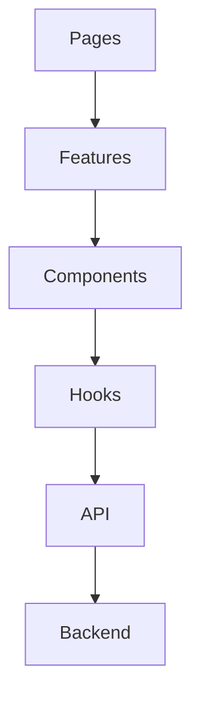
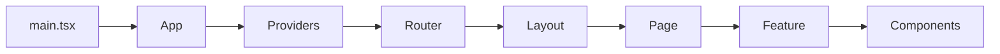
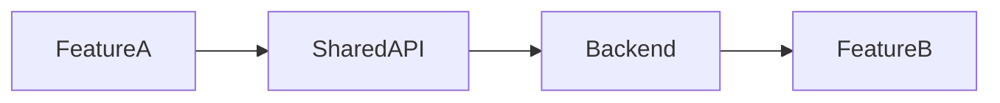
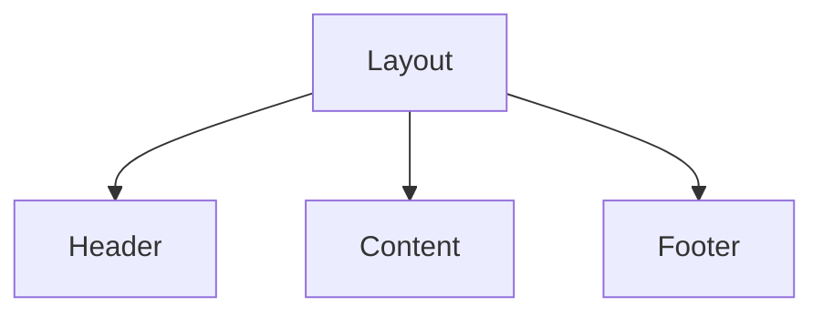

Frontend Foundation & Standards

---

# Cover Page

| Item     | Details                                                               |
| -------- | --------------------------------------------------------------------- |
| Document | Frontend Technical Design                                             |
| Project  | WoofBnB                                                               |
| Version  | 1.0                                                                   |
| Status   | Draft                                                                 |
| Owner    | Solution Architect                                                    |
| Audience | Frontend Developers, UI Engineers, QA Engineers, AI Development Tools |

---

# Revision History

| Version | Date        | Author             | Description                       |
| ------- | ----------- | ------------------ | --------------------------------- |
| 1.0     | August 2026 | Solution Architect | Initial Frontend Technical Design |

---

# 1. Purpose

This document defines the implementation standards for the WoofBnB React frontend.

It serves as the primary technical reference for:

- React developers
- Frontend architects
- UI engineers
- QA engineers
- AI-assisted development tools (Lovable, Cursor, Claude Code, GitHub Copilot)

Unlike the **Software Architecture Document**, this document focuses on **implementation decisions**, coding conventions, project structure, and development workflows.

---

# 2. Scope

This document covers:

- React application architecture
- Folder organization
- Feature modules
- State management
- Routing
- API integration
- Forms
- Components
- UI patterns
- Performance optimization
- Accessibility
- AI development guidelines

This document does **not** define:

- Business requirements _(Project Documentation)_
- Backend implementation _(Backend Technical Design)_
- Database schemas _(Database Design)_
- API contracts _(OpenAPI Specification)_

---

# 3. Technology Stack

## Core Framework

| Technology                 | Purpose       |
| -------------------------- | ------------- |
| React 19                   | UI Framework  |
| Vite                       | Build Tool    |
| TypeScript _(Recommended)_ | Static Typing |

> **Recommendation:** Although the current prototype uses JavaScript, plan the production version in **TypeScript**. It aligns better with your company's AI-assisted migration workflow and reduces runtime errors.

---

## State Management

| Technology  | Purpose               |
| ----------- | --------------------- |
| React Query | Server State          |
| Context API | Global UI State       |
| React Hooks | Local Component State |

---

## UI

| Technology      | Purpose    |
| --------------- | ---------- |
| Tailwind CSS    | Styling    |
| React Hook Form | Forms      |
| Zod             | Validation |

---

## Maps

| Technology  | Purpose         |
| ----------- | --------------- |
| Leaflet     | MVP Development |
| Google Maps | Production      |

---

## HTTP

| Technology | Purpose           |
| ---------- | ----------------- |
| Axios      | API Communication |

---

# 4. Frontend Design Principles

| ID     | Principle                                 |
| ------ | ----------------------------------------- |
| FE-001 | Feature-first organization                |
| FE-002 | Components remain reusable                |
| FE-003 | Business logic stays outside UI           |
| FE-004 | Server state uses React Query             |
| FE-005 | UI state uses Context only when necessary |
| FE-006 | Components should be composable           |
| FE-007 | API communication is isolated             |
| FE-008 | Mobile-first responsive design            |

---

# FDR-001 — Feature-Based Architecture

**Decision**

The frontend is organized by feature rather than file type.

**Reason**

Improves scalability, ownership, and maintainability as the application grows.

---

# 5. Frontend Architecture Overview

```mermaid
flowchart TD

Pages

-->

Features

-->

Components

-->

Hooks

-->

API Layer

-->

Backend API
```

---

## Layer Responsibilities

| Layer      | Responsibility         |
| ---------- | ---------------------- |
| Pages      | Route entry points     |
| Features   | Business functionality |
| Components | Reusable UI            |
| Hooks      | Shared logic           |
| API Layer  | Server communication   |
| Utils      | Pure helper functions  |

---

# 6. Frontend Goals

| ID     | Goal                         |
| ------ | ---------------------------- |
| FG-001 | Fast initial load            |
| FG-002 | Responsive on all devices    |
| FG-003 | Maintainable codebase        |
| FG-004 | Reusable components          |
| FG-005 | Easy AI-assisted development |
| FG-006 | Minimal prop drilling        |
| FG-007 | Consistent UI behavior       |

---

# 7. Frontend Quality Attributes

| Attribute       | Target    |
| --------------- | --------- |
| Performance     | Excellent |
| Accessibility   | WCAG AA   |
| Maintainability | High      |
| Scalability     | High      |
| Reusability     | High      |
| Testability     | High      |

---

# 8. Application Modules

Current MVP

| Module       | Status |
| ------------ | ------ |
| Home         | ✅     |
| Search       | ✅     |
| Pet Sitters  | ✅     |
| Map          | ✅     |
| Registration | ✅     |

Future

| Module         | Status |
| -------------- | ------ |
| Authentication | 🚀     |
| Bookings       | 🚀     |
| Reviews        | 🚀     |
| Notifications  | 🚀     |
| Favorites      | 🚀     |
| Admin          | 🚀     |

---

# 9. Frontend Responsibility Matrix

| Concern             | Frontend | Backend |
| ------------------- | -------- | ------- |
| Rendering           | ✅       | ❌      |
| Validation (UX)     | ✅       | ❌      |
| Business Validation | ❌       | ✅      |
| Authentication UI   | ✅       | ❌      |
| Authorization       | ❌       | ✅      |
| API Calls           | ✅       | ❌      |
| Database Access     | ❌       | ✅      |

---

# FDR-002 — Thin UI Components

**Decision**

React components should focus on presentation and interaction.

Business rules remain in hooks, services, or backend APIs.

**Reason**

Improves reusability and simplifies testing.

---

# 10. Coding Philosophy

The frontend should emphasize:

- Predictability over cleverness
- Readability over brevity
- Composition over inheritance
- Reusability over duplication
- Convention over configuration

Developers should favor simple, explicit implementations that align with the documented architecture.

---

# 11. Frontend Development Workflow

```mermaid
flowchart LR

Business Requirement

-->

OpenAPI Contract

-->

React Component

-->

React Query

-->

API Layer

-->

Backend
```

Every feature should begin with the **OpenAPI contract**, ensuring the UI is implemented against a stable API specification rather than assumptions.

---

# 12. AI Development Guidelines

AI-assisted tools should follow these rules when generating frontend code:

### Must

- Follow the feature-based folder structure.
- Reuse existing shared components.
- Use React Query for server state.
- Use React Hook Form with Zod for forms.
- Consume DTOs defined in the OpenAPI Specification.
- Keep components focused on a single responsibility.

### Must Not

- Duplicate business logic.
- Call Axios directly from UI components.
- Mix styling approaches.
- Create global state unnecessarily.
- Bypass the API layer.

---

# FDR-003 — API Layer Isolation

**Decision**

All HTTP communication must pass through the dedicated API layer.

**Reason**

Centralizes error handling, authentication, logging, and future API changes.

---

# 13. Current Implementation Assessment

| Area            | Status         | Notes                              |
| --------------- | -------------- | ---------------------------------- |
| React + Vite    | ✅             | Good foundation                    |
| React Query     | ✅             | Appropriate server-state solution  |
| Context API     | ✅             | Keep limited to UI concerns        |
| Tailwind CSS    | ✅             | Consistent utility-first styling   |
| React Hook Form | ✅             | Strong form solution               |
| Zod             | ✅             | Schema validation aligned with API |
| TypeScript      | 🔄 Recommended | Adopt before production            |

---

# Architect's Notes

The current frontend technology choices are well suited for the MVP and align with the long-term roadmap. The main recommendation is to adopt **TypeScript** before significant feature expansion, as it will improve maintainability, strengthen AI-assisted code generation, and simplify the eventual migration to the organization's target stack.

---

# 14. Application Architecture Overview

WoofBnB follows a **Feature-Based Modular Architecture**.

The architecture separates:

- Routing
- Features
- Shared Components
- API Communication
- State Management
- Utilities

Each layer has a single responsibility.

---

# Frontend Architecture

```mermaid
flowchart TD

App

-->

Router

-->

Pages

-->

Features

-->

Components

-->

Hooks

-->

API Layer

-->

Backend
```

---

# FDR-004 — Layered Frontend Architecture

**Decision**

Separate routing, pages, features, components, and API communication into independent layers.

**Reason**

Improves maintainability, scalability, and onboarding for developers.

---

# 15. Project Structure

```text
src/

├── app/
│   ├── App.tsx
│   ├── providers/
│   └── config/
│
├── api/
│   ├── axios.ts
│   ├── auth.api.ts
│   ├── petSitters.api.ts
│   └── index.ts
│
├── assets/
│
├── components/
│   ├── common/
│   ├── layout/
│   ├── map/
│   └── ui/
│
├── context/
│
├── features/
│
├── hooks/
│
├── layouts/
│
├── pages/
│
├── routes/
│
├── styles/
│
├── types/
│
├── utils/
│
└── main.tsx
```

---

# 16. Feature Module Structure

Every feature follows the same internal organization.

```text
features/

petSitters/

├── api/
├── components/
├── hooks/
├── pages/
├── schemas/
├── services/
├── types/
└── utils/
```

---

## Benefits

- Self-contained modules
- Easier maintenance
- Better scalability
- Reduced coupling

---

# FDR-005 — Self-Contained Features

**Decision**

Each feature owns its API wrappers, hooks, types, and components.

**Reason**

Allows independent development and minimizes cross-feature dependencies.

---

# 17. Module Responsibilities

| Module     | Responsibility          |
| ---------- | ----------------------- |
| app        | Application bootstrap   |
| api        | HTTP communication      |
| assets     | Static resources        |
| components | Shared UI               |
| context    | Global UI state         |
| features   | Business functionality  |
| hooks      | Shared reusable hooks   |
| layouts    | Page layouts            |
| pages      | Route entry points      |
| routes     | Route definitions       |
| styles     | Global styles           |
| types      | Shared TypeScript types |
| utils      | Helper utilities        |

---

# 18. Feature Inventory

Current MVP

```text
features/

home/

search/

petSitters/

map/

registration/
```

Future

```text
features/

auth/

bookings/

reviews/

notifications/

favorites/

admin/
```

---

# 19. Dependency Direction

Dependencies must always flow downward.



---

## Rules

Pages may depend on features.

Features may depend on shared components.

Components must never depend on pages.

Hooks must never depend on UI components.

API modules must not import React components.

---

# FDR-006 — One-Way Dependencies

**Decision**

Dependencies flow from higher-level modules to lower-level modules only.

**Reason**

Prevents circular dependencies and simplifies testing.

---

# 20. Layout Architecture

WoofBnB uses layout components to provide a consistent user experience.

```text
layouts/

MainLayout

AuthLayout

AdminLayout (Future)
```

---

## MainLayout

Contains:

- Navigation
- Footer
- Global notifications
- Shared page container

---

## AuthLayout

Contains:

- Authentication pages
- Minimal navigation
- Focused user flow

---

## AdminLayout

Reserved for future administrative features.

---

# 21. Routing Structure

```text
/

├── /

├── /search

├── /pet-sitters/:id

├── /register-sitter

├── /login

├── /profile

├── /bookings

└── /admin
```

---

## Route Ownership

| Route            | Feature      |
| ---------------- | ------------ |
| /                | Home         |
| /search          | Search       |
| /pet-sitters/:id | Pet Sitters  |
| /register-sitter | Registration |
| /login           | Auth         |
| /profile         | User         |
| /bookings        | Bookings     |
| /admin           | Admin        |

---

# FDR-007 — Feature-Owned Routes

**Decision**

Every route belongs to exactly one feature module.

**Reason**

Avoids duplicated routing logic and keeps ownership clear.

---

# 22. Shared Component Strategy

Shared components should remain business-agnostic.

Examples:

```text
Button

Card

Modal

Input

Spinner

Badge

Avatar

EmptyState

Pagination
```

---

## Business Components

Remain inside features.

Examples:

```text
PetSitterCard

PetSitterList

NearbySearch

RegistrationForm

BookingCard
```

---

# FDR-008 — Shared vs Feature Components

**Decision**

Only reusable, domain-independent UI belongs in `components/`.

Business-specific UI remains within its feature.

**Reason**

Prevents the shared component library from becoming tightly coupled to business logic.

---

# 23. Custom Hook Organization

## Global Hooks

```text
hooks/

useDebounce

useGeolocation

useLocalStorage

useMediaQuery
```

---

## Feature Hooks

```text
features/search/hooks/

useNearbySearch

useCitySearch

useSearchFilters
```

---

## Rules

- Hooks encapsulate reusable logic.
- Hooks do not render UI.
- Hooks do not perform direct DOM manipulation unless required.

---

# 24. Bootstrapping Flow



---

# 25. Component Ownership Matrix

| Component        | Owner                |
| ---------------- | -------------------- |
| Navbar           | Layout               |
| Footer           | Layout               |
| SearchBar        | Search Feature       |
| PetSitterCard    | Pet Sitters Feature  |
| MapView          | Map Feature          |
| RegistrationForm | Registration Feature |
| LoadingSpinner   | Shared Components    |
| EmptyState       | Shared Components    |

---

# 26. Application Initialization

During application startup:

1. Render root application.
2. Register providers (React Query, Context).
3. Configure routing.
4. Load global styles.
5. Initialize API client.
6. Render first route.

No business data should be fetched before providers are initialized.

---

# Current Architecture Assessment

| Area                       | Status         |
| -------------------------- | -------------- |
| Feature-Based Organization | ✅ Recommended |
| Shared Component Library   | ✅ Defined     |
| Route Ownership            | ✅ Defined     |
| Layout Strategy            | ✅ Defined     |
| Hook Organization          | ✅ Defined     |
| Dependency Rules           | ✅ Defined     |
| Bootstrapping Flow         | ✅ Defined     |

---

# Architect's Notes

The proposed frontend architecture aligns well with modern React practices and your existing technology stack. The **feature-first organization** minimizes coupling, supports parallel development, and fits naturally with AI-assisted code generation. By clearly separating shared UI, business features, hooks, and API communication, the codebase remains maintainable as WoofBnB grows beyond the MVP.

---

# 27. Feature Module Philosophy

WoofBnB adopts a **feature-first architecture**.

A feature owns everything required to implement a business capability.

Each feature is:

- Independent
- Self-contained
- Testable
- Reusable
- Easy to remove or replace

---

# FDR-009 — Feature Ownership

**Decision**

Each business capability is implemented as a single feature module.

**Reason**

Improves maintainability and enables parallel development.

---

# 28. Feature Directory Structure

Every feature follows the same internal structure.

```text
features/

search/

├── api/
├── components/
├── hooks/
├── pages/
├── schemas/
├── services/
├── types/
├── utils/
└── index.ts
```

---

## Folder Responsibilities

| Folder     | Responsibility                   |
| ---------- | -------------------------------- |
| api        | API wrappers                     |
| components | Feature-specific UI              |
| hooks      | Feature-specific hooks           |
| pages      | Feature entry pages              |
| schemas    | Zod validation schemas           |
| services   | Business helpers (frontend only) |
| types      | Feature models & DTOs            |
| utils      | Pure helper functions            |
| index.ts   | Barrel exports                   |

---

# 29. Current Feature Inventory

```text
features/

home/

search/

petSitters/

map/

registration/
```

---

## Future Features

```text
features/

auth/

bookings/

reviews/

notifications/

favorites/

profile/

admin/
```

---

# 30. Search Feature

Responsible for:

- Current location search
- City search
- Search filters
- Search state
- Search results

---

### Structure

```text
search/

api/

components/
    SearchBar
    LocationButton
    SearchResults

hooks/
    useNearbySearch
    useCitySearch

schemas/
    search.schema

types/

index.ts
```

---

# 31. Pet Sitters Feature

Responsible for:

- Pet sitter cards
- Detail page
- Rating display
- Verification badges

---

### Structure

```text
petSitters/

components/

PetSitterCard

PetSitterList

PetSitterDetails

Rating

VerificationBadge

hooks/

usePetSitter

api/
```

---

# 32. Map Feature

Responsible for:

- Leaflet integration (MVP)
- Google Maps integration (Future)
- User marker
- Pet sitter markers
- Marker interactions

---

### Structure

```text
map/

components/

MapView

MarkerLayer

UserMarker

PetSitterMarker

hooks/

useMap

useMapMarkers

api/
```

---

# FDR-010 — Isolated Map Feature

**Decision**

Map functionality is isolated into its own feature.

**Reason**

Supports future migration from Leaflet to Google Maps with minimal impact.

---

# 33. Registration Feature

Responsible for:

- Pet sitter registration
- Form validation
- API submission
- Success flow

---

### Structure

```text
registration/

components/

RegistrationForm

LocationPicker

ImageUpload

hooks/

useRegistration

schemas/

registration.schema
```

---

# 34. Home Feature

Responsible for:

- Hero section
- Landing page
- Featured content
- Quick search

---

### Structure

```text
home/

components/

Hero

FeatureHighlights

CallToAction

NearbyPreview
```

---

# 35. Authentication Feature (Future)

```text
auth/

components/

LoginForm

RegisterForm

ForgotPasswordForm

hooks/

useLogin

useRegister

useLogout
```

---

# 36. Booking Feature (Future)

```text
bookings/

components/

BookingCard

BookingTimeline

BookingStatus

BookingSummary

hooks/

useBookings

useCreateBooking
```

---

# 37. File Naming Standards

| Item       | Convention           | Example                  |
| ---------- | -------------------- | ------------------------ |
| Components | PascalCase           | `PetSitterCard.tsx`      |
| Hooks      | camelCase with `use` | `useNearbySearch.ts`     |
| Types      | camelCase            | `petSitter.types.ts`     |
| Schemas    | camelCase            | `registration.schema.ts` |
| API        | camelCase            | `petSitters.api.ts`      |
| Utils      | camelCase            | `distanceFormatter.ts`   |

---

# FDR-011 — Naming Convention

**Decision**

Adopt consistent naming conventions for all frontend files.

**Reason**

Improves readability and AI-generated code consistency.

---

# 38. Barrel Exports

Each feature exposes a single public entry point.

Example:

```text
features/

search/

index.ts
```

The `index.ts` file exports only the public API of the feature.

Benefits:

- Cleaner imports
- Controlled module boundaries
- Easier refactoring

---

# 39. Feature Communication

Features should communicate through:

- Props
- Shared hooks
- React Query cache
- Context (only when necessary)

Avoid direct imports between unrelated feature internals.

---

## Communication Flow



---

# FDR-012 — Loose Coupling

**Decision**

Features communicate through public interfaces rather than internal implementation details.

**Reason**

Reduces coupling and simplifies maintenance.

---

# 40. Shared Utilities

Only truly reusable utilities belong outside feature folders.

Examples:

```text
utils/

dateFormatter

distanceFormatter

debounce

storage

validators
```

Rules:

- No React code.
- No business logic.
- Pure functions only.

---

# 41. Shared Types

Global types shared across multiple features.

```text
types/

api.types

pagination.types

user.types

common.types
```

Feature-specific types remain inside the feature.

---

# 42. Asset Organization

```text
assets/

images/

icons/

illustrations/

logos/

fonts/
```

Rules:

- Optimize images before committing.
- Prefer SVG for icons.
- Avoid duplicating assets across features.

---

# 43. Module Boundary Rules

| Allowed                     | Not Allowed                                |
| --------------------------- | ------------------------------------------ |
| Feature → Shared Components | Feature → Another Feature's Internal Files |
| Feature → Shared Hooks      | Feature → Another Feature's API Folder     |
| Feature → Shared Types      | Circular Feature Dependencies              |
| Feature → API Layer         | Direct Database Access                     |

---

# 44. AI Code Generation Rules

When generating a new feature, AI tools should:

### Create

- Feature folder
- `index.ts`
- `components/`
- `hooks/`
- `api/`
- `schemas/`
- `types/`

### Follow

- Existing naming conventions
- Feature boundaries
- Shared component reuse
- API layer usage

### Never

- Duplicate shared components
- Call Axios directly from components
- Access another feature's internal files
- Introduce circular dependencies

---

# Current Implementation Assessment

| Area                    | Status         |
| ----------------------- | -------------- |
| Feature-Based Structure | ✅ Recommended |
| Naming Standards        | ✅ Defined     |
| Module Boundaries       | ✅ Defined     |
| Barrel Exports          | ✅ Recommended |
| Shared Utilities        | ✅ Defined     |
| AI Generation Rules     | ✅ Defined     |

---

# Architect's Notes

The feature module structure is intentionally designed for **long-term scalability**. By enforcing consistent internal organization, clear ownership, and strict module boundaries, developers and AI tools can add new functionality without disrupting existing features.

This approach also supports your company's workflow of rapidly prototyping with AI and later refactoring into a production-ready codebase, because each feature remains modular and independently maintainable.

---

# 45. State Management Philosophy

WoofBnB uses **different state management strategies for different types of state**.

Not all state belongs in Context.

---

## State Categories

| State Type      | Technology      |
| --------------- | --------------- |
| Server State    | React Query     |
| Global UI State | Context API     |
| Component State | useState        |
| Form State      | React Hook Form |
| URL State       | React Router    |
| Derived State   | useMemo         |

---

# FDR-013 — Right Tool for the Right State

**Decision**

Use the simplest state management solution appropriate for each state type.

**Reason**

Reduces complexity and avoids unnecessary global state.

---

# 46. State Ownership

```mermaid
flowchart TD

Backend

-->

React Query Cache

-->

Feature Hooks

-->

Components

-->

UI
```

---

## Ownership Matrix

| State              | Owner           |
| ------------------ | --------------- |
| Nearby Pet Sitters | React Query     |
| Pet Sitter Details | React Query     |
| User Profile       | React Query     |
| Search Form        | React Hook Form |
| Current Theme      | Context         |
| Sidebar Open       | Context         |
| Modal Visibility   | Local State     |
| Selected Card      | Local State     |
| Search Radius      | URL State       |

---

# 47. React Query Architecture

React Query manages all server state.

## Responsibilities

- Data fetching
- Caching
- Refetching
- Mutations
- Retry logic
- Loading states
- Error states

---

## React Query Flow

```mermaid
flowchart LR

Component

-->

Hook

-->

React Query

-->

API Layer

-->

Backend
```

---

# FDR-014 — React Query for Server State

**Decision**

All backend communication is managed through React Query.

**Reason**

Provides consistent caching, retries, synchronization, and request lifecycle management.

---

# 48. Query Key Strategy

Every query must use standardized keys.

```text
queryKeys/

auth.currentUser

petSitters.nearby

petSitters.detail

search.city

bookings.list

reviews.bySitter

notifications.list
```

---

## Naming Rules

```
feature.resource

feature.resource.detail

feature.resource.list
```

Example:

```
petSitters.nearby

petSitters.detail

bookings.list
```

---

# 49. Cache Strategy

| Data               | Cache Duration | Refetch         |
| ------------------ | -------------- | --------------- |
| Nearby Search      | 5 minutes      | On demand       |
| Pet Sitter Details | 10 minutes     | On window focus |
| User Profile       | 15 minutes     | Manual          |
| Notifications      | 1 minute       | Automatic       |
| Reviews            | 10 minutes     | Manual          |

---

## Cache Invalidation Rules

| Mutation            | Invalidate                          |
| ------------------- | ----------------------------------- |
| Register Pet Sitter | petSitters.list                     |
| Update Profile      | currentUser, petSitters.detail      |
| Create Booking      | bookings.list                       |
| Submit Review       | reviews.bySitter, petSitters.detail |

---

# FDR-015 — Predictable Cache Invalidation

**Decision**

Mutations explicitly invalidate affected queries.

**Reason**

Ensures UI consistency while avoiding unnecessary refetches.

---

# 50. Mutation Strategy

Mutations are responsible for:

- Creating resources
- Updating resources
- Deleting resources (soft delete)
- Triggering cache invalidation
- Handling optimistic UI where appropriate

---

## Mutation Flow

```mermaid
flowchart LR

Form

-->

Mutation

-->

API

-->

Backend

-->

Invalidate Cache

-->

Updated UI
```

---

# 51. Context API Responsibilities

Context is reserved for **global UI state only**.

---

## Allowed Context

```text
ThemeContext

AuthContext (UI/session only)

ToastContext

LayoutContext
```

---

## Not Allowed

Do **not** store:

- Search results
- API responses
- Bookings
- Reviews
- Pet sitter lists

These belong in React Query.

---

# FDR-016 — Minimal Context Usage

**Decision**

Context manages application-wide UI concerns, not server data.

**Reason**

Avoids duplicated state and unnecessary re-renders.

---

# 52. Local State Guidelines

Use `useState` for:

- Open/close modal
- Dropdown selection
- Active tab
- Accordion state
- Hover state
- Card expansion

Never use local state for shared business data.

---

# 53. URL State Management

Certain state should remain in the URL.

Examples:

| State  | Example        |
| ------ | -------------- |
| City   | `?city=Delhi`  |
| Radius | `?radius=5`    |
| Page   | `?page=2`      |
| Sort   | `?sort=rating` |

Benefits:

- Shareable URLs
- Browser navigation support
- Better UX

---

# 54. Axios Client Configuration

All HTTP communication passes through a single configured Axios instance.

Responsibilities:

- Base URL configuration
- Authentication headers
- Request interceptors
- Response interceptors
- Error normalization
- Timeout configuration

No component should create its own Axios instance.

---

# FDR-017 — Centralized API Client

**Decision**

Use a single shared Axios client for all API requests.

**Reason**

Ensures consistent configuration and simplifies maintenance.

---

# 55. API Service Layer

Structure:

```text
api/

axios.ts

auth.api.ts

petSitters.api.ts

bookings.api.ts

reviews.api.ts
```

Each service should:

- Map directly to OpenAPI endpoints.
- Return typed DTOs.
- Avoid UI logic.
- Avoid React-specific code.

---

# 56. Error Handling Strategy

Errors are categorized into:

| Type           | Handling                             |
| -------------- | ------------------------------------ |
| Validation     | Inline form errors                   |
| Authentication | Redirect to login or refresh session |
| Authorization  | Access denied page/message           |
| Network        | Retry with user feedback             |
| Server         | Generic error screen                 |

---

## Error Flow

```mermaid
flowchart LR

API Error

-->

Interceptor

-->

Normalized Error

-->

React Query

-->

UI
```

---

# 57. Loading State Strategy

Every async operation must expose loading state.

Examples:

- Initial page load
- Search results
- Form submission
- Booking creation
- Profile update

Use:

- Skeleton loaders for page content
- Spinners for short actions
- Disabled buttons during submissions

---

# 58. Optimistic Updates

Optimistic UI updates are recommended for:

| Feature                      | Strategy                    |
| ---------------------------- | --------------------------- |
| Favorites                    | ✅ Optimistic               |
| Notifications (mark as read) | ✅ Optimistic               |
| Profile Updates              | ⚠️ Optional                 |
| Booking Creation             | ❌ Wait for confirmation    |
| Registration                 | ❌ Wait for server response |

---

# FDR-018 — Selective Optimistic Updates

**Decision**

Apply optimistic updates only where rollback is simple and user expectations are clear.

**Reason**

Prevents inconsistent UI for critical business operations such as bookings.

---

# 59. Offline & Retry Strategy

| Scenario                  | Behavior                                            |
| ------------------------- | --------------------------------------------------- |
| Temporary network failure | Automatic retry                                     |
| Authentication failure    | Redirect or token refresh                           |
| Server unavailable        | Display friendly error                              |
| Offline mode              | Preserve UI, retry when online (future enhancement) |

---

# 60. State Management Checklist

Before introducing new state, ask:

- Is this server data? → React Query
- Is this global UI? → Context
- Is this page-specific? → useState
- Is this form data? → React Hook Form
- Should users share the state via URL? → URL parameters

---

# Current Implementation Assessment

| Area           | Status                         |
| -------------- | ------------------------------ |
| React Query    | ✅ Strong choice               |
| Context Usage  | ✅ Keep UI-focused             |
| Axios Layer    | ✅ Centralize                  |
| Cache Strategy | ✅ Defined                     |
| Query Keys     | ✅ Standardized                |
| Mutation Flow  | ✅ Defined                     |
| Error Handling | 🔄 Standardize across features |

---

# Architect's Notes

The chosen state management strategy aligns with modern React best practices. By clearly separating **server state (React Query)** from **UI state (Context/useState)**, the application avoids duplicated data, improves performance, and simplifies maintenance. The API layer remains isolated behind Axios services, ensuring future backend changes—or the planned migration to ASP.NET Core—require minimal frontend modifications.

---

# 61. UI Architecture Philosophy

The UI should be:

- Modular
- Reusable
- Accessible
- Responsive
- Consistent

Every screen should be composed from reusable components rather than large monolithic pages.

---

## UI Composition

```mermaid
flowchart TD

Page

-->

Feature

-->

Business Components

-->

Shared Components

-->

UI Elements
```

---

# FDR-019 — Component Composition

**Decision**

Pages compose features, and features compose reusable components.

**Reason**

Encourages reuse and keeps components focused on a single responsibility.

---

# 62. Component Hierarchy

## Shared Components

```text
components/

Button

Input

Textarea

Select

Modal

Card

Badge

Avatar

Spinner

Skeleton

EmptyState

Pagination
```

---

## Business Components

```text
features/

search/
    SearchBar
    SearchResults

petSitters/
    PetSitterCard
    PetSitterList
    RatingBadge

map/
    MapView
    MarkerPopup

registration/
    RegistrationForm
```

---

## Component Rules

| Rule                                                 | Description |
| ---------------------------------------------------- | ----------- |
| UI components contain no business logic              |             |
| Business components may compose shared components    |             |
| Shared components remain domain-independent          |             |
| Components expose clear props and avoid side effects |             |

---

# 63. Component Communication

Allowed communication methods:

| Method             | Usage               |
| ------------------ | ------------------- |
| Props              | Parent → Child      |
| Callback Functions | Child → Parent      |
| React Query        | Shared server state |
| Context            | Global UI state     |

Avoid direct communication between sibling components.

---

## Component Flow

```mermaid
flowchart LR

Page

-->

Feature

-->

Component

-->

Shared UI
```

---

# FDR-020 — Predictable Data Flow

**Decision**

Use unidirectional data flow throughout the application.

**Reason**

Simplifies debugging and improves maintainability.

---

# 64. Form Architecture

All forms follow the same implementation pattern.

Technology stack:

- React Hook Form
- Zod
- React Query (mutations)

---

## Form Flow

```mermaid
flowchart LR

User Input

-->

React Hook Form

-->

Zod Validation

-->

Mutation

-->

API

-->

Backend
```

---

## Form Responsibilities

| Layer           | Responsibility      |
| --------------- | ------------------- |
| React Hook Form | State management    |
| Zod             | Validation          |
| Mutation        | Submission          |
| Backend         | Business validation |

---

# FDR-021 — Standard Form Pattern

**Decision**

Every form follows the React Hook Form + Zod pattern.

**Reason**

Ensures consistent validation and simplifies maintenance.

---

# 65. Form Standards

Every form should provide:

- Client-side validation
- Inline error messages
- Loading state
- Disabled submit button during submission
- Success feedback
- Failure feedback

---

## Validation Order

```text
User Input

↓

Zod Validation

↓

Submit

↓

Backend Validation

↓

Response
```

---

# 66. Routing Strategy

React Router manages navigation.

---

## Route Hierarchy

```text
/

├── /

├── /search

├── /pet-sitters/:id

├── /register-sitter

├── /login

├── /profile

├── /bookings

└── /admin
```

---

## Route Ownership

| Route            | Feature        |
| ---------------- | -------------- |
| /                | Home           |
| /search          | Search         |
| /pet-sitters/:id | Pet Sitters    |
| /register-sitter | Registration   |
| /login           | Authentication |
| /profile         | Profile        |
| /bookings        | Bookings       |
| /admin           | Admin          |

---

# 67. Route Guards

Routes are categorized as:

| Type           | Authentication |
| -------------- | -------------- |
| Public         | None           |
| Protected      | JWT            |
| Role Protected | JWT + Role     |

---

## Examples

Public

```text
/

/search

/login

/register-sitter
```

Protected

```text
/profile

/bookings
```

Role Protected

```text
/admin
```

---

# FDR-022 — Route Protection

**Decision**

Authorization is enforced through centralized route guards.

**Reason**

Keeps access control consistent and avoids duplication.

---

# 68. Layout Composition

Layouts provide a consistent application shell.

---

## Main Layout

Contains:

- Header
- Navigation
- Footer
- Toast container

---

## Auth Layout

Contains:

- Minimal header
- Authentication forms
- Focused content area

---

## Admin Layout _(Future)_

Contains:

- Sidebar
- Dashboard navigation
- Administrative workspace

---

## Layout Structure



---

# 69. Responsive Design Standards

The application follows a **mobile-first** approach.

---

## Breakpoints

| Device        |      Width |
| ------------- | ---------: |
| Mobile        |    < 640px |
| Tablet        | 640–1023px |
| Desktop       |   ≥ 1024px |
| Large Desktop |   ≥ 1440px |

---

## Layout Rules

- Single-column layout on mobile.
- Sticky map only on desktop/tablet.
- Touch-friendly controls (minimum 44×44 px).
- Horizontal padding scales by breakpoint.
- Avoid horizontal scrolling.

---

# 70. Navigation Strategy

Navigation should expose only relevant destinations.

---

## MVP Navigation

```text
Home

Search

Become a Pet Sitter

Login
```

---

## Future Navigation

```text
Bookings

Favorites

Notifications

Profile

Admin
```

---

# 71. UI Feedback Standards

Every user action should produce immediate feedback.

| Action       | Feedback                  |
| ------------ | ------------------------- |
| Search       | Loading skeleton          |
| Form Submit  | Disabled button + spinner |
| Success      | Toast notification        |
| Error        | Inline message + toast    |
| Empty Search | Empty state illustration  |

---

# 72. Empty, Loading & Error States

Every data-driven screen should define three UI states.

---

## Loading

- Skeleton loaders
- Spinner for lightweight actions

---

## Empty

Example:

```text
No pet sitters found in this area.

Try increasing the search radius or choosing another location.
```

---

## Error

Example:

```text
Unable to load nearby pet sitters.

Please try again.
```

---

# FDR-023 — Explicit UI States

**Decision**

Every asynchronous screen implements loading, empty, success, and error states.

**Reason**

Improves usability and prevents blank or confusing interfaces.

---

# 73. Accessibility Standards

Target compliance:

**WCAG 2.1 Level AA**

Requirements:

- Semantic HTML
- Keyboard navigation
- Visible focus indicators
- ARIA labels where appropriate
- Color contrast compliance
- Accessible error messages
- Screen reader support

---

# 74. UI Consistency Checklist

Every new screen should satisfy:

- Uses shared layout
- Uses shared components
- Responsive at all breakpoints
- Accessible
- Supports loading state
- Supports empty state
- Supports error state
- Uses React Hook Form (where applicable)
- Uses React Query for server interactions

---

# Current Implementation Assessment

| Area                  | Status     |
| --------------------- | ---------- |
| Component Composition | ✅ Defined |
| Form Standards        | ✅ Defined |
| Routing Strategy      | ✅ Defined |
| Route Guards          | ✅ Defined |
| Responsive Design     | ✅ Defined |
| Accessibility         | ✅ Defined |
| UI Feedback           | ✅ Defined |

---

# Architect's Notes

The UI architecture prioritizes **consistency over customization**. Every feature should feel like part of the same application by relying on shared layouts, reusable components, and standardized interaction patterns. This approach not only improves the user experience but also makes AI-generated UI code significantly more predictable and easier to review.

# 75. Frontend Performance Strategy

## Purpose

The frontend should provide a fast, responsive, and reliable experience across desktop and mobile devices, including moderate network conditions common in India.

Performance optimization should focus on **real user experience** rather than premature micro-optimizations.

---

## Performance Principles

| ID          | Principle                         |
| ----------- | --------------------------------- |
| PERF-FE-001 | Load only what is needed          |
| PERF-FE-002 | Minimize unnecessary re-renders   |
| PERF-FE-003 | Cache server data intelligently   |
| PERF-FE-004 | Optimize images and static assets |
| PERF-FE-005 | Measure before optimizing         |

---

# FDR-024 — Performance by Design

**Decision**

Performance considerations are incorporated during implementation rather than added after development.

**Reason**

Reduces technical debt and improves perceived application speed.

---

# 76. Code Splitting Strategy

The application should use **route-level code splitting**.

## Lazy Loaded Routes

| Route              | Loading Strategy |
| ------------------ | ---------------- |
| `/login`           | Lazy             |
| `/register-sitter` | Lazy             |
| `/profile`         | Lazy             |
| `/bookings`        | Lazy             |
| `/admin`           | Lazy             |
| `/pet-sitters/:id` | Lazy             |

---

## Always Loaded

- App shell
- Home page
- Shared layout
- Navigation

---

## Loading Flow

```mermaid
flowchart LR

User

-->

Route

-->

Lazy Import

-->

Loading Skeleton

-->

Component Loaded
```

---

# FDR-025 — Route-Level Lazy Loading

**Decision**

Feature routes are lazy-loaded.

**Reason**

Reduces initial bundle size and improves first-load performance.

---

# 77. Rendering Optimization

Avoid unnecessary renders by following these guidelines.

| Technique         | Usage                                      |
| ----------------- | ------------------------------------------ |
| `React.memo`      | Pure presentational components             |
| `useMemo`         | Expensive derived values                   |
| `useCallback`     | Stable callback references when beneficial |
| React Query Cache | Prevent duplicate requests                 |

---

## Avoid

- Overusing memoization
- Inline object/function creation when it causes measurable re-renders
- Duplicated server state

---

# 78. Image Optimization

Image handling should follow these standards.

| Asset          | Recommendation                       |
| -------------- | ------------------------------------ |
| Icons          | SVG                                  |
| Logos          | SVG                                  |
| Profile Images | Responsive formats                   |
| Hero Images    | Compressed WebP/AVIF where supported |
| Placeholder    | Low-resolution preview               |

---

## Rules

- Compress images before deployment.
- Lazy-load off-screen images.
- Avoid oversized assets.

---

# 79. Bundle Optimization

The frontend should minimize JavaScript delivered to users.

Strategies:

- Route splitting
- Remove unused dependencies
- Tree shaking
- Dynamic imports
- Shared dependency optimization

---

## Bundle Targets

| Asset       | Target             |
| ----------- | ------------------ |
| Initial JS  | ≤ 250 KB (gzipped) |
| Initial CSS | ≤ 75 KB (gzipped)  |
| Hero Image  | ≤ 200 KB           |

These are **targets**, not hard limits, and should be reviewed as features grow.

---

# 80. Error Handling Strategy

Errors are handled consistently across the application.

---

## Error Categories

| Type           | UI Behavior                 |
| -------------- | --------------------------- |
| Validation     | Inline form message         |
| Network        | Retry option                |
| Authentication | Redirect or session refresh |
| Authorization  | Access denied screen        |
| Server Error   | Generic error page          |

---

## Error Flow

```mermaid
flowchart LR

API Error

-->

Axios Interceptor

-->

React Query

-->

Error Boundary

-->

User Feedback
```

---

# FDR-026 — Centralized Error Handling

**Decision**

Normalize API errors before exposing them to UI components.

**Reason**

Provides a consistent user experience and simplifies component logic.

---

# 81. Error Boundaries

React Error Boundaries should be implemented at key application levels.

---

## Recommended Placement

- Application root
- Route-level layouts
- High-risk feature modules (e.g., Map)

---

## Recovery Behavior

When an unrecoverable rendering error occurs:

- Display a friendly fallback screen.
- Log the error.
- Allow the user to retry or navigate home.

---

# 82. Logging Strategy

The frontend should record operational events without exposing sensitive information.

Examples:

- Unhandled exceptions
- Failed API requests
- Rendering failures
- Performance metrics

Do **not** log:

- Passwords
- JWT tokens
- Personal information
- Payment data (future)

---

# FDR-027 — Secure Client Logging

**Decision**

Only operational information is logged.

**Reason**

Protects user privacy while supporting diagnostics.

---

# 83. Accessibility Implementation

Target compliance:

**WCAG 2.1 Level AA**

---

## Requirements

| Area                 | Requirement                         |
| -------------------- | ----------------------------------- |
| Keyboard Navigation  | Full support                        |
| Focus Indicators     | Visible                             |
| Images               | Meaningful alt text                 |
| Forms                | Labels associated with controls     |
| Errors               | Announced to assistive technologies |
| Interactive Controls | Keyboard accessible                 |

---

## Special Considerations

For the interactive map:

- Provide an accessible list view as an alternative.
- Ensure search results are usable without interacting with the map.
- Marker selection should synchronize with the results list.

---

# FDR-028 — Accessible Map Experience

**Decision**

The map complements, but does not replace, accessible navigation.

**Reason**

Ensures users relying on keyboards or assistive technologies can access all functionality.

---

# 84. Performance Monitoring

The following metrics should be monitored.

| Metric                          | Target   |
| ------------------------------- | -------- |
| First Contentful Paint (FCP)    | < 1.8 s  |
| Largest Contentful Paint (LCP)  | < 2.5 s  |
| Interaction to Next Paint (INP) | < 200 ms |
| Cumulative Layout Shift (CLS)   | < 0.1    |
| Time to Interactive (TTI)       | < 3.5 s  |

---

# 85. Network Resilience

The application should gracefully handle unreliable networks.

| Scenario           | Expected Behavior        |
| ------------------ | ------------------------ |
| Slow API           | Loading indicator        |
| Temporary Failure  | Retry option             |
| Offline _(Future)_ | Inform user, preserve UI |
| Timeout            | Friendly error message   |

---

# 86. Accessibility & Performance Checklist

Before release, verify:

- ✅ Responsive across supported breakpoints
- ✅ Keyboard navigation works
- ✅ Images optimized
- ✅ Lazy loading implemented
- ✅ Loading states available
- ✅ Error boundaries configured
- ✅ Core Web Vitals measured
- ✅ Accessible forms
- ✅ Accessible map alternative available

---

# Current Implementation Assessment

| Area                   | Status             | Recommendation                         |
| ---------------------- | ------------------ | -------------------------------------- |
| React Performance      | ✅ Good foundation | Add lazy-loaded routes                 |
| React Query            | ✅ Appropriate     | Fine-tune cache durations              |
| Images                 | 🔄 Review          | Adopt WebP/AVIF where practical        |
| Error Boundaries       | 🔄 Recommended     | Add route-level boundaries             |
| Accessibility          | 🔄 Improve         | Validate against WCAG 2.1 AA           |
| Performance Monitoring | 🚀 Planned         | Integrate Lighthouse/PageSpeed into CI |

---

# Architect's Notes

WoofBnB's frontend should optimize **perceived performance** as much as actual performance. Features such as skeleton loaders, lazy-loaded routes, intelligent caching, and responsive images will have a greater impact on user experience than aggressive micro-optimizations.

Accessibility should be considered a core quality attribute rather than a post-development enhancement. In particular, the map interface must always have an equivalent list-based interaction model to ensure that location discovery remains usable for all users.

# 87. Development Philosophy

The frontend should prioritize:

- Simplicity
- Readability
- Maintainability
- Reusability
- Predictability

Developers should write code that is easy to understand, review, test, and refactor.

---

## Core Principles

| ID      | Principle                           |
| ------- | ----------------------------------- |
| DEV-001 | Prefer clarity over cleverness      |
| DEV-002 | Build reusable components           |
| DEV-003 | Keep business logic outside UI      |
| DEV-004 | Minimize component responsibilities |
| DEV-005 | Follow documented conventions       |

---

# FDR-029 — Convention Over Configuration

**Decision**

The frontend follows documented conventions instead of allowing multiple implementation styles.

**Reason**

Improves consistency and reduces onboarding time.

---

# 88. React Coding Standards

## Component Rules

Every component should:

- Have a single responsibility.
- Accept explicit props.
- Avoid hidden side effects.
- Be reusable where practical.
- Keep rendering logic straightforward.

---

## Recommended Structure

```text
Component

↓

Props

↓

Hooks

↓

Derived Values

↓

Event Handlers

↓

JSX
```

---

## Guidelines

| Rule                   | Recommendation                |
| ---------------------- | ----------------------------- |
| One component per file | ✅                            |
| Default export         | ❌ Avoid                      |
| Named exports          | ✅ Preferred                  |
| Large components       | Split into smaller components |

---

# 89. TypeScript Standards (Production Target)

Although the MVP may use JavaScript, the production frontend should adopt TypeScript.

---

## Rules

- Avoid `any`.
- Define interfaces/types for DTOs.
- Type component props.
- Type hook return values.
- Use enums only where shared with backend contracts.

---

## Shared Types

```text
types/

api.types.ts

user.types.ts

petSitter.types.ts

booking.types.ts
```

---

# FDR-030 — Strong Typing

**Decision**

Production code should use TypeScript with explicit types.

**Reason**

Improves maintainability, tooling, and AI-assisted refactoring.

---

# 90. Styling Standards

Tailwind CSS is the primary styling solution.

---

## Rules

- Utility classes only.
- Avoid inline styles.
- Extract repeated patterns into reusable components.
- Use design tokens (colors, spacing, typography) consistently.

---

## Do Not

- Mix multiple CSS methodologies.
- Create duplicate utility combinations repeatedly.
- Hard-code colors or spacing values without design token alignment.

---

# 91. Hook Design Standards

Custom hooks encapsulate reusable behavior.

---

## Responsibilities

Hooks may:

- Fetch data
- Manage state
- Coordinate business interactions
- Compose other hooks

Hooks must not:

- Render JSX
- Manipulate unrelated DOM elements
- Depend on feature-specific UI components

---

## Naming

```text
useNearbySearch

usePetSitter

useBookings

useRegistration
```

---

# FDR-031 — Hook Responsibility

**Decision**

Hooks encapsulate reusable logic and expose a stable interface.

**Reason**

Promotes reuse and simplifies testing.

---

# 92. Component Design Standards

Component categories:

| Category   | Example       |
| ---------- | ------------- |
| Layout     | MainLayout    |
| Shared UI  | Button        |
| Feature UI | PetSitterCard |
| Composite  | SearchResults |
| Page       | HomePage      |

---

## Maximum Responsibilities

Each component should ideally perform one primary task.

If a component grows beyond roughly **200–250 lines**, review whether it should be split into smaller components. This is a guideline rather than a strict rule.

---

# 93. Testing Expectations

Frontend testing should be layered.

| Level             | Purpose              |
| ----------------- | -------------------- |
| Unit Tests        | Components and hooks |
| Integration Tests | Feature workflows    |
| End-to-End Tests  | User journeys        |

---

## Recommended Coverage

| Area              | Priority |
| ----------------- | -------- |
| Search Flow       | High     |
| Registration Form | High     |
| API Integration   | High     |
| Shared Components | Medium   |
| Utility Functions | Medium   |

---

# 94. Git Workflow

Recommended branching strategy:

```text
main

↓

develop

↓

feature/search

feature/map

feature/auth
```

---

## Commit Message Convention

```text
feat:

fix:

refactor:

docs:

test:

chore:
```

Examples:

```text
feat: implement nearby pet sitter search

fix: resolve map marker synchronization

refactor: simplify search state management
```

---

# 95. Pull Request Checklist

Before merging:

- Feature follows folder structure.
- API integration uses the service layer.
- React Query used for server state.
- Forms use React Hook Form + Zod.
- No duplicated components.
- Loading, empty, and error states implemented.
- Accessibility reviewed.
- Responsive behavior verified.
- Tests updated where applicable.

---

# 96. AI Development Guidelines

This project is designed to support AI-assisted development.

---

## AI Must

- Follow the documented folder structure.
- Reuse existing components.
- Generate code that aligns with the OpenAPI specification.
- Place API calls in the API layer.
- Use React Query for server state.
- Use React Hook Form and Zod for forms.
- Respect module boundaries.

---

## AI Must Not

- Create duplicate UI components.
- Introduce global state unnecessarily.
- Call APIs directly from JSX.
- Bypass validation.
- Introduce circular dependencies.
- Mix business logic with presentation.

---

# FDR-032 — AI-Constrained Development

**Decision**

AI-generated code must conform to the documented frontend architecture and standards.

**Reason**

Ensures generated code remains maintainable and consistent with human-written code.

---

# 97. Refactoring Guidelines

Refactoring should preserve observable behavior.

Focus on:

- Reducing duplication
- Improving readability
- Simplifying component composition
- Extracting reusable hooks
- Improving testability

Avoid large-scale rewrites unless there is a clear architectural benefit.

---

# 98. Code Review Standards

Reviewers should evaluate:

| Area          | Question                                   |
| ------------- | ------------------------------------------ |
| Architecture  | Does it follow the documented structure?   |
| Components    | Single responsibility?                     |
| State         | Correct state management choice?           |
| API           | Uses service layer and React Query?        |
| UI            | Loading, empty, and error states included? |
| Accessibility | Keyboard and screen reader considerations? |
| Performance   | Any obvious unnecessary re-renders?        |

---

# 99. Frontend Maintainability Checklist

Every new feature should:

- Follow the feature module structure.
- Use shared components where appropriate.
- Avoid duplicated business logic.
- Respect OpenAPI contracts.
- Include loading, empty, success, and error states.
- Be responsive.
- Be accessible.
- Remain independently testable.

---

# 100. Development Readiness Assessment

| Area                 | Status     |
| -------------------- | ---------- |
| Coding Standards     | ✅ Defined |
| TypeScript Strategy  | ✅ Defined |
| Component Standards  | ✅ Defined |
| Hook Standards       | ✅ Defined |
| Styling Standards    | ✅ Defined |
| Testing Expectations | ✅ Defined |
| AI Guidelines        | ✅ Defined |
| Review Process       | ✅ Defined |

---

# Architect's Notes

The frontend standards are intentionally aligned with modern React engineering practices while supporting your organization's AI-assisted workflow. By documenting conventions for components, hooks, styling, testing, and AI-generated code, the project gains consistency regardless of whether code is written by a developer or produced by an AI assistant.

These standards also make the future migration from the prototype to the production stack significantly easier because the codebase remains modular, predictable, and well-structured.

# 101. Frontend Governance

## Purpose

Frontend governance ensures that the React application evolves in a consistent, maintainable, and scalable manner.

All new features, components, and architectural changes must comply with the standards defined in this document.

---

## Governance Principles

| ID        | Principle                                                |
| --------- | -------------------------------------------------------- |
| FEGOV-001 | Feature-first architecture is mandatory                  |
| FEGOV-002 | Shared components remain business-agnostic               |
| FEGOV-003 | Server state belongs to React Query                      |
| FEGOV-004 | API access occurs only through the API layer             |
| FEGOV-005 | UI follows documented design and accessibility standards |

---

# 102. Frontend Architecture Review Checklist

Every new feature should be reviewed against the following checklist.

| Category          | Review Question                                |
| ----------------- | ---------------------------------------------- |
| Feature Structure | Is the feature self-contained?                 |
| Components        | Are components single-responsibility?          |
| Hooks             | Is reusable logic extracted into hooks?        |
| State             | Is the correct state management approach used? |
| API               | Does communication go through the API layer?   |
| Routing           | Is route ownership clear?                      |
| Styling           | Does it follow Tailwind conventions?           |
| Accessibility     | Does it meet WCAG AA guidelines?               |
| Performance       | Are loading and rendering optimized?           |

---

# 103. Feature Readiness Checklist

Before a feature is considered complete, it should satisfy the following criteria.

| Requirement                         | Status |
| ----------------------------------- | ------ |
| Feature module created              | ☐      |
| API integration complete            | ☐      |
| Validation implemented              | ☐      |
| Loading state implemented           | ☐      |
| Empty state implemented             | ☐      |
| Error state implemented             | ☐      |
| Responsive layout verified          | ☐      |
| Accessibility reviewed              | ☐      |
| Unit tests added (where applicable) | ☐      |
| Documentation updated               | ☐      |

---

# 104. Requirement Traceability Matrix

The frontend implementation should remain traceable to the business and technical documentation.

| Business Requirement           | Frontend Feature | API                       | React Module            |
| ------------------------------ | ---------------- | ------------------------- | ----------------------- |
| BR-001 User Registration       | Registration     | POST `/auth/register`     | `features/registration` |
| BR-002 User Login              | Authentication   | POST `/auth/login`        | `features/auth`         |
| BR-003 Nearby Search           | Search           | GET `/pet-sitters/nearby` | `features/search`       |
| BR-004 Pet Sitter Registration | Registration     | POST `/pet-sitters`       | `features/registration` |
| BR-005 Booking                 | Bookings         | POST `/bookings`          | `features/bookings`     |
| BR-006 Reviews                 | Reviews          | POST `/reviews`           | `features/reviews`      |

---

# 105. Frontend Decision Register

The following Frontend Decision Records (FDRs) govern implementation.

| FDR     | Decision                       |
| ------- | ------------------------------ |
| FDR-001 | Feature-Based Architecture     |
| FDR-002 | Thin UI Components             |
| FDR-003 | API Layer Isolation            |
| FDR-004 | Layered Frontend Architecture  |
| FDR-005 | Self-Contained Features        |
| FDR-006 | One-Way Dependencies           |
| FDR-007 | Feature-Owned Routes           |
| FDR-008 | Shared vs Feature Components   |
| FDR-009 | Feature Ownership              |
| FDR-010 | Isolated Map Feature           |
| FDR-011 | Naming Convention              |
| FDR-012 | Loose Coupling                 |
| FDR-013 | Right Tool for the Right State |
| FDR-014 | React Query for Server State   |
| FDR-015 | Predictable Cache Invalidation |
| FDR-016 | Minimal Context Usage          |
| FDR-017 | Centralized API Client         |
| FDR-018 | Selective Optimistic Updates   |
| FDR-019 | Component Composition          |
| FDR-020 | Predictable Data Flow          |
| FDR-021 | Standard Form Pattern          |
| FDR-022 | Route Protection               |
| FDR-023 | Explicit UI States             |
| FDR-024 | Performance by Design          |
| FDR-025 | Route-Level Lazy Loading       |
| FDR-026 | Centralized Error Handling     |
| FDR-027 | Secure Client Logging          |
| FDR-028 | Accessible Map Experience      |
| FDR-029 | Convention Over Configuration  |
| FDR-030 | Strong Typing                  |
| FDR-031 | Hook Responsibility            |
| FDR-032 | AI-Constrained Development     |

---

# 106. Frontend Technical Debt Register

Known improvement opportunities.

| ID        | Area                                               | Priority |
| --------- | -------------------------------------------------- | -------- |
| FE-TD-001 | Migrate prototype to TypeScript                    | High     |
| FE-TD-002 | Add comprehensive unit and integration tests       | High     |
| FE-TD-003 | Introduce route-level error boundaries             | Medium   |
| FE-TD-004 | Optimize image delivery with modern formats        | Medium   |
| FE-TD-005 | Add offline support and background synchronization | Low      |

---

# 107. Production Readiness Assessment

| Area                  | Status      |
| --------------------- | ----------- |
| Feature Architecture  | ✅ Complete |
| Folder Structure      | ✅ Complete |
| Routing Strategy      | ✅ Complete |
| State Management      | ✅ Complete |
| API Integration       | ✅ Complete |
| Forms & Validation    | ✅ Complete |
| Accessibility         | ✅ Defined  |
| Performance Strategy  | ✅ Defined  |
| Development Standards | ✅ Defined  |

---

# 108. Frontend Maturity Assessment

| Category             | Score    |
| -------------------- | -------- |
| Architecture         | 10 / 10  |
| Maintainability      | 10 / 10  |
| Scalability          | 10 / 10  |
| Performance Strategy | 9.5 / 10 |
| Accessibility        | 9.5 / 10 |
| API Integration      | 10 / 10  |
| AI Readiness         | 10 / 10  |
| Developer Experience | 10 / 10  |

---

# 109. Solution Architect's Final Assessment

The frontend design provides a complete implementation blueprint for the React application.

### Strengths

- Clear feature-based organization
- Well-defined separation of concerns
- Consistent state management strategy
- Strong API integration patterns
- Reusable component architecture
- Scalable routing and layout design
- AI-friendly development standards

### Recommended Improvements Before Production

- Complete the migration to TypeScript.
- Establish automated testing in CI/CD.
- Add runtime monitoring (e.g., error tracking and performance metrics).
- Validate accessibility with manual and automated audits.
- Perform bundle analysis before each production release.

These are implementation and operational improvements rather than architectural changes.

---

# Relationship to Other Documents

```text
01_PROJECT_DOCUMENTATION.md
            │
            ▼
02_SOFTWARE_ARCHITECTURE.md
            │
            ▼
03_DATABASE_DESIGN.md
            │
            ▼
04_OPENAPI_SPECIFICATION.md
            │
            ▼
05_FRONTEND_TECHNICAL_DESIGN.md ✅
            │
            ▼
06_BACKEND_TECHNICAL_DESIGN.md
            │
            ▼
07_DEPLOYMENT_ARCHITECTURE.md
```

The Frontend Technical Design translates the business, architecture, database, and API specifications into a concrete React implementation strategy.

---

# Document Completion

| Section                     | Status      |
| --------------------------- | ----------- |
| Frontend Foundation         | ✅ Complete |
| React Architecture          | ✅ Complete |
| Feature Modules             | ✅ Complete |
| State Management            | ✅ Complete |
| UI Components & Routing     | ✅ Complete |
| Performance & Accessibility | ✅ Complete |
| Development Standards       | ✅ Complete |
| Governance & Readiness      | ✅ Complete |

---

# End of Document
