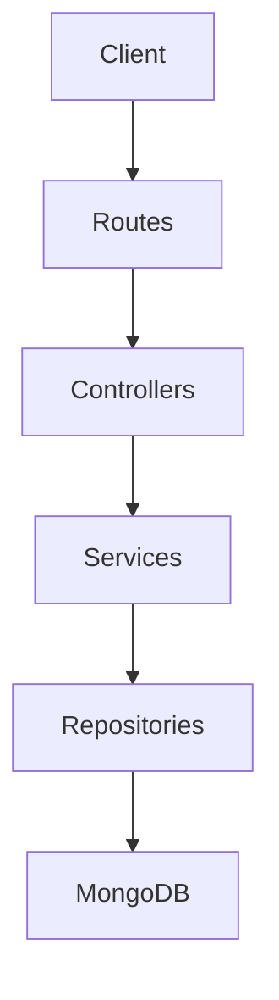
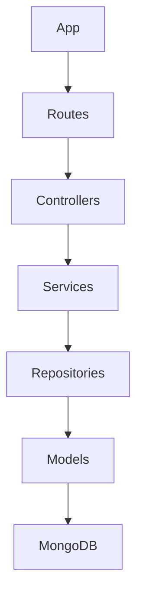
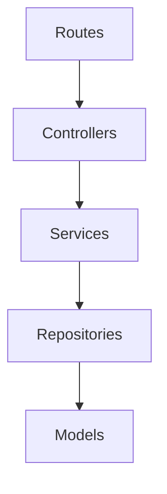
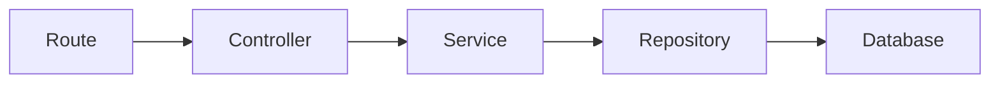
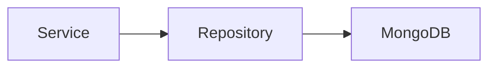
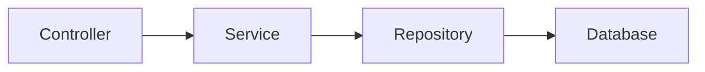
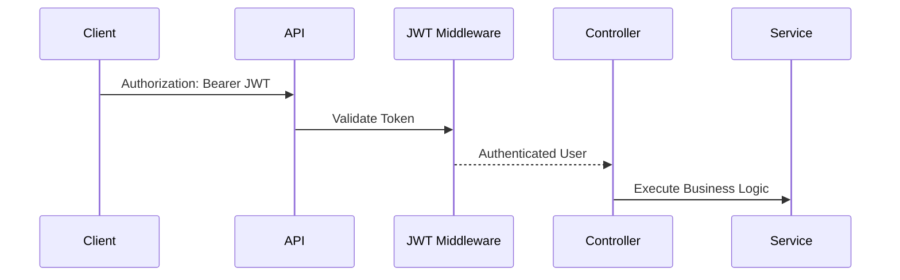

# 06_BACKEND_TECHNICAL_DESIGN.md

# PBackend Foundation & Standards

---

# Cover Page

| Item     | Details                                                                     |
| -------- | --------------------------------------------------------------------------- |
| Document | Backend Technical Design                                                    |
| Project  | WoofBnB                                                                     |
| Version  | 1.0                                                                         |
| Status   | Draft                                                                       |
| Owner    | Solution Architect                                                          |
| Audience | Backend Developers, Solution Architects, QA Engineers, AI Development Tools |

---

# Revision History

| Version | Date        | Author             | Description                      |
| ------- | ----------- | ------------------ | -------------------------------- |
| 1.0     | August 2026 | Solution Architect | Initial Backend Technical Design |

---

# 1. Purpose

This document defines the implementation standards for the WoofBnB backend.

It serves as the technical reference for:

- Backend developers
- Technical leads
- QA engineers
- DevOps engineers
- AI-assisted development tools

Unlike the **Software Architecture Document**, this document focuses on implementation standards, project organization, coding conventions, and development practices.

---

# 2. Scope

This document defines:

- Express application structure
- Layer responsibilities
- Routing standards
- Controller implementation
- Service layer implementation
- Repository implementation
- Mapper strategy
- Validation
- Authentication
- Middleware
- Logging
- Performance
- AI-assisted backend development

This document does **not** define:

- Business requirements _(Project Documentation)_
- Database schema _(Database Design)_
- API contracts _(OpenAPI Specification)_
- Frontend implementation _(Frontend Technical Design)_

---

# 3. Technology Stack

## Runtime

| Technology    | Purpose            |
| ------------- | ------------------ |
| Node.js (LTS) | JavaScript runtime |
| Express.js    | REST API framework |

---

## Database

| Technology | Purpose           |
| ---------- | ----------------- |
| MongoDB    | Document database |
| Mongoose   | ODM               |

---

## Validation

| Technology | Purpose            |
| ---------- | ------------------ |
| Zod        | Request validation |

> Standardize on **Zod** to align frontend and backend validation where practical.

---

## Authentication

| Technology | Purpose          |
| ---------- | ---------------- |
| JWT        | Access tokens    |
| bcrypt     | Password hashing |

---

## Supporting Libraries

| Technology  | Purpose                                      |
| ----------- | -------------------------------------------- |
| Axios       | External API communication (e.g., geocoding) |
| dotenv      | Environment configuration                    |
| CORS        | Cross-origin requests                        |
| Helmet      | Security headers                             |
| Compression | Response compression                         |
| Morgan/Pino | HTTP logging (choose one project-wide)       |

---

# 4. Backend Design Principles

| ID     | Principle                                 |
| ------ | ----------------------------------------- |
| BE-001 | Layered architecture                      |
| BE-002 | Thin controllers                          |
| BE-003 | Business logic belongs in services        |
| BE-004 | Data access belongs in repositories       |
| BE-005 | Never expose database models directly     |
| BE-006 | DTOs define API contracts                 |
| BE-007 | Global error handling                     |
| BE-008 | Dependency direction is strictly enforced |

---

# BDR-001 — Layered Backend Architecture

**Decision**

Adopt a layered backend architecture consisting of Routes → Controllers → Services → Repositories.

**Reason**

Improves maintainability, testability, and future migration to ASP.NET Core.

---

# 5. Backend Architecture Overview



---

## Layer Responsibilities

| Layer        | Responsibility          |
| ------------ | ----------------------- |
| Routes       | Endpoint registration   |
| Controllers  | Request handling        |
| Services     | Business rules          |
| Repositories | Database access         |
| Models       | Persistence models      |
| Mappers      | Entity ↔ DTO conversion |
| Middleware   | Cross-cutting concerns  |
| Utilities    | Shared helper functions |

---

# 6. Backend Goals

| ID     | Goal                                 |
| ------ | ------------------------------------ |
| BG-001 | Modular implementation               |
| BG-002 | Predictable request flow             |
| BG-003 | Framework-independent business logic |
| BG-004 | High testability                     |
| BG-005 | Clear separation of concerns         |
| BG-006 | AI-friendly code organization        |

---

# 7. Backend Quality Attributes

| Attribute       | Target |
| --------------- | ------ |
| Maintainability | High   |
| Scalability     | High   |
| Reliability     | High   |
| Security        | High   |
| Testability     | High   |
| Performance     | High   |

---

# 8. Layer Responsibility Matrix

| Concern                 | Controller         | Service | Repository |
| ----------------------- | ------------------ | ------- | ---------- |
| HTTP Parsing            | ✅                 | ❌      | ❌         |
| Validation Trigger      | ✅                 | ❌      | ❌         |
| Business Rules          | ❌                 | ✅      | ❌         |
| Authorization Decisions | 🔄 (invoke)        | ✅      | ❌         |
| Database Queries        | ❌                 | ❌      | ✅         |
| DTO Mapping             | 🔄 (invoke mapper) | 🔄      | ❌         |

> **Recommendation:** Controllers should invoke mappers rather than manually shaping responses.

---

# BDR-002 — Thin Controllers

**Decision**

Controllers coordinate requests and responses only.

Controllers must **not** contain:

- Business rules
- Database queries
- Complex calculations

**Reason**

Keeps HTTP concerns separate from business logic.

---

# 9. Backend Request Lifecycle

```mermaid
flowchart LR

HTTP Request

-->

Route

-->

Middleware

-->

Controller

-->

Service

-->

Repository

-->

MongoDB

-->

Repository

-->

Service

-->

Mapper

-->

Controller

-->

HTTP Response
```

---

# 10. Coding Philosophy

The backend should emphasize:

- Readability over brevity
- Explicit behavior over hidden magic
- Composition over inheritance
- Consistency over personal preference
- Small, focused classes/modules

Developers should prioritize maintainability over clever implementations.

---

# 11. Backend Development Workflow

```mermaid
flowchart LR

Business Requirement

-->

OpenAPI Contract

-->

Controller

-->

Service

-->

Repository

-->

Database
```

Every backend feature should begin with the **OpenAPI Specification**, ensuring the implementation matches the published API contract.

---

# 12. AI Development Guidelines

AI-assisted development tools should follow these rules.

### Must

- Follow the layered architecture.
- Generate thin controllers.
- Place business logic inside services.
- Place database access inside repositories.
- Reuse DTOs and mappers.
- Respect OpenAPI contracts.
- Keep modules focused on one responsibility.

### Must Not

- Query MongoDB from controllers.
- Return Mongoose documents directly.
- Duplicate validation logic.
- Mix routing and business logic.
- Bypass the repository layer.

---

# BDR-003 — Repository Isolation

**Decision**

Repositories are the only layer permitted to communicate with MongoDB.

**Reason**

Simplifies testing and supports future database migration with minimal impact on business logic.

---

# 13. Current Implementation Assessment

| Area                  | Status                                              | Notes |
| --------------------- | --------------------------------------------------- | ----- |
| Express.js            | ✅ Good foundation                                  |       |
| Layered Architecture  | ✅ Present                                          |       |
| Repository Pattern    | ✅ Present                                          |       |
| Service Layer         | ✅ Present                                          |       |
| Mapper Pattern        | ✅ Present                                          |       |
| GeoJSON Support       | ✅ Appropriate                                      |       |
| Global Error Handling | ✅ Present                                          |       |
| Validation            | 🔄 Standardize with Zod across all routes           |       |
| Logging               | 🔄 Select and standardize a single logging solution |       |

---

# Architect's Notes

The current backend architecture is already aligned with modern enterprise practices. The most important improvements before production are **standardizing validation**, **formalizing DTO usage**, and **ensuring strict layer separation**. These refinements will also make the planned migration to **ASP.NET Core + MySQL** significantly easier because business logic remains isolated from framework and persistence concerns.

---

# 14. Application Architecture Overview

WoofBnB follows a **Layered Modular Architecture**.

Each layer has a clearly defined responsibility and communicates only with adjacent layers.

---

## Architecture Flow



---

# BDR-004 — Layer Isolation

**Decision**

Every layer communicates only with the layer immediately below it.

**Reason**

Reduces coupling, improves maintainability, and simplifies testing.

---

# 15. Project Structure

```text
src/

├── app/
│   ├── app.js
│   ├── server.js
│   ├── providers/
│   └── config/
│
├── config/
│   ├── database.js
│   ├── environment.js
│   └── logger.js
│
├── routes/
│
├── controllers/
│
├── services/
│
├── repositories/
│
├── models/
│
├── mappers/
│
├── middlewares/
│
├── validators/
│
├── dto/
│
├── utils/
│
└── constants/
```

---

# 16. Folder Responsibilities

| Folder       | Responsibility                             |
| ------------ | ------------------------------------------ |
| app          | Application startup                        |
| config       | Environment & infrastructure configuration |
| routes       | Express route definitions                  |
| controllers  | HTTP request handling                      |
| services     | Business logic                             |
| repositories | Database operations                        |
| models       | Mongoose schemas                           |
| mappers      | Entity ↔ DTO conversion                    |
| middlewares  | Cross-cutting concerns                     |
| validators   | Request validation                         |
| dto          | API request & response models              |
| utils        | Shared utilities                           |
| constants    | Shared constants & enums                   |

---

# 17. Feature Organization

Business capabilities should remain modular.

```text
controllers/

auth/

petSitters/

bookings/

reviews/

search/

repositories/

auth/

petSitters/

bookings/

services/

auth/

petSitters/

bookings/
```

Each business domain owns its own controller, service, and repository implementation.

---

# BDR-005 — Feature-Oriented Layers

**Decision**

Each business domain owns implementations across all backend layers.

**Reason**

Improves ownership and supports parallel development.

---

# 18. Application Bootstrap

Application startup sequence:

```mermaid
flowchart LR

Load Environment

-->

Initialize Logger

-->

Connect Database

-->

Register Middleware

-->

Register Routes

-->

Global Error Handler

-->

Start Server
```

---

## Startup Responsibilities

| Step                       | Description                  |
| -------------------------- | ---------------------------- |
| Load environment variables | Read configuration           |
| Initialize logger          | Configure logging            |
| Connect MongoDB            | Verify database connectivity |
| Register middleware        | Security, parsing, CORS      |
| Register routes            | Mount API endpoints          |
| Register error handler     | Last middleware              |
| Start server               | Listen for requests          |

---

# 19. Configuration Management

Configuration should be centralized.

---

## Categories

| Configuration | Example            |
| ------------- | ------------------ |
| Server        | Port               |
| Database      | MongoDB URI        |
| JWT           | Secret, expiration |
| Maps          | API key            |
| Logging       | Log level          |
| Rate Limiting | Request limits     |

---

## Rules

- Never hard-code secrets.
- Read values from environment variables.
- Validate required configuration during startup.
- Fail fast if mandatory configuration is missing.

---

# BDR-006 — Centralized Configuration

**Decision**

Application configuration is loaded through a dedicated configuration layer.

**Reason**

Improves security and simplifies deployment across environments.

---

# 20. Environment Strategy

Supported environments:

| Environment | Purpose                   |
| ----------- | ------------------------- |
| Development | Local development         |
| Test        | Automated testing         |
| Staging     | Pre-production validation |
| Production  | Live system               |

---

## Environment Responsibilities

| Environment | Logging    | Debug    | Optimizations   |
| ----------- | ---------- | -------- | --------------- |
| Development | Verbose    | Enabled  | Minimal         |
| Test        | Minimal    | Enabled  | Fast execution  |
| Staging     | Structured | Disabled | Production-like |
| Production  | Structured | Disabled | Enabled         |

---

# 21. Dependency Direction

Dependencies always move downward.



---

## Rules

Routes import controllers.

Controllers import services.

Services import repositories.

Repositories import models.

Models never import higher layers.

---

# BDR-007 — One-Way Dependencies

**Decision**

Dependencies flow in one direction only.

**Reason**

Prevents circular dependencies and keeps architecture predictable.

---

# 22. Route Registration

Routes should be organized by feature.

```text
routes/

auth.routes.js

petSitters.routes.js

bookings.routes.js

reviews.routes.js

search.routes.js
```

---

## Responsibilities

Routes:

- Register endpoints
- Apply middleware
- Delegate to controllers

Routes must **not** contain business logic.

---

# 23. Controller Organization

Controllers remain thin.

Responsibilities:

- Parse requests
- Trigger validation
- Call services
- Map responses
- Return HTTP status codes

Controllers must not:

- Query MongoDB
- Apply business rules
- Perform complex calculations

---

# BDR-008 — HTTP Responsibility

**Decision**

Controllers manage HTTP concerns only.

**Reason**

Keeps business logic independent of Express.

---

# 24. Module Communication

Communication follows this flow:



No layer should bypass another.

---

# 25. Application Providers

Application-wide providers include:

| Provider                | Purpose              |
| ----------------------- | -------------------- |
| Database Provider       | MongoDB connection   |
| Logger Provider         | Structured logging   |
| Configuration Provider  | Environment settings |
| Authentication Provider | JWT validation       |

Future providers:

- Redis Cache
- Event Bus
- Background Jobs
- Message Queue

---

# 26. Initialization Checklist

Application startup should verify:

- Environment variables loaded
- Database connected
- Middleware registered
- Routes mounted
- Error handler configured
- Server listening
- Health endpoint responding

Startup should fail if critical infrastructure is unavailable.

---

# Current Architecture Assessment

| Area                   | Status          |
| ---------------------- | --------------- |
| Layered Architecture   | ✅ Defined      |
| Folder Structure       | ✅ Standardized |
| Module Ownership       | ✅ Defined      |
| Environment Management | ✅ Defined      |
| Route Registration     | ✅ Defined      |
| Configuration Strategy | ✅ Defined      |
| Dependency Rules       | ✅ Defined      |

---

# Architect's Notes

The proposed Express architecture emphasizes **clarity and portability**. By isolating configuration, controllers, services, repositories, and infrastructure concerns, the backend becomes easier to maintain and substantially easier to migrate to **ASP.NET Core** in the future. Developers should treat this structure as mandatory to avoid architectural drift as the codebase grows.

# 27. Feature Module Philosophy

WoofBnB organizes backend functionality by **business feature**, not by technical layer alone.

Each feature owns its implementation across:

- Routes
- Controllers
- Services
- Repositories
- DTOs
- Validators
- Mappers

---

# BDR-009 — Feature Ownership

**Decision**

Every business capability is implemented as an independent feature spanning all backend layers.

**Reason**

Improves modularity, scalability, and enables parallel development.

---

# 28. Feature Module Structure

Each feature follows the same internal organization.

```text
petSitters/

├── routes/
│   └── petSitters.routes.js
│
├── controllers/
│   └── petSitters.controller.js
│
├── services/
│   └── petSitters.service.js
│
├── repositories/
│   └── petSitters.repository.js
│
├── validators/
│   └── petSitters.validator.js
│
├── dto/
│   ├── requests/
│   └── responses/
│
├── mappers/
│   └── petSitters.mapper.js
│
└── index.js
```

---

## Module Responsibilities

| Layer      | Responsibility               |
| ---------- | ---------------------------- |
| Route      | Register endpoints           |
| Controller | Handle HTTP request/response |
| Service    | Business logic               |
| Repository | Database interaction         |
| Validator  | Request validation           |
| DTO        | API contract objects         |
| Mapper     | Entity ↔ DTO conversion      |

---

# 29. Current Feature Inventory

## MVP Features

```text
auth/

search/

petSitters/

registration/

health/
```

---

## Future Features

```text
bookings/

reviews/

payments/

notifications/

favorites/

admin/

analytics/
```

---

# 30. Controller Standards

Controllers coordinate requests.

Responsibilities:

- Read request parameters
- Trigger validation
- Invoke service methods
- Convert responses
- Return HTTP status codes

---

## Controllers Must Not

- Execute MongoDB queries
- Contain business rules
- Transform database entities manually
- Access configuration directly

---

## Request Flow

```mermaid
flowchart LR

HTTP Request

-->

Controller

-->

Validation

-->

Service
```

---

# BDR-010 — Controller Responsibility

**Decision**

Controllers remain thin and stateless.

**Reason**

Separates HTTP concerns from business logic.

---

# 31. Service Layer Standards

The Service Layer owns all business rules.

Examples:

- Search radius validation
- Duplicate registration checks
- Booking workflow
- Verification rules
- Availability logic

---

## Responsibilities

| Responsibility          | Service |
| ----------------------- | ------- |
| Business Rules          | ✅      |
| Transactions            | ✅      |
| Workflow Coordination   | ✅      |
| Authorization Decisions | ✅      |
| Database Access         | ❌      |

---

## Service Flow


---

# BDR-011 — Business Logic Isolation

**Decision**

Business rules belong exclusively in services.

**Reason**

Improves testability and framework independence.

---

# 32. Repository Standards

Repositories are responsible for persistence only.

Responsibilities:

- MongoDB queries
- Aggregation pipelines
- GeoJSON searches
- Pagination
- Index-aware queries

Repositories must not:

- Validate business rules
- Return HTTP responses
- Perform authorization

---

## Repository Flow



---

# BDR-012 — Repository Isolation

**Decision**

Repositories encapsulate all database interactions.

**Reason**

Simplifies migration to future persistence technologies.

---

# 33. DTO Organization

DTOs define the API contract.

```text
dto/

requests/

CreatePetSitterRequest

UpdatePetSitterRequest

SearchRequest

responses/

PetSitterResponse

NearbySearchResponse

RegistrationResponse
```

---

## Rules

- Separate request and response DTOs.
- Never expose database models.
- Align DTOs with the OpenAPI Specification.

---

# 34. Mapper Strategy

Mappers convert between:

```text
Request DTO

↓

Domain Model

↓

Persistence Model

↓

Response DTO
```

---

## Responsibilities

- Hide database implementation
- Remove internal fields
- Format API responses
- Maintain consistency

---

# BDR-013 — Mapper Pattern

**Decision**

Use dedicated mappers instead of returning persistence models directly.

**Reason**

Prevents coupling between database schema and API contract.

---

# 35. Validator Organization

Validation should be feature-specific.

```text
validators/

auth.validator.js

petSitters.validator.js

bookings.validator.js

search.validator.js
```

---

## Validation Types

| Type             | Example       |
| ---------------- | ------------- |
| Request Body     | Registration  |
| Query Parameters | Nearby Search |
| Path Parameters  | Pet Sitter ID |
| Headers          | Authorization |

---

# 36. Feature Communication

Features communicate through services, not repositories.

Correct flow:


---

Incorrect flow:

```text
BookingRepository

↓

PetSitterRepository
```

Repositories should never call other repositories directly.

---

# BDR-014 — Service-Based Communication

**Decision**

Cross-feature communication occurs at the service layer.

**Reason**

Keeps repositories focused on persistence and prevents hidden business dependencies.

---

# 37. Module Boundaries

Allowed dependencies:

| Source     | Allowed Target                   |
| ---------- | -------------------------------- |
| Route      | Controller                       |
| Controller | Service                          |
| Service    | Repository                       |
| Service    | Another Service (when justified) |
| Repository | Model                            |
| Mapper     | DTO                              |

---

Not allowed:

- Controller → Repository
- Route → Service
- Repository → Controller
- Model → Service
- Repository → Repository (cross-feature)

---

# 38. Dependency Injection Strategy

Services receive repositories through construction or dependency injection.

Benefits:

- Easier testing
- Better mocking
- Lower coupling
- Future framework portability

The implementation mechanism may evolve (manual wiring today, DI container in the future), but dependencies should remain explicit.

---

# 39. Shared Modules

Shared functionality belongs outside business features.

```text
shared/

logger/

errors/

security/

pagination/

geo/

constants/
```

These modules should remain framework-agnostic where practical.

---

# 40. Feature Creation Checklist

Every new backend feature should include:

- Route
- Controller
- Service
- Repository
- Validator
- DTOs
- Mapper
- Tests
- Documentation updates

---

# 41. AI Code Generation Rules

AI-generated backend features must:

### Create

- Route
- Controller
- Service
- Repository
- Validator
- DTOs
- Mapper

### Follow

- Layered architecture
- OpenAPI contracts
- Existing naming conventions
- Feature boundaries

### Never

- Place business logic in controllers
- Query MongoDB outside repositories
- Return Mongoose models directly
- Duplicate validation logic
- Introduce circular dependencies

---

# Current Implementation Assessment

| Area                    | Status     |
| ----------------------- | ---------- |
| Feature-Based Modules   | ✅ Defined |
| Controller Standards    | ✅ Defined |
| Service Layer           | ✅ Defined |
| Repository Pattern      | ✅ Defined |
| DTO Strategy            | ✅ Defined |
| Mapper Pattern          | ✅ Defined |
| Validation Organization | ✅ Defined |
| AI Development Rules    | ✅ Defined |

---

# Architect's Notes

The backend feature structure is intentionally designed to mirror the frontend's feature-first philosophy while preserving a strict layered architecture. This consistency reduces cognitive load for developers, supports AI-assisted code generation, and simplifies the planned migration to ASP.NET Core because each business capability remains isolated behind stable interfaces.

# 42. Service Layer Philosophy

The Service Layer is the **business core** of WoofBnB.

It coordinates:

- Business rules
- Workflow orchestration
- Validation beyond schema checks
- Repository interactions
- Response mapping

Services remain independent of Express and MongoDB.

---

## Service Flow



---

# BDR-015 — Service-Centric Business Logic

**Decision**

All business logic resides in the Service Layer.

**Reason**

Keeps business rules independent of transport (HTTP) and persistence (MongoDB), simplifying testing and future migration.

---

# 43. Service Design Standards

Each service should:

- Implement one business capability.
- Coordinate repository calls.
- Enforce business rules.
- Return DTOs or domain objects.
- Throw domain-specific exceptions.

---

## Services Must Not

- Parse HTTP requests.
- Return HTTP responses.
- Execute raw database queries.
- Access Express objects directly.

---

# 44. Repository Philosophy

Repositories abstract persistence.

Responsibilities include:

- CRUD operations
- Geo-spatial queries
- Pagination
- Filtering
- Sorting
- Aggregation pipelines

Repositories should expose a clean API to the Service Layer without leaking MongoDB implementation details.

---

# Repository Flow


---

# BDR-016 — Repository Abstraction

**Decision**

Repositories encapsulate all persistence concerns.

**Reason**

Allows the database implementation to change without impacting business logic.

---

# 45. GeoJSON Query Strategy

Nearby searches are a core feature of WoofBnB.

Repositories should implement geospatial queries using:

- GeoJSON `Point`
- `2dsphere` index
- Radius-based search

---

## Search Workflow

```mermaid
flowchart LR

Coordinates

-->

Geo Query

-->

Distance Filter

-->

Sort by Distance

-->

Mapped DTO
```

---

## Query Rules

| Rule    | Description                      |
| ------- | -------------------------------- |
| GEO-001 | Use GeoJSON `Point`              |
| GEO-002 | Require `2dsphere` index         |
| GEO-003 | Distance calculated by MongoDB   |
| GEO-004 | Default radius configurable      |
| GEO-005 | Results ordered by nearest first |

---

# BDR-017 — Database-Level Distance Calculation

**Decision**

Distance calculations are performed by MongoDB rather than the application layer.

**Reason**

Improves performance and leverages database indexing.

---

# 46. Pagination Strategy

Collection endpoints should support pagination.

---

## Standard Parameters

| Parameter | Default |
| --------- | ------- |
| page      | 1       |
| limit     | 20      |
| maxLimit  | 100     |

---

## Pagination Flow

```mermaid
flowchart LR

Request

-->

Repository

-->

Query

-->

Paged Result

-->

Service

-->

DTO
```

---

## Rules

- Apply pagination before mapping.
- Return pagination metadata.
- Avoid returning unbounded collections.

---

# 47. Filtering & Sorting

Repositories should support composable query filters.

Examples:

| Filter   | Description    |
| -------- | -------------- |
| City     | Exact match    |
| Verified | Boolean        |
| Rating   | Minimum rating |
| Radius   | Geo filter     |

---

## Sorting Options

| Sort         | Default  |
| ------------ | -------- |
| Distance     | ✅       |
| Rating       | Optional |
| Name         | Optional |
| Created Date | Optional |

---

# BDR-018 — Repository-Level Filtering

**Decision**

Filtering and sorting are implemented within repositories.

**Reason**

Reduces unnecessary data transfer and keeps query logic centralized.

---

# 48. Mapper Implementation

Mappers translate persistence models into API DTOs.

---

## Mapping Flow

```mermaid
flowchart LR

Mongo Document

-->

Mapper

-->

Response DTO
```

---

## Mapper Responsibilities

- Remove internal fields.
- Format responses.
- Normalize data.
- Hide persistence implementation.

---

## Never Expose

- `_id`
- `__v`
- Internal audit fields
- Password hashes
- Internal configuration

---

# BDR-019 — DTO-Only Responses

**Decision**

Controllers return DTOs, never persistence models.

**Reason**

Prevents accidental exposure of internal implementation details.

---

# 49. Transaction Strategy

The MVP minimizes multi-document transactions.

Transactions should be introduced for operations requiring consistency across multiple collections, such as future payment or booking workflows.

---

## Future Transaction Candidates

| Feature              | Transaction Required |
| -------------------- | -------------------- |
| Booking Confirmation | Yes                  |
| Payment Processing   | Yes                  |
| Review Creation      | Conditional          |
| Notifications        | No                   |

---

# 50. Repository Performance Guidelines

Repositories should:

- Use indexed queries.
- Select only required fields.
- Avoid N+1 query patterns.
- Leverage aggregation where appropriate.
- Minimize unnecessary document population.

---

## Performance Rules

| Rule        | Description                  |
| ----------- | ---------------------------- |
| PERF-BE-001 | Query only required fields   |
| PERF-BE-002 | Use indexes effectively      |
| PERF-BE-003 | Avoid unnecessary population |
| PERF-BE-004 | Apply pagination early       |

---

# 51. Caching Strategy (Future)

Caching is not required for the MVP but should be considered for production.

Potential cache candidates:

| Data                  | Cacheability |
| --------------------- | ------------ |
| Nearby Search         | Medium       |
| Pet Sitter Profiles   | High         |
| Reviews               | Medium       |
| Static Reference Data | High         |

Future implementation may use Redis without changing service contracts.

---

# BDR-020 — Cache Behind Services

**Decision**

Caching should be introduced within the Service Layer, not controllers.

**Reason**

Keeps caching transparent to API consumers and repositories.

---

# 52. Repository Testing Strategy

Repositories should be tested independently.

Test scenarios include:

- CRUD operations
- Geo-spatial search
- Pagination
- Filtering
- Sorting
- Index utilization
- Error handling

---

# 53. Service Testing Strategy

Services should verify:

- Business rules
- Workflow execution
- Repository interaction
- Validation
- Exception handling

Repositories should be mocked for service unit tests.

---

# 54. Data Access Checklist

Before implementing a new repository method:

- Uses existing indexes
- Returns only required fields
- Supports pagination where applicable
- Maps persistence models to DTOs
- Handles missing data gracefully
- Includes unit tests

---

# Current Implementation Assessment

| Area               | Status                           | Recommendation                                  |
| ------------------ | -------------------------------- | ----------------------------------------------- |
| Service Layer      | ✅ Strong foundation             | Keep framework-independent                      |
| Repository Pattern | ✅ Implemented                   | Standardize query methods                       |
| GeoJSON Queries    | ✅ Appropriate                   | Validate index usage                            |
| Pagination         | 🔄 Standardize response metadata |                                                 |
| Mapper Pattern     | ✅ Recommended                   | Apply consistently across features              |
| Transactions       | 🚀 Future                        | Introduce only when business rules require them |

---

# Architect's Notes

The Service and Repository layers form the **core business engine** of WoofBnB. By keeping services focused on business workflows and repositories focused on persistence, the backend remains modular, testable, and resilient to future technology changes.

This separation also aligns with your long-term migration strategy. Whether the persistence layer changes from **MongoDB to MySQL** or the application framework changes from **Express to ASP.NET Core**, the business services can remain largely unchanged because they are isolated behind repository interfaces.

# 55. Middleware Philosophy

Middleware is responsible for **cross-cutting concerns** that apply to multiple endpoints.

Middleware should:

- Be reusable
- Be stateless
- Have a single responsibility
- Execute before controllers

---

## Request Processing Pipeline

```mermaid
flowchart LR

HTTP Request

-->

Request Logger

-->

Security Headers

-->

CORS

-->

Rate Limiter

-->

Authentication

-->

Authorization

-->

Validation

-->

Controller

-->

Service
```

---

# BDR-021 — Middleware Pipeline

**Decision**

All requests pass through a standardized middleware pipeline before reaching controllers.

**Reason**

Ensures consistent security, validation, and logging across the application.

---

# 56. Global Middleware Order

Middleware registration order is important.

| Order | Middleware     | Purpose                |
| ----- | -------------- | ---------------------- |
| 1     | Request Logger | Log incoming requests  |
| 2     | Helmet         | Security headers       |
| 3     | CORS           | Cross-origin control   |
| 4     | Compression    | Compress responses     |
| 5     | JSON Parser    | Parse request body     |
| 6     | Rate Limiter   | Prevent abuse          |
| 7     | Authentication | Verify JWT             |
| 8     | Authorization  | Verify permissions     |
| 9     | Validation     | Validate request       |
| 10    | Routes         | Execute endpoint       |
| 11    | Error Handler  | Handle uncaught errors |

---

# 57. Authentication

WoofBnB uses **JWT Bearer Authentication**.

---

## Authentication Flow



---

## JWT Claims

| Claim | Description |
| ----- | ----------- |
| sub   | User ID     |
| email | User email  |
| role  | User role   |
| iat   | Issued at   |
| exp   | Expiration  |

---

# BDR-022 — Stateless Authentication

**Decision**

Authentication is implemented using JWT access tokens.

**Reason**

Supports horizontal scaling and avoids server-side session storage.

---

# 58. Authorization

Authentication verifies identity.

Authorization verifies permissions.

---

## Roles

| Role   | Access                  |
| ------ | ----------------------- |
| Guest  | Public APIs             |
| Owner  | Booking & profile       |
| Sitter | Availability & bookings |
| Admin  | Platform administration |

---

## RBAC Flow

```mermaid
flowchart LR

Authenticated User

-->

Role Check

-->

Permission Check

-->

Controller
```

---

## Authorization Rules

| Resource            | Guest | Owner | Sitter | Admin |
| ------------------- | :---: | :---: | :----: | :---: |
| Search              |  ✅   |  ✅   |   ✅   |  ✅   |
| Register Sitter     |  ❌   |  ✅   |   ✅   |  ✅   |
| Create Booking      |  ❌   |  ✅   |   ❌   |  ✅   |
| Manage Availability |  ❌   |  ❌   |   ✅   |  ✅   |
| Admin APIs          |  ❌   |  ❌   |   ❌   |  ✅   |

---

# BDR-023 — Role-Based Access Control

**Decision**

Authorization is enforced through RBAC middleware.

**Reason**

Provides consistent permission enforcement across all endpoints.

---

# 59. Validation Pipeline

Validation occurs **before** controller execution.

---

## Validation Flow

```mermaid
flowchart LR

Request

-->

Zod Schema

-->

Valid

-->

Controller

Request

-->

Invalid

-->

400 Response
```

---

## Validation Types

| Validation | Example       |
| ---------- | ------------- |
| Body       | Registration  |
| Query      | Nearby Search |
| Path       | Pet Sitter ID |
| Headers    | Authorization |

---

# Validation Rules

- Required fields
- Data type validation
- String length limits
- Enum validation
- Coordinate validation
- Email format
- Password strength

---

# BDR-024 — Schema-First Validation

**Decision**

Every request is validated against a Zod schema before reaching business logic.

**Reason**

Reduces invalid input, simplifies controllers, and standardizes error responses.

---

# 60. Request Sanitization

Before validation:

- Trim whitespace
- Normalize email addresses
- Remove unsupported fields
- Reject malformed JSON

Sanitization should not alter business meaning.

---

# 61. CORS Policy

Allowed origins depend on the environment.

| Environment | Allowed Origins          |
| ----------- | ------------------------ |
| Development | Local development hosts  |
| Staging     | Staging frontend domain  |
| Production  | Official WoofBnB domains |

---

## Allowed Methods

- GET
- POST
- PUT
- PATCH
- DELETE
- OPTIONS

---

## Allowed Headers

- Authorization
- Content-Type
- Accept
- X-Correlation-Id

---

# BDR-025 — Restricted CORS

**Decision**

Only trusted frontend origins may access the API.

**Reason**

Reduces exposure to cross-origin attacks.

---

# 62. Security Headers

Security headers should be enabled through Helmet.

| Header                    | Purpose                   |
| ------------------------- | ------------------------- |
| Strict-Transport-Security | HTTPS enforcement         |
| X-Content-Type-Options    | Prevent MIME sniffing     |
| X-Frame-Options           | Prevent clickjacking      |
| Referrer-Policy           | Limit referrer leakage    |
| Content-Security-Policy   | Restrict resource loading |

---

# 63. Rate Limiting

Rate limiting protects public endpoints from abuse.

---

## Limits

| Endpoint      | Limit        |
| ------------- | ------------ |
| Login         | 5/min/IP     |
| Registration  | 3/min/IP     |
| Nearby Search | 100/min/IP   |
| Booking       | 30/min/User  |
| Admin         | Configurable |

---

## Response

**HTTP 429**

```json
{
  "success": false,
  "message": "Too many requests.",
  "retryAfter": 60
}
```

---

# BDR-026 — Endpoint-Specific Rate Limiting

**Decision**

Different endpoint categories use independent rate limits.

**Reason**

Protects sensitive operations without restricting normal user activity.

---

# 64. Request Context

Every authenticated request should include a request context containing:

| Field      | Purpose       |
| ---------- | ------------- |
| User ID    | Current user  |
| User Role  | Authorization |
| Request ID | Correlation   |
| Timestamp  | Auditing      |

This context should be available throughout the request lifecycle.

---

# 65. Middleware Responsibilities

| Middleware    | Responsibility           |
| ------------- | ------------------------ |
| Logger        | Request logging          |
| Helmet        | Security headers         |
| CORS          | Origin validation        |
| Compression   | Response optimization    |
| Auth          | JWT verification         |
| RBAC          | Permission enforcement   |
| Validation    | Schema validation        |
| Error Handler | Standard error responses |

Each middleware should perform **one responsibility only**.

---

# 66. Security Checklist

Before exposing a new endpoint:

- Authentication applied where required
- Authorization verified
- Validation schema created
- Rate limiting configured
- Logging enabled
- Sensitive data excluded from responses
- OpenAPI specification updated

---

# Current Implementation Assessment

| Area               | Status                                    | Recommendation                      |
| ------------------ | ----------------------------------------- | ----------------------------------- |
| JWT Authentication | ✅ Appropriate                            | Add refresh token support in future |
| RBAC               | ✅ Defined                                | Centralize permission rules         |
| Validation         | 🔄 Standardize with Zod across all routes |                                     |
| Helmet             | ✅ Recommended                            | Enable in all environments          |
| CORS               | ✅ Defined                                | Restrict production origins         |
| Rate Limiting      | 🔄 Implement per endpoint category        |                                     |
| Middleware Order   | ✅ Standardized                           | Keep registration consistent        |

---

# Architect's Notes

The middleware pipeline forms the **security gateway** of the backend. By handling authentication, authorization, validation, logging, and request processing before controllers execute, business logic remains clean and focused.

This approach also supports your planned migration to **ASP.NET Core**, as the concepts of middleware, authentication, authorization, and request validation map directly to the ASP.NET Core middleware pipeline with minimal architectural changes.

---

# 67. Error Handling Philosophy

The backend must fail **predictably**.

Clients should always receive:

- Consistent HTTP status codes
- Standardized error responses
- Useful error messages
- Correlation identifiers
- No internal implementation details

---

## Error Handling Flow

```mermaid
flowchart LR

Request

-->

Controller

-->

Service

-->

Exception

-->

Global Error Handler

-->

Standard Error Response
```

---

# BDR-027 — Centralized Exception Handling

**Decision**

All unhandled exceptions are processed by a global error handler.

**Reason**

Ensures consistent responses and prevents leaking internal implementation details.

---

# 68. Standard Error Response

Every failed request follows the same response structure.

```json
{
  "success": false,
  "message": "Validation failed.",
  "errors": [
    {
      "field": "email",
      "code": "INVALID_EMAIL",
      "message": "Email format is invalid."
    }
  ],
  "traceId": "req-123456789"
}
```

---

## Response Fields

| Field   | Description                         |
| ------- | ----------------------------------- |
| success | Always false                        |
| message | Summary of the error                |
| errors  | Detailed validation/business errors |
| traceId | Correlation identifier              |

---

# 69. Exception Hierarchy

Backend exceptions should be categorized.

| Exception               | HTTP Status |
| ----------------------- | ----------: |
| ValidationException     |         400 |
| AuthenticationException |         401 |
| AuthorizationException  |         403 |
| NotFoundException       |         404 |
| ConflictException       |         409 |
| BusinessRuleException   |         422 |
| InternalServerException |         500 |

---

# BDR-028 — Domain Exceptions

**Decision**

Business failures are represented by domain-specific exceptions.

**Reason**

Improves readability and simplifies controller logic.

---

# 70. Logging Strategy

Logging should support:

- Troubleshooting
- Auditing
- Monitoring
- Performance analysis

Logging should be **structured**, **searchable**, and **consistent**.

---

## Log Levels

| Level | Usage                   |
| ----- | ----------------------- |
| ERROR | Unexpected failures     |
| WARN  | Recoverable problems    |
| INFO  | Business events         |
| DEBUG | Development diagnostics |

---

## Logged Information

- Request ID
- Endpoint
- HTTP method
- Response status
- Execution time
- User ID (when authenticated)

---

## Never Log

- Passwords
- JWT tokens
- Refresh tokens
- Personal documents
- Payment information
- Sensitive environment variables

---

# BDR-029 — Structured Logging

**Decision**

Application logs follow a structured format.

**Reason**

Supports centralized log aggregation and analysis.

---

# 71. Audit Logging

Critical business operations should generate audit events.

---

## Audit Events

| Event                   | Logged |
| ----------------------- | ------ |
| User Login              | ✅     |
| Registration            | ✅     |
| Pet Sitter Registration | ✅     |
| Booking Created         | ✅     |
| Booking Cancelled       | ✅     |
| Review Submitted        | ✅     |
| Admin Action            | ✅     |

---

Audit records should include:

- User ID
- Timestamp
- Action
- Resource
- Outcome

---

# 72. Performance Strategy

Performance optimization should prioritize:

- Database efficiency
- Predictable response times
- Efficient resource usage

---

## Performance Principles

| ID          | Principle                       |
| ----------- | ------------------------------- |
| PERF-BE-005 | Optimize database queries first |
| PERF-BE-006 | Minimize payload size           |
| PERF-BE-007 | Avoid unnecessary computation   |
| PERF-BE-008 | Measure before optimizing       |

---

# 73. Database Performance

Repositories should:

- Use indexed queries
- Limit returned fields
- Avoid full collection scans
- Apply pagination
- Use aggregation when appropriate

---

## Geo Queries

Geo-spatial searches should:

- Use `2dsphere` indexes
- Filter before sorting
- Return only required fields

---

# BDR-030 — Index-Aware Queries

**Decision**

Repository queries should be designed around database indexes.

**Reason**

Ensures scalability as the dataset grows.

---

# 74. Response Time Targets

| Endpoint           | Target    |
| ------------------ | --------- |
| Health Check       | < 100 ms  |
| Login              | < 500 ms  |
| Nearby Search      | < 700 ms  |
| Pet Sitter Details | < 500 ms  |
| Registration       | < 1000 ms |

These targets should be validated through performance testing before production.

---

# 75. Health Checks

Expose a lightweight health endpoint.

---

## Health Indicators

| Check               | Purpose                 |
| ------------------- | ----------------------- |
| API Status          | Service availability    |
| Database Connection | MongoDB health          |
| Application Version | Deployment verification |
| Uptime              | Operational status      |

---

## Health Workflow

```mermaid
flowchart LR

Health Request

-->

API

-->

Database Check

-->

Health Response
```

---

# 76. Monitoring Strategy

The backend should expose operational metrics.

Recommended metrics:

| Metric                | Purpose             |
| --------------------- | ------------------- |
| Request Count         | Traffic volume      |
| Error Rate            | Reliability         |
| Average Response Time | Performance         |
| Database Latency      | Query performance   |
| Memory Usage          | Resource monitoring |
| CPU Usage             | Capacity planning   |

---

# BDR-031 — Observability

**Decision**

Application health should be measured through logs, metrics, and health endpoints.

**Reason**

Supports proactive issue detection and operational visibility.

---

# 77. Performance Testing

The backend should be evaluated under realistic load.

---

## Test Categories

| Test           | Purpose                 |
| -------------- | ----------------------- |
| Load Test      | Expected traffic        |
| Stress Test    | Peak traffic            |
| Spike Test     | Sudden traffic increase |
| Endurance Test | Long-running stability  |

---

## Success Criteria

- Stable response times
- No memory leaks
- No connection exhaustion
- Graceful degradation under load

---

# 78. Resilience Strategy

The backend should recover gracefully from common failures.

| Scenario             | Expected Behavior                        |
| -------------------- | ---------------------------------------- |
| Database unavailable | Return 503 with friendly message         |
| External API timeout | Retry where appropriate, fail gracefully |
| Invalid request      | Return standardized validation error     |
| Unexpected exception | Log error and return 500 response        |
| Rate limit exceeded  | Return 429 response                      |

---

# 79. Operational Checklist

Before production deployment:

- Global error handler enabled
- Structured logging configured
- Audit logging enabled
- Health endpoint operational
- Database indexes verified
- Performance targets validated
- Monitoring configured
- Alerting configured

---

# Current Implementation Assessment

| Area                  | Status         | Recommendation                                      |
| --------------------- | -------------- | --------------------------------------------------- |
| Global Error Handling | ✅ Present     | Standardize custom exception hierarchy              |
| Logging               | 🔄 Partial     | Adopt a single structured logger (Pino recommended) |
| Audit Logging         | 🚀 Planned     | Add for critical business events                    |
| Health Checks         | 🔄 Recommended | Add database connectivity checks                    |
| Monitoring            | 🚀 Planned     | Integrate metrics collection                        |
| Performance Testing   | 🚀 Planned     | Execute before production release                   |

---

# Architect's Notes

The operational quality of the backend depends as much on **observability** as on implementation quality. Centralized error handling, structured logging, health monitoring, and performance testing should be treated as first-class features rather than operational afterthoughts.

These practices also support the planned migration to **ASP.NET Core**, as the concepts of exception middleware, structured logging, health checks, and metrics map directly to the target platform.

---

# 80. Development Philosophy

The backend should prioritize:

- Simplicity
- Readability
- Maintainability
- Testability
- Predictability

Business logic should be easy to understand and independent of framework-specific concerns.

---

## Core Principles

| ID         | Principle                          |
| ---------- | ---------------------------------- |
| DEV-BE-001 | Prefer readability over cleverness |
| DEV-BE-002 | Keep layers independent            |
| DEV-BE-003 | Write small, focused methods       |
| DEV-BE-004 | Avoid duplicated business logic    |
| DEV-BE-005 | Follow documented architecture     |

---

# BDR-032 — Convention Over Configuration

**Decision**

All backend development follows documented conventions rather than individual coding styles.

**Reason**

Ensures consistency across human-written and AI-generated code.

---

# 81. Coding Standards

## General Rules

- One primary class/module per file.
- Keep functions focused on a single responsibility.
- Use meaningful names.
- Avoid deeply nested logic.
- Prefer early returns over nested conditionals.
- Eliminate duplicated code through shared utilities or services.

---

## File Naming

| Item         | Convention                | Example                  |
| ------------ | ------------------------- | ------------------------ |
| Routes       | `<feature>.routes.js`     | `petSitters.routes.js`   |
| Controllers  | `<feature>.controller.js` | `bookings.controller.js` |
| Services     | `<feature>.service.js`    | `search.service.js`      |
| Repositories | `<feature>.repository.js` | `reviews.repository.js`  |
| Validators   | `<feature>.validator.js`  | `auth.validator.js`      |
| Mappers      | `<feature>.mapper.js`     | `petSitters.mapper.js`   |

---

# 82. Service Standards

Services should:

- Contain business rules.
- Coordinate repositories.
- Throw domain exceptions.
- Return DTOs or domain models.

Services should **not**:

- Parse HTTP requests.
- Access Express objects.
- Build HTTP responses.

---

## Service Flow

```mermaid id="kgq5s8"
flowchart LR

Controller

-->

Service

-->

Repository

-->

Mapper

-->

Controller
```

---

# BDR-033 — Service Responsibility

**Decision**

Services are the exclusive location for business workflows.

**Reason**

Improves maintainability and framework independence.

---

# 83. Repository Standards

Repositories should:

- Encapsulate persistence logic.
- Return persistence models only to services.
- Use indexes efficiently.
- Support pagination and filtering.

Repositories should **never**:

- Perform authorization.
- Implement business rules.
- Return HTTP responses.

---

# 84. DTO & Mapper Standards

Every externally exposed model should use DTOs.

---

## Request DTOs

Examples:

```text
CreatePetSitterRequest

UpdateProfileRequest

CreateBookingRequest
```

---

## Response DTOs

Examples:

```text
PetSitterResponse

BookingResponse

ReviewResponse
```

---

## Mapper Responsibilities

- Convert entities to DTOs.
- Remove internal fields.
- Format API responses.
- Preserve OpenAPI contracts.

---

# BDR-034 — DTO-Centric API

**Decision**

All controller responses are based on DTOs.

**Reason**

Protects internal implementation details and ensures API stability.

---

# 85. Validation Standards

Validation should be centralized.

Rules:

- Validate before controller execution.
- Keep schemas close to feature modules.
- Reuse validation where possible.
- Return standardized validation errors.

---

## Validation Layers

| Layer      | Responsibility          |
| ---------- | ----------------------- |
| Zod Schema | Structure & format      |
| Service    | Business validation     |
| Repository | Persistence constraints |

---

# 86. Testing Expectations

Backend testing should follow a layered strategy.

| Level             | Purpose                      |
| ----------------- | ---------------------------- |
| Unit Tests        | Services, utilities, mappers |
| Repository Tests  | Database queries             |
| Integration Tests | API endpoints                |
| End-to-End Tests  | Complete business workflows  |

---

## Priority Areas

| Area                    | Priority |
| ----------------------- | -------- |
| Authentication          | High     |
| Nearby Search           | High     |
| Pet Sitter Registration | High     |
| Booking Flow            | High     |
| Reviews                 | Medium   |
| Utilities               | Medium   |

---

# 87. Git Workflow

Recommended branching model:

```text
main

↓

develop

↓

feature/search

feature/bookings

feature/reviews
```

---

## Commit Message Convention

```text
feat:

fix:

refactor:

docs:

test:

chore:
```

Examples:

```text
feat: implement nearby pet sitter search

fix: correct GeoJSON radius calculation

refactor: simplify booking service workflow
```

---

# 88. Pull Request Checklist

Before merging:

- Layered architecture followed.
- No business logic in controllers.
- Validation implemented.
- DTOs and mappers updated.
- Repository methods tested.
- OpenAPI contract remains unchanged.
- Logging added where required.
- Security reviewed.
- Documentation updated.

---

# 89. AI Development Guidelines

The backend is designed to support AI-assisted development.

---

## AI Must

- Follow the layered architecture.
- Generate thin controllers.
- Place business logic in services.
- Use repositories for persistence.
- Respect DTO boundaries.
- Follow the OpenAPI Specification.
- Reuse validators and mappers.

---

## AI Must Not

- Query MongoDB from controllers.
- Return Mongoose documents directly.
- Duplicate business logic.
- Mix persistence and business rules.
- Create circular dependencies.
- Modify API contracts without updating documentation.

---

# BDR-035 — AI-Constrained Backend Development

**Decision**

AI-generated backend code must conform to documented architecture and implementation standards.

**Reason**

Maintains consistency and reduces review effort.

---

# 90. Refactoring Guidelines

Refactoring should:

- Preserve external behavior.
- Reduce duplication.
- Improve readability.
- Simplify services.
- Increase testability.

Avoid architectural rewrites without documented approval.

---

# 91. Code Review Standards

Reviewers should verify:

| Area         | Question                                                 |
| ------------ | -------------------------------------------------------- |
| Architecture | Does the implementation follow the layered design?       |
| Controllers  | Are they thin and HTTP-focused?                          |
| Services     | Is all business logic contained here?                    |
| Repositories | Are queries efficient and indexed?                       |
| Validation   | Are Zod schemas implemented correctly?                   |
| Security     | Are authentication and authorization applied correctly?  |
| Logging      | Are important events logged?                             |
| API          | Does the implementation match the OpenAPI specification? |

---

# 92. Backend Maintainability Checklist

Every new feature should:

- Follow the feature module structure.
- Include routes, controller, service, repository, validator, DTOs, and mapper.
- Respect OpenAPI contracts.
- Use centralized error handling.
- Include structured logging.
- Support unit and integration testing.
- Follow naming conventions.
- Be independently testable.

---

# 93. Development Readiness Assessment

| Area                 | Status     |
| -------------------- | ---------- |
| Coding Standards     | ✅ Defined |
| Service Standards    | ✅ Defined |
| Repository Standards | ✅ Defined |
| DTO Strategy         | ✅ Defined |
| Validation Standards | ✅ Defined |
| Testing Expectations | ✅ Defined |
| AI Guidelines        | ✅ Defined |
| Review Process       | ✅ Defined |

---

# Architect's Notes

The backend standards intentionally emphasize **consistency over flexibility**. A predictable architecture makes onboarding easier, improves long-term maintainability, and produces better results from AI coding assistants.

The separation of controllers, services, repositories, validators, and mappers also aligns with your organization's long-term migration strategy. Since business logic is isolated from Express and MongoDB, transitioning to **ASP.NET Core + MySQL** becomes a matter of replacing infrastructure layers rather than rewriting the application.

---

# 94. Backend Governance

## Purpose

Backend governance ensures that the implementation remains consistent, maintainable, secure, and aligned with the approved architecture.

Every new feature and architectural change must comply with this document.

---

## Governance Principles

| ID        | Principle                                                   |
| --------- | ----------------------------------------------------------- |
| BEGOV-001 | Layered architecture is mandatory                           |
| BEGOV-002 | Controllers remain thin                                     |
| BEGOV-003 | Business logic resides in services                          |
| BEGOV-004 | Database access occurs only through repositories            |
| BEGOV-005 | API contracts remain aligned with the OpenAPI Specification |
| BEGOV-006 | Security is enforced through middleware                     |
| BEGOV-007 | Every business feature is independently testable            |

---

# 95. Backend Architecture Review Checklist

Every feature implementation should be reviewed before merging.

| Category     | Review Question                               |
| ------------ | --------------------------------------------- |
| Architecture | Does it follow the layered architecture?      |
| Controller   | Is it free from business logic?               |
| Service      | Are business rules centralized?               |
| Repository   | Are database queries isolated?                |
| Validation   | Is request validation implemented?            |
| Security     | Are authentication and authorization applied? |
| API          | Does it match the OpenAPI contract?           |
| Logging      | Are important events logged?                  |
| Testing      | Are appropriate tests included?               |

---

# 96. Backend Feature Readiness Checklist

Before a backend feature is considered complete:

| Requirement                    | Status |
| ------------------------------ | ------ |
| Routes implemented             | ☐      |
| Controller implemented         | ☐      |
| Service implemented            | ☐      |
| Repository implemented         | ☐      |
| Validation schema created      | ☐      |
| DTOs implemented               | ☐      |
| Mapper implemented             | ☐      |
| Unit tests added               | ☐      |
| Integration tests added        | ☐      |
| OpenAPI specification verified | ☐      |

---

# 97. Requirement Traceability Matrix

Backend implementation remains traceable to the business and technical documentation.

| Business Requirement           | API Endpoint              | Service          | Repository          | Database Collection |
| ------------------------------ | ------------------------- | ---------------- | ------------------- | ------------------- |
| BR-001 User Registration       | POST `/auth/register`     | AuthService      | UserRepository      | users               |
| BR-002 User Login              | POST `/auth/login`        | AuthService      | UserRepository      | users               |
| BR-003 Nearby Search           | GET `/pet-sitters/nearby` | SearchService    | PetSitterRepository | petSitters          |
| BR-004 Pet Sitter Registration | POST `/pet-sitters`       | PetSitterService | PetSitterRepository | petSitters          |
| BR-005 Booking                 | POST `/bookings`          | BookingService   | BookingRepository   | bookings            |
| BR-006 Reviews                 | POST `/reviews`           | ReviewService    | ReviewRepository    | reviews             |

---

# 98. Backend Decision Register

The following Backend Decision Records (BDRs) govern implementation.

| BDR     | Decision                            |
| ------- | ----------------------------------- |
| BDR-001 | Layered Backend Architecture        |
| BDR-002 | Thin Controllers                    |
| BDR-003 | Repository Isolation                |
| BDR-004 | Layer Isolation                     |
| BDR-005 | Feature-Oriented Layers             |
| BDR-006 | Centralized Configuration           |
| BDR-007 | One-Way Dependencies                |
| BDR-008 | HTTP Responsibility                 |
| BDR-009 | Feature Ownership                   |
| BDR-010 | Controller Responsibility           |
| BDR-011 | Business Logic Isolation            |
| BDR-012 | Repository Isolation                |
| BDR-013 | Mapper Pattern                      |
| BDR-014 | Service-Based Communication         |
| BDR-015 | Service-Centric Business Logic      |
| BDR-016 | Repository Abstraction              |
| BDR-017 | Database-Level Distance Calculation |
| BDR-018 | Repository-Level Filtering          |
| BDR-019 | DTO-Only Responses                  |
| BDR-020 | Cache Behind Services               |
| BDR-021 | Middleware Pipeline                 |
| BDR-022 | Stateless Authentication            |
| BDR-023 | Role-Based Access Control           |
| BDR-024 | Schema-First Validation             |
| BDR-025 | Restricted CORS                     |
| BDR-026 | Endpoint-Specific Rate Limiting     |
| BDR-027 | Centralized Exception Handling      |
| BDR-028 | Domain Exceptions                   |
| BDR-029 | Structured Logging                  |
| BDR-030 | Index-Aware Queries                 |
| BDR-031 | Observability                       |
| BDR-032 | Convention Over Configuration       |
| BDR-033 | Service Responsibility              |
| BDR-034 | DTO-Centric API                     |
| BDR-035 | AI-Constrained Backend Development  |

---

# 99. Backend Technical Debt Register

Known improvements for future iterations.

| ID        | Area                                | Priority |
| --------- | ----------------------------------- | -------- |
| BE-TD-001 | Add refresh token workflow          | High     |
| BE-TD-002 | Introduce Redis caching             | Medium   |
| BE-TD-003 | Implement background job processing | Medium   |
| BE-TD-004 | Add API contract testing to CI/CD   | Medium   |
| BE-TD-005 | Introduce distributed tracing       | Low      |
| BE-TD-006 | Add asynchronous event processing   | Low      |

---

# 100. Production Readiness Assessment

| Area                           | Status      |
| ------------------------------ | ----------- |
| Layered Architecture           | ✅ Complete |
| API Contract Compliance        | ✅ Complete |
| Authentication & Authorization | ✅ Defined  |
| Validation                     | ✅ Defined  |
| Repository Pattern             | ✅ Defined  |
| DTO & Mapper Strategy          | ✅ Defined  |
| Logging & Monitoring           | ✅ Defined  |
| Performance Strategy           | ✅ Defined  |
| Testing Strategy               | ✅ Defined  |

---

# 101. Backend Maturity Assessment

| Category             | Score    |
| -------------------- | -------- |
| Architecture         | 10 / 10  |
| Maintainability      | 10 / 10  |
| Scalability          | 10 / 10  |
| Security             | 10 / 10  |
| Performance Strategy | 9.5 / 10 |
| Observability        | 9.5 / 10 |
| AI Readiness         | 10 / 10  |
| Developer Experience | 10 / 10  |

---

# 102. Solution Architect's Final Assessment

The backend design provides a comprehensive implementation blueprint for the WoofBnB API.

### Strengths

- Clear layered architecture
- Strict separation of concerns
- Standardized validation and error handling
- Consistent DTO and mapper strategy
- Secure middleware pipeline
- Scalable repository design
- AI-friendly implementation standards

### Recommended Improvements Before Production

- Implement refresh token support.
- Add Redis caching for high-read endpoints.
- Integrate contract testing into CI/CD.
- Add distributed tracing and centralized monitoring.
- Perform load testing against target performance metrics.

These enhancements improve operational maturity without requiring architectural changes.

---

# Relationship to Other Documents

```text
01_PROJECT_DOCUMENTATION.md
            │
            ▼
02_SOFTWARE_ARCHITECTURE.md
            │
            ▼
03_DATABASE_DESIGN.md
            │
            ▼
04_OPENAPI_SPECIFICATION.md
            │
            ▼
05_FRONTEND_TECHNICAL_DESIGN.md
            │
            ▼
06_BACKEND_TECHNICAL_DESIGN.md ✅
            │
            ▼
07_DEPLOYMENT_ARCHITECTURE.md
```

The Backend Technical Design translates the business requirements, architecture, database model, and API contract into a complete implementation strategy for the Node.js/Express backend.

---

# Document Completion

| Section                      | Status      |
| ---------------------------- | ----------- |
| Backend Foundation           | ✅ Complete |
| Express Architecture         | ✅ Complete |
| Feature Modules              | ✅ Complete |
| Services & Repositories      | ✅ Complete |
| Middleware & Security        | ✅ Complete |
| Error Handling & Performance | ✅ Complete |
| Development Standards        | ✅ Complete |
| Governance & Readiness       | ✅ Complete |

---

# End of Document
