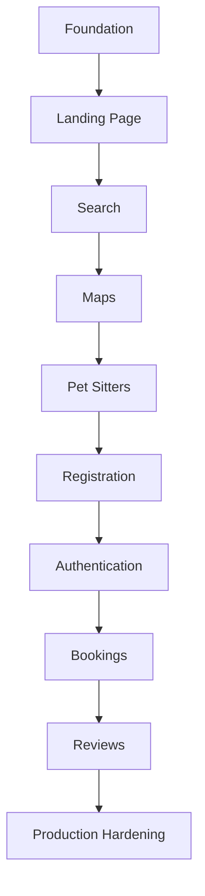
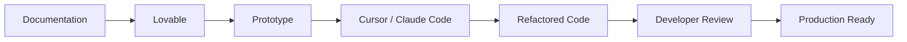
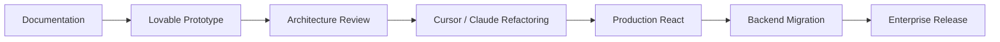
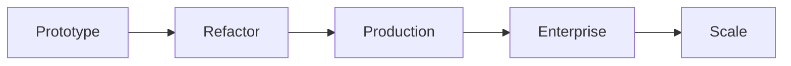

# AI Development Philosophy & Project Rules

---

# Cover Page

| Item     | Details                                               |
| -------- | ----------------------------------------------------- |
| Document | AI Implementation Guide                               |
| Project  | WoofBnB                                               |
| Version  | 1.0                                                   |
| Status   | Draft                                                 |
| Owner    | Solution Architect                                    |
| Audience | AI Development Tools, Developers, Solution Architects |

---

# Revision History

| Version | Date        | Author             | Description                     |
| ------- | ----------- | ------------------ | ------------------------------- |
| 1.0     | August 2026 | Solution Architect | Initial AI Implementation Guide |

---

# 1. Purpose

This document defines how AI-assisted development tools should implement the WoofBnB platform.

It provides:

- AI development workflow
- Implementation order
- Prompting standards
- Architecture guardrails
- Code generation rules
- Review procedures
- Refactoring strategy

This document complements the existing project documentation and serves as the operational guide for AI-generated development.

---

# 2. Scope

This guide applies to all AI coding tools used during development, including:

| Tool           | Purpose                      |
| -------------- | ---------------------------- |
| Lovable        | Rapid MVP generation         |
| Cursor         | Refactoring & implementation |
| Claude Code    | Architecture-aware coding    |
| GitHub Copilot | Code completion              |
| OpenAI Codex   | Assisted implementation      |

Future AI tools should follow the same standards.

---

# 3. AI Development Philosophy

AI should be treated as a **software engineer**, not as an autonomous architect.

Responsibilities of AI:

- Generate implementation
- Follow documentation
- Respect architecture
- Improve developer productivity

Responsibilities of humans:

- Define requirements
- Review generated code
- Approve architectural changes
- Make business decisions

---

# ADR-AI-001 — Documentation as the Source of Truth

**Decision**

AI must implement the system based on the approved documentation suite.

**Reason**

Prevents architectural drift and ensures generated code aligns with business and technical requirements.

---

# 4. Documentation Hierarchy

When documentation conflicts arise, AI should follow this priority order:

```text
01_PROJECT_DOCUMENTATION.md
            ↓
02_SOFTWARE_ARCHITECTURE.md
            ↓
03_DATABASE_DESIGN.md
            ↓
04_OPENAPI_SPECIFICATION.md
            ↓
05_FRONTEND_TECHNICAL_DESIGN.md
            ↓
06_BACKEND_TECHNICAL_DESIGN.md
            ↓
07_DEPLOYMENT_ARCHITECTURE.md
            ↓
08_AI_IMPLEMENTATION_GUIDE.md
```

The higher document always takes precedence.

---

# 5. AI Development Principles

| ID     | Principle                                   |
| ------ | ------------------------------------------- |
| AI-001 | Follow documentation before generating code |
| AI-002 | Implement one feature at a time             |
| AI-003 | Never redesign approved architecture        |
| AI-004 | Prefer small incremental changes            |
| AI-005 | Maintain consistency across the codebase    |
| AI-006 | Produce readable, maintainable code         |

---

# ADR-AI-002 — Incremental Feature Development

**Decision**

AI implements the application feature-by-feature rather than generating the entire system in one prompt.

**Reason**

Improves code quality, reduces hallucinations, and simplifies review.

---

# 6. AI Responsibilities

AI should:

- Follow the documented architecture.
- Respect folder structures.
- Reuse existing components.
- Generate modular code.
- Maintain API compatibility.
- Follow naming conventions.

AI should not:

- Invent new requirements.
- Change business logic.
- Modify API contracts.
- Rename existing features without approval.
- Introduce undocumented technologies.

---

# 7. Development Constraints

AI must assume:

- React + Vite frontend
- Node.js + Express backend
- MongoDB + Mongoose
- Tailwind CSS
- React Query
- Context API
- Zod validation
- Google Maps (future production)

Technology substitutions require explicit approval.

---

# ADR-AI-003 — Technology Lock

**Decision**

AI uses only the approved technology stack unless instructed otherwise.

**Reason**

Ensures consistency and avoids introducing unsupported dependencies.

---

# 8. AI Coding Standards

Every generated feature should:

- Follow the feature-based architecture.
- Keep components focused.
- Use descriptive names.
- Avoid duplicated logic.
- Include error handling.
- Respect DTOs and API contracts.
- Use existing utility functions where available.

---

# 9. AI Decision Boundaries

AI may decide:

- Internal function names
- Helper method organization
- Component extraction
- Minor refactoring

AI must not decide:

- Business requirements
- Database schema changes
- API contract modifications
- Authentication strategy
- Folder restructuring

These decisions require human approval.

---

# 10. AI Implementation Workflow

```mermaid
flowchart LR

Documentation

-->

Prompt

-->

AI Implementation

-->

Developer Review

-->

Refinement

-->

Approved Code
```

Every implementation cycle ends with a human review before merging.

---

# 11. AI Quality Objectives

Generated code should prioritize:

| Attribute       | Target |
| --------------- | ------ |
| Readability     | High   |
| Maintainability | High   |
| Reusability     | High   |
| Testability     | High   |
| Consistency     | High   |

Optimization should never reduce readability.

---

# 12. AI Success Criteria

An AI-generated feature is considered successful when it:

- Matches the documented requirements.
- Compiles successfully.
- Integrates with the existing architecture.
- Passes manual review.
- Requires minimal corrective refactoring.

---

# Current Project Assessment

| Area                   | Status                |
| ---------------------- | --------------------- |
| Business Documentation | ✅ Complete           |
| Architecture           | ✅ Complete           |
| Database Design        | ✅ Complete           |
| API Specification      | ✅ Complete           |
| Frontend Design        | ✅ Complete           |
| Backend Design         | ✅ Complete           |
| Deployment Design      | ✅ Complete           |
| AI Development Guide   | 🚧 Partially Complete |

---

# Architect's Notes

The purpose of this guide is **not to make AI autonomous**—it is to make AI predictable.

By defining clear responsibilities, decision boundaries, and implementation rules, every AI coding session begins with a shared understanding of the project. This reduces prompt engineering effort, improves code consistency, and allows human developers to focus on reviewing and refining rather than correcting architectural mistakes.

---

# 13. Purpose

This roadmap defines the mandatory implementation sequence for AI-assisted development.

AI must implement the system incrementally.

Each phase should produce a working application before moving to the next phase.

---

# ADR-AI-004 — Phase-Based Development

**Decision**

AI develops WoofBnB in small, independently testable phases.

**Reason**

Reduces complexity, simplifies debugging, and improves code quality.

---

# 14. Development Roadmap Overview



---

# 15. Phase 0 — Project Foundation

**Objective**

Create the project structure before implementing features.

### Deliverables

- React project
- Express project
- Tailwind configuration
- Folder structure
- Routing
- API client
- Environment configuration
- Shared utilities

---

## Success Criteria

✔ Project runs successfully

✔ Frontend connects to backend

✔ API health endpoint works

✔ Folder structure follows documentation

---

# ADR-AI-005 — Foundation First

**Decision**

No business features are implemented before the application foundation.

**Reason**

Prevents architectural rework later.

---

# 16. Phase 1 — Landing Page

Implement:

- Navigation
- Hero Section
- Search Bar
- CTA
- Responsive Layout
- Footer

Do **NOT** implement:

- Authentication
- Bookings
- Reviews

---

## Success Criteria

✔ Responsive

✔ Pixel-perfect

✔ No dummy layouts

✔ Production-ready components

---

# 17. Phase 2 — Location Search

Implement:

- Current Location
- Browser Geolocation
- City Search
- Geocoder
- Search State

---

## Success Criteria

✔ Current location works

✔ City search works

✔ Error handling included

✔ Loading states included

---

# ADR-AI-006 — Search Before Maps

**Decision**

Implement location search before map rendering.

**Reason**

Maps depend on successful location resolution.

---

# 18. Phase 3 — Interactive Map

Implement:

- Google Maps (Leaflet for prototype if required)
- User Marker
- Pet Sitter Markers
- Zoom
- Pan
- Marker Selection

---

## Success Criteria

✔ Map centers correctly

✔ Marker interaction works

✔ Responsive layout maintained

---

# 19. Phase 4 — Nearby Pet Sitters

Implement:

- Nearby API integration
- Cards
- Distance display
- Empty states
- Loading states
- Error handling

---

## Success Criteria

✔ Cards update dynamically

✔ Marker and card selection synchronized

✔ Sorting by distance

---

# ADR-AI-007 — API Before UI Enhancements

**Decision**

Connect real APIs before polishing UI interactions.

**Reason**

Functional correctness precedes visual refinement.

---

# 20. Phase 5 — Pet Sitter Registration

Implement:

- Registration Form
- Validation
- Image Upload Placeholder
- API Integration
- Success/Error Messages

---

## Success Criteria

✔ Validation works

✔ API submission successful

✔ Clear user feedback

---

# 21. Phase 6 — Authentication

Implement:

- Login
- Registration
- JWT
- Protected Routes
- Session Management

---

## Success Criteria

✔ Authentication flow complete

✔ Unauthorized access blocked

✔ Logout works

---

# ADR-AI-008 — Authentication After MVP Discovery

**Decision**

Authentication is implemented after the core discovery experience.

**Reason**

Users should be able to explore the platform before creating an account.

---

# 22. Phase 7 — Booking System

Implement:

- Booking Request
- Booking Confirmation
- Booking Status
- Booking History

---

## Success Criteria

✔ Booking lifecycle functional

✔ Business rules enforced

---

# 23. Phase 8 — Reviews & Ratings

Implement:

- Ratings
- Reviews
- Average Rating
- Review Display

---

## Success Criteria

✔ Reviews linked to bookings

✔ Ratings calculated correctly

---

# 24. Phase 9 — Production Hardening

Implement:

- Performance optimization
- Accessibility improvements
- Error boundaries
- Logging
- Security review
- SEO improvements
- Code cleanup

---

# ADR-AI-009 — Quality Last

**Decision**

Production optimization occurs after all functional features are complete.

**Reason**

Avoids optimizing code that may still change significantly.

---

# 25. Feature Dependency Matrix

| Feature              | Depends On          |
| -------------------- | ------------------- |
| Landing Page         | Foundation          |
| Search               | Landing Page        |
| Maps                 | Search              |
| Nearby Pet Sitters   | Maps                |
| Registration         | Nearby Pet Sitters  |
| Authentication       | Registration        |
| Bookings             | Authentication      |
| Reviews              | Bookings            |
| Production Hardening | All Previous Phases |

---

# 26. AI Development Rules

AI must:

- Complete one phase before starting the next.
- Keep each phase deployable.
- Avoid partially implemented features.
- Update documentation when architecture changes.
- Reuse existing components and services.

AI must not:

- Skip phases.
- Implement future features early.
- Break existing functionality while adding new features.

---

# 27. Phase Completion Checklist

Before advancing to the next phase:

- Feature implemented
- Build succeeds
- No lint errors
- Manual testing completed
- API integration verified
- Documentation updated (if applicable)
- Code reviewed

---

# Current Roadmap Status

| Phase                          | Status |
| ------------------------------ | ------ |
| Phase 0 – Foundation           | ☐      |
| Phase 1 – Landing Page         | ☐      |
| Phase 2 – Search               | ☐      |
| Phase 3 – Maps                 | ☐      |
| Phase 4 – Nearby Pet Sitters   | ☐      |
| Phase 5 – Registration         | ☐      |
| Phase 6 – Authentication       | ☐      |
| Phase 7 – Bookings             | ☐      |
| Phase 8 – Reviews              | ☐      |
| Phase 9 – Production Hardening | ☐      |

---

# Architect's Notes

This roadmap is intentionally aligned with **how experienced engineering teams de-risk product development**:

1. Establish a stable foundation.
2. Deliver the core user journey (discover nearby pet sitters).
3. Add user account functionality.
4. Introduce transactional features (bookings).
5. Layer on trust features (reviews).
6. Finish with optimization and production readiness.

Following this sequence minimizes rework, keeps each milestone demonstrable, and produces a continuously functional MVP rather than a collection of unfinished features.

# 28. Prompting Philosophy

Each prompt should implement **one milestone**.

Avoid asking Lovable to build the entire application in one request.

Instead:

```
Architecture

↓

Feature

↓

Review

↓

Refactor

↓

Next Feature
```

---

# ADR-AI-010 — Incremental Prompting

**Decision**

Generate the application using multiple focused prompts instead of one comprehensive prompt.

**Reason**

Improves architectural consistency, reduces hallucinations, and makes debugging significantly easier.

---

# 29. Universal System Prompt

Every Lovable session should begin with the following context.

---

## System Prompt

```text
You are a Senior Full Stack Engineer.

You are implementing the WoofBnB platform.

Follow the provided documentation exactly.

Never redesign the architecture.

Never change APIs.

Never invent requirements.

Follow feature-based React architecture.

Follow layered backend architecture.

Generate production-quality code.

Keep components reusable.

Use TypeScript where applicable.

Do not create unnecessary abstractions.

Stop after completing the requested feature.
```

---

# 30. Prompt Template

Every implementation prompt should follow this structure.

```text
Objective

Documentation Reference

Scope

Requirements

Constraints

Definition of Done
```

---

Example:

```text
Objective

Implement the Landing Page.

Documentation Reference

PROJECT_DOCUMENTATION.md

FR-001

FR-005

FR-009

Scope

Hero

Search

Navigation

Footer

Constraints

Do not implement authentication.

Do not implement bookings.

Definition of Done

Responsive

Pixel-perfect

Uses reusable components

Build succeeds
```

---

# ADR-AI-011 — Structured Prompt Format

**Decision**

All implementation prompts follow a common structure.

**Reason**

Produces more predictable AI outputs and simplifies review.

---

# 31. Phase 0 Prompt — Project Foundation

**Objective**

Create the application foundation.

---

Generate:

- React project structure
- Vite configuration
- Tailwind CSS setup
- React Router
- React Query
- API layer
- Folder structure
- Shared components
- Environment configuration

---

Do **NOT** implement:

- UI pages
- Business logic
- Authentication
- Maps

---

Definition of Done

✔ Project builds successfully

✔ Folder structure follows documentation

✔ Routing operational

✔ API layer configured

---

# 32. Phase 1 Prompt — Landing Page

Generate:

- Navigation
- Hero
- Search Bar
- CTA
- Footer
- Responsive layout

---

Do NOT:

- Connect APIs
- Add authentication
- Create placeholder business logic

---

Definition of Done

✔ Responsive

✔ Clean UI

✔ Componentized layout

---

# 33. Phase 2 Prompt — Location Search

Generate:

- Current location detection
- Browser geolocation
- City search
- Geocoder integration
- Search state
- Loading states
- Error handling

---

Do NOT:

- Implement map rendering
- Implement bookings
- Implement authentication

---

Definition of Done

✔ Coordinates retrieved

✔ City search operational

✔ API ready

---

# ADR-AI-012 — Search Before Visualization

**Decision**

Implement search functionality before rendering maps.

**Reason**

Map rendering depends on successful location resolution.

---

# 34. Phase 3 Prompt — Interactive Map

Generate:

- Google Maps (or Leaflet for prototype)
- User marker
- Pet sitter markers
- Marker selection
- Map controls
- Responsive map container

---

Definition of Done

✔ Map renders correctly

✔ Marker selection works

✔ User location displayed

---

# 35. Phase 4 Prompt — Nearby Pet Sitters

Generate:

- Nearby API integration
- Pet sitter cards
- Distance badges
- Sorting by proximity
- Empty state
- Loading state
- Error state

---

Definition of Done

✔ Dynamic data displayed

✔ Cards synchronized with map

✔ Responsive layout

---

# ADR-AI-013 — Functional Integration Before Enhancement

**Decision**

Connect backend functionality before polishing interactions or animations.

**Reason**

Ensures correctness before optimization.

---

# 36. Phase 5 Prompt — Registration

Generate:

- Registration form
- Validation
- Image upload placeholder
- Success/error feedback
- API integration

---

Definition of Done

✔ Validation complete

✔ API connected

✔ Error handling implemented

---

# 37. Phase 6 Prompt — Authentication

Generate:

- Login page
- Registration
- JWT handling
- Protected routes
- Logout
- Session persistence

---

Definition of Done

✔ Authentication complete

✔ Protected pages enforced

---

# ADR-AI-014 — Authentication After Discovery

**Decision**

Authentication is implemented after users can explore the platform.

**Reason**

Improves the initial user experience and aligns with the MVP goals.

---

# 38. Refactoring Prompt

After every 2–3 completed features, pause feature development and refactor.

Use a prompt like:

```text
Review the existing codebase.

Do not add new features.

Refactor for readability.

Remove duplicate logic.

Extract reusable components.

Improve folder organization.

Improve naming.

Improve TypeScript types.

Do not change functionality.

Do not modify APIs.

Do not alter business logic.
```

This keeps the project clean as it grows.

---

# 39. UI Polish Prompt

After core functionality is complete:

```text
Improve the visual design.

Maintain all existing functionality.

Improve spacing.

Typography.

Animations.

Transitions.

Accessibility.

Responsive behavior.

Do not change APIs.

Do not change business logic.
```

---

# ADR-AI-015 — Separate Functional and Visual Work

**Decision**

Functional implementation and UI refinement are handled in separate prompts.

**Reason**

Prevents unnecessary regressions and keeps each AI task focused.

---

# 40. Bug Fix Prompt

```text
Review the existing implementation.

Fix bugs only.

Do not refactor.

Do not redesign.

Do not introduce new features.

Preserve architecture.

Preserve APIs.

Return only the modified files.
```

---

# 41. Prompt Quality Checklist

Before sending any prompt to Lovable:

- References the correct documentation.
- Defines a single objective.
- States clear scope.
- Lists constraints.
- Includes a definition of done.
- Avoids unrelated feature requests.

---

# Current Prompt Library

| Prompt         | Status |
| -------------- | ------ |
| Foundation     | ✅     |
| Landing Page   | ✅     |
| Search         | ✅     |
| Map            | ✅     |
| Nearby Results | ✅     |
| Registration   | ✅     |
| Authentication | ✅     |
| Refactoring    | ✅     |
| UI Polish      | ✅     |
| Bug Fix        | ✅     |

---

# Architect's Notes

A successful AI-assisted project depends less on **one perfect prompt** and more on a **disciplined prompting workflow**. By limiting each prompt to a single, well-defined objective, you reduce ambiguity, make reviews easier, and keep the generated code aligned with the documented architecture.

This prompt library should be treated as a reusable toolkit. As WoofBnB evolves, new prompts can be added for future features while preserving the same structure and development discipline.

# 42. Purpose

This section defines how AI coding assistants should improve the prototype generated by Lovable.

The objective is **not** to add new features.

The objective is to improve:

- Architecture
- Maintainability
- Readability
- Performance
- Scalability

while preserving functionality.

---

# ADR-AI-016 — Prototype First, Refactor Second

**Decision**

Lovable is used for rapid feature generation.

Cursor or Claude Code is used for structured refactoring.

**Reason**

Separating feature creation from code improvement produces cleaner, more maintainable systems.

---

# 43. AI Development Lifecycle



---

# 44. Refactoring Philosophy

Cursor should improve code **without changing behavior**.

Allowed improvements:

- Better naming
- Smaller components
- Cleaner folder structure
- Better TypeScript types
- Performance improvements
- Better error handling
- Better accessibility

Not allowed:

- Rewrite business logic
- Rename APIs
- Change DTOs
- Change database schema
- Introduce undocumented frameworks

---

# ADR-AI-017 — Behavior Preservation

**Decision**

Refactoring must preserve existing functionality.

**Reason**

Prevents regressions while improving code quality.

---

# 45. Refactoring Order

Cursor should follow this sequence.

```
Folder Structure

↓

Components

↓

Hooks

↓

API Layer

↓

State Management

↓

Utilities

↓

Styling

↓

Performance

↓

Testing
```

Never refactor everything at once.

---

# 46. Component Refactoring

Cursor should:

✅ Split large components

✅ Remove duplicated JSX

✅ Extract reusable UI

✅ Improve props

✅ Improve naming

Avoid:

❌ Creating unnecessary abstractions

❌ Premature optimization

---

# Example

Before

```
SearchPage

1200 lines
```

After

```
SearchPage

↓

SearchBar

↓

MapView

↓

PetSitterList

↓

PetSitterCard

↓

FilterPanel
```

---

# ADR-AI-018 — Small Components

**Decision**

Large components should be decomposed into focused, reusable components.

**Reason**

Improves readability, testing, and long-term maintenance.

---

# 47. State Management Review

Cursor should verify:

- State lives in the correct location.
- Duplicate state is removed.
- Derived state is not stored.
- React Query manages server state.
- Context API manages shared client state.

Do not move everything into Context or global state.

---

# 48. API Layer Review

Verify:

- Axios instance reused.
- Error handling centralized.
- Response types defined.
- API calls removed from UI components.
- React Query used consistently.

---

# ADR-AI-019 — Centralized API Layer

**Decision**

All API communication flows through the dedicated API layer.

**Reason**

Improves maintainability and simplifies future backend changes.

---

# 49. Styling Review

Cursor should:

- Remove duplicate Tailwind classes.
- Extract reusable UI patterns.
- Improve responsive layouts.
- Improve spacing consistency.
- Improve accessibility.

Never redesign the application unless explicitly requested.

---

# 50. Backend Refactoring

Cursor should verify:

- Thin controllers.
- Services contain business logic.
- Repositories contain persistence.
- Validation centralized.
- DTOs used consistently.
- Mappers applied correctly.

Never move database queries into controllers.

---

# ADR-AI-020 — Architecture Compliance

**Decision**

Refactoring must strengthen the documented architecture rather than replace it.

**Reason**

Keeps the implementation aligned with the approved design.

---

# 51. Performance Review

Cursor should inspect:

- Unnecessary re-renders.
- Memoization opportunities.
- Lazy-loaded routes.
- Bundle size.
- API over-fetching.
- Duplicate requests.

Optimize only when measurable improvements exist.

---

# 52. Code Quality Checklist

Before completing a refactoring pass:

- No duplicated code
- Clear naming
- Small components
- Thin controllers
- Centralized API layer
- Consistent folder structure
- No lint errors
- Build succeeds

---

# 53. AI Refactoring Prompt Template

Use prompts like:

```text
Review the current implementation.

Do not add features.

Refactor for readability.

Preserve all functionality.

Improve folder organization.

Improve naming.

Extract reusable components.

Centralize duplicated logic.

Respect the Software Architecture document.

Respect the Frontend Technical Design.

Respect the Backend Technical Design.

Do not modify API contracts.

Do not change business rules.

Return only modified files.
```

---

# 54. Multi-Pass Refactoring Strategy

Avoid trying to perfect everything in one pass.

| Pass   | Focus                      |
| ------ | -------------------------- |
| Pass 1 | Folder organization        |
| Pass 2 | Component decomposition    |
| Pass 3 | State management           |
| Pass 4 | API layer cleanup          |
| Pass 5 | Performance optimization   |
| Pass 6 | Accessibility improvements |
| Pass 7 | Code style consistency     |
| Pass 8 | Final cleanup              |

Each pass should have one clear objective.

---

# ADR-AI-021 — Multi-Pass Improvement

**Decision**

Large refactoring efforts are divided into multiple focused passes.

**Reason**

Reduces risk, improves review quality, and makes AI outputs more predictable.

---

# 55. Human Review Responsibilities

After every AI refactoring pass, verify:

| Review Area  | Question                               |
| ------------ | -------------------------------------- |
| Architecture | Still follows documented architecture? |
| Features     | Any functionality changed?             |
| API          | Contracts unchanged?                   |
| UI           | Same user experience?                  |
| Performance  | Any measurable improvements?           |
| Tests        | Existing tests still pass?             |

No refactoring should be merged without review.

---

# Current Workflow Assessment

| Stage                      | Status         |
| -------------------------- | -------------- |
| Lovable Prototype          | ✅ Planned     |
| Initial Feature Generation | ✅ Planned     |
| Cursor Refactoring         | ✅ Defined     |
| Multi-Pass Improvement     | ✅ Defined     |
| Human Review               | ✅ Required    |
| Production Readiness       | 🚧 Final Stage |

---

# Architect's Notes

Think of Lovable and Cursor as two different team members:

- **Lovable** is the fast implementation engineer. It gets features working quickly.
- **Cursor/Claude Code** is the senior engineer who cleans up the implementation, improves architecture, and prepares the codebase for long-term maintenance.

Separating these responsibilities produces significantly better results than expecting a single AI tool to generate production-ready code in one step.

# 56. Purpose

This chapter defines the mandatory rules that AI-assisted development tools must follow.

These rules exist to:

- Preserve architecture
- Prevent undocumented changes
- Protect API contracts
- Maintain code quality
- Ensure consistency across AI-generated code

These guardrails apply to all AI tools used on the project.

---

# ADR-AI-022 — Architecture Protection

**Decision**

AI must treat the approved architecture as immutable unless explicitly instructed otherwise.

**Reason**

Prevents architectural drift and maintains long-term maintainability.

---

# 57. Protected Documents

The following documents are the **single source of truth**.

| Document                        | Protected |
| ------------------------------- | :-------: |
| 01_PROJECT_DOCUMENTATION.md     |    ✅     |
| 02_SOFTWARE_ARCHITECTURE.md     |    ✅     |
| 03_DATABASE_DESIGN.md           |    ✅     |
| 04_OPENAPI_SPECIFICATION.md     |    ✅     |
| 05_FRONTEND_TECHNICAL_DESIGN.md |    ✅     |
| 06_BACKEND_TECHNICAL_DESIGN.md  |    ✅     |
| 07_DEPLOYMENT_ARCHITECTURE.md   |    ✅     |

AI must implement these documents—not reinterpret or redesign them.

---

# 58. Protected Architecture

AI must not modify the approved architecture.

Protected elements include:

- Feature-based frontend architecture
- Layered backend architecture
- Repository pattern
- Service layer
- DTO strategy
- Mapper pattern
- Folder organization

---

## Never Replace

- React Query
- Context API
- Express architecture
- Repository layer
- Service layer

without explicit approval.

---

# ADR-AI-023 — Architectural Stability

**Decision**

AI preserves the documented architecture throughout implementation.

**Reason**

Ensures consistency and simplifies maintenance.

---

# 59. Protected API Contracts

The OpenAPI Specification is authoritative.

AI must not:

- Rename endpoints
- Change HTTP methods
- Modify request DTOs
- Modify response DTOs
- Remove fields
- Add undocumented fields

---

## Example

Allowed:

✔ Improve controller implementation

✔ Improve validation

✔ Improve error handling

Not Allowed:

❌ Change:

```text
GET /pet-sitters/nearby
```

to

```text
GET /search
```

---

# ADR-AI-024 — API Stability

**Decision**

Published API contracts remain stable throughout implementation.

**Reason**

Prevents breaking changes and preserves frontend-backend compatibility.

---

# 60. Protected Business Rules

AI must not modify:

- Search radius rules
- Registration workflow
- Booking workflow
- Authentication flow
- Validation requirements
- Business constraints

Business rules originate from the Project Documentation.

---

# 61. Protected Folder Structure

AI must preserve the documented project organization.

Frontend:

```text
src/
├── features/
├── components/
├── pages/
├── hooks/
├── api/
├── context/
├── utils/
└── types/
```

Backend:

```text
src/
├── routes/
├── controllers/
├── services/
├── repositories/
├── models/
├── validators/
├── dto/
├── mappers/
└── middlewares/
```

Do not reorganize folders without approval.

---

# ADR-AI-025 — Stable Project Structure

**Decision**

AI follows the documented folder structure for all generated code.

**Reason**

Keeps the project predictable and simplifies onboarding.

---

# 62. Technology Guardrails

Approved technologies:

| Layer      | Technology                                    |
| ---------- | --------------------------------------------- |
| Frontend   | React + Vite                                  |
| Styling    | Tailwind CSS                                  |
| State      | React Query + Context API                     |
| Backend    | Node.js + Express                             |
| Database   | MongoDB                                       |
| Validation | Zod                                           |
| Maps       | Leaflet (Prototype), Google Maps (Production) |

---

AI must not introduce:

- Redux
- Next.js
- NestJS
- Prisma
- GraphQL
- Firebase
- Alternative CSS frameworks

unless explicitly approved.

---

# ADR-AI-026 — Technology Consistency

**Decision**

Only approved technologies may be used during implementation.

**Reason**

Maintains architectural consistency and avoids unnecessary complexity.

---

# 63. Code Generation Rules

AI should:

- Reuse existing components
- Reuse utilities
- Reuse hooks
- Reuse services
- Reuse repositories

Avoid creating duplicate implementations.

---

## Never

- Duplicate API calls
- Duplicate validation schemas
- Duplicate utility functions
- Duplicate business logic

---

# 64. Refactoring Rules

AI may:

- Rename local variables
- Improve readability
- Split components
- Improve TypeScript types
- Improve accessibility

AI may not:

- Change functionality
- Remove existing features
- Change APIs
- Change business rules

---

# ADR-AI-027 — Safe Refactoring

**Decision**

Refactoring improves implementation quality while preserving behavior.

**Reason**

Allows continuous improvement without introducing regressions.

---

# 65. Documentation Compliance

Every generated feature should be traceable to documentation.

| Source                  | Purpose            |
| ----------------------- | ------------------ |
| Project Documentation   | Business rules     |
| Software Architecture   | System structure   |
| Database Design         | Persistence        |
| OpenAPI                 | API contract       |
| Frontend Design         | UI implementation  |
| Backend Design          | API implementation |
| Deployment Architecture | Infrastructure     |

If documentation is missing or unclear, AI should stop and request clarification rather than invent requirements.

---

# 66. AI Stop Conditions

AI should pause implementation when:

- Requirements conflict.
- Documentation is incomplete.
- Architecture is ambiguous.
- API contracts are missing.
- Business rules are undefined.
- A requested change contradicts approved documentation.

In these cases, AI should explain the issue and ask for clarification before proceeding.

---

# 67. AI Compliance Checklist

Before completing any implementation:

- Documentation followed
- Architecture preserved
- API contracts unchanged
- Folder structure maintained
- Approved technologies used
- No duplicated logic
- No undocumented features
- Build succeeds
- Existing functionality preserved

---

# Current Compliance Assessment

| Area                        | Status     |
| --------------------------- | ---------- |
| Documentation Protection    | ✅ Defined |
| Architecture Protection     | ✅ Defined |
| API Protection              | ✅ Defined |
| Technology Guardrails       | ✅ Defined |
| Folder Structure Protection | ✅ Defined |
| Refactoring Rules           | ✅ Defined |
| AI Stop Conditions          | ✅ Defined |

---

# Architect's Notes

The purpose of these guardrails is **not to limit AI** but to ensure that it behaves like a disciplined member of the engineering team. AI should generate implementation within clearly defined boundaries, leaving architectural decisions, business rules, and major design changes under human control.

These guardrails are especially valuable in long-running projects, where multiple AI tools may be used over time. They ensure that every generated feature remains consistent with the approved WoofBnB architecture.

# 68. Purpose

This chapter establishes the review process for AI-generated code.

The objectives are to ensure:

- Architectural compliance
- Functional correctness
- Code quality
- Security
- Maintainability
- Production readiness

AI-generated code is considered a **first draft** until it passes review.

---

# ADR-AI-028 — Human Approval Required

**Decision**

All AI-generated code requires human review before merging.

**Reason**

AI accelerates development but does not replace engineering judgment.

---

# 69. AI Review Workflow

```mermaid
flowchart LR

AI Generation

-->

Developer Review

-->

Architecture Review

-->

Testing

-->

Approval

-->

Merge
```

No code should bypass this workflow.

---

# 70. Architecture Compliance Review

Verify that the implementation follows the approved architecture.

| Review Item            | Check |
| ---------------------- | :---: |
| Feature-based frontend |   ☐   |
| Layered backend        |   ☐   |
| Repository pattern     |   ☐   |
| Service layer          |   ☐   |
| DTO usage              |   ☐   |
| Mapper usage           |   ☐   |
| Folder structure       |   ☐   |

---

# ADR-AI-029 — Architecture First

**Decision**

Architecture compliance is reviewed before implementation details.

**Reason**

Correct architecture is more valuable than isolated code optimizations.

---

# 71. Frontend Review Checklist

Every frontend feature should verify:

| Item              | Check |
| ----------------- | :---: |
| Responsive layout |   ☐   |
| Component reuse   |   ☐   |
| TypeScript types  |   ☐   |
| Accessibility     |   ☐   |
| Loading states    |   ☐   |
| Error states      |   ☐   |
| API integration   |   ☐   |
| React Query usage |   ☐   |
| Context usage     |   ☐   |

---

## UI Review Questions

- Are components reusable?
- Are props clearly defined?
- Are layouts responsive?
- Are loading and empty states implemented?
- Is the UI consistent with the design system?

---

# 72. Backend Review Checklist

Verify:

| Item                       | Check |
| -------------------------- | :---: |
| Thin controllers           |   ☐   |
| Business logic in services |   ☐   |
| Repository isolation       |   ☐   |
| Validation implemented     |   ☐   |
| DTOs used                  |   ☐   |
| Mapper used                |   ☐   |
| Error handling             |   ☐   |
| Logging                    |   ☐   |

---

## Backend Questions

- Any business logic inside controllers?
- Any database queries outside repositories?
- Any duplicated validation?
- Any undocumented endpoints?

---

# ADR-AI-030 — Layer Verification

**Decision**

Every backend review verifies correct layer responsibilities.

**Reason**

Maintains architectural integrity as the codebase grows.

---

# 73. API Review Checklist

Confirm alignment with the OpenAPI Specification.

| Item            | Check |
| --------------- | :---: |
| Endpoint names  |   ☐   |
| HTTP methods    |   ☐   |
| Request DTOs    |   ☐   |
| Response DTOs   |   ☐   |
| Status codes    |   ☐   |
| Validation      |   ☐   |
| Error responses |   ☐   |

---

# 74. Security Review

Every feature should verify:

| Item                     | Check |
| ------------------------ | :---: |
| Authentication applied   |   ☐   |
| Authorization enforced   |   ☐   |
| Input validated          |   ☐   |
| Sensitive data protected |   ☐   |
| Secrets excluded         |   ☐   |
| Rate limiting considered |   ☐   |

---

## Security Questions

- Can unauthorized users access protected endpoints?
- Are secrets exposed?
- Are user inputs validated?
- Is sensitive information excluded from logs?

---

# ADR-AI-031 — Security by Default

**Decision**

Security validation is part of every code review.

**Reason**

Security should be integrated into development rather than added later.

---

# 75. Performance Review

Verify:

| Item                                | Check |
| ----------------------------------- | :---: |
| Duplicate API calls removed         |   ☐   |
| Unnecessary re-renders avoided      |   ☐   |
| Lazy loading used where appropriate |   ☐   |
| Indexed database queries            |   ☐   |
| Pagination implemented              |   ☐   |

Performance improvements should be measurable and should not reduce readability.

---

# 76. Accessibility Review

Frontend features should satisfy:

| Item                          | Check |
| ----------------------------- | :---: |
| Semantic HTML                 |   ☐   |
| Keyboard navigation           |   ☐   |
| Visible focus states          |   ☐   |
| Alt text                      |   ☐   |
| ARIA attributes (when needed) |   ☐   |
| Color contrast                |   ☐   |

Target compliance:

- WCAG 2.1 AA (where applicable)

---

# ADR-AI-032 — Accessibility Included

**Decision**

Accessibility is reviewed alongside functionality.

**Reason**

Accessibility is a quality requirement, not a post-development enhancement.

---

# 77. Documentation Review

Every completed feature should confirm:

- Documentation references remain valid.
- API documentation remains accurate.
- Architecture remains unchanged.
- New decisions are documented if required.

If implementation changes documented behavior, the documentation must be updated before merging.

---

# 78. AI Quality Scorecard

Each feature receives a quality score.

| Category                | Score (1–5) |
| ----------------------- | ----------- |
| Architecture Compliance | ☐           |
| Code Quality            | ☐           |
| Readability             | ☐           |
| Maintainability         | ☐           |
| Security                | ☐           |
| Performance             | ☐           |
| Accessibility           | ☐           |
| Documentation           | ☐           |

---

## Interpretation

| Total Score | Assessment                               |
| ----------- | ---------------------------------------- |
| 36–40       | Excellent                                |
| 30–35       | Good                                     |
| 24–29       | Acceptable (requires minor improvements) |
| Below 24    | Refactoring required before merge        |

---

# ADR-AI-033 — Objective Quality Review

**Decision**

AI-generated features are evaluated using a standardized scorecard.

**Reason**

Provides consistent quality assessment and reduces subjective reviews.

---

# 79. Human Approval Checklist

Before merging:

- Architecture approved
- Functionality verified
- Security reviewed
- Performance acceptable
- Documentation updated
- Tests passed
- Build succeeds

Only after all items are complete should the feature be merged.

---

# Current Quality Assessment Process

| Stage                | Status      |
| -------------------- | ----------- |
| AI Generation        | ✅          |
| Architecture Review  | ✅ Defined  |
| Frontend Review      | ✅ Defined  |
| Backend Review       | ✅ Defined  |
| API Review           | ✅ Defined  |
| Security Review      | ✅ Defined  |
| Accessibility Review | ✅ Defined  |
| Human Approval       | ✅ Required |

---

# Architect's Notes

The review process should focus on **correctness before optimization**. AI can generate code quickly, but consistent quality comes from disciplined reviews.

For a solo developer, these checklists act as a substitute for a second reviewer. By systematically verifying architecture, functionality, security, and maintainability, you reduce the likelihood of technical debt and improve long-term code quality.

---

# 80. Purpose

This chapter defines the structured migration path from a rapidly generated MVP to a production-grade application.

The objective is to preserve business functionality while improving architecture, maintainability, and scalability.

---

# ADR-AI-034 — Evolutionary Migration

**Decision**

The application evolves through controlled refactoring rather than complete rewrites.

**Reason**

Reduces risk, preserves tested functionality, and minimizes redevelopment effort.

---

# 81. Migration Philosophy

WoofBnB should evolve through incremental improvements.

The migration process follows:



Each stage should produce a working application.

---

# 82. Phase 1 — Prototype Generation

Objective:

Generate a fully functional MVP using Lovable.

Focus on:

- Core user journey
- UI
- Feature completeness
- Functional APIs

Ignore:

- Perfect architecture
- Maximum optimization
- Enterprise patterns

---

## Deliverables

- Functional React application
- Functional backend
- Working database
- Working API

---

## Exit Criteria

✔ Application works end-to-end

✔ Core business flow complete

✔ Documentation alignment verified

---

# ADR-AI-035 — Functional MVP First

**Decision**

The first milestone prioritizes functionality over implementation perfection.

**Reason**

A working prototype provides faster feedback and validates product assumptions.

---

# 83. Phase 2 — Architecture Review

Before refactoring begins:

Review:

- Folder structure
- Components
- API layer
- State management
- Backend layers
- Database usage

---

## Questions

- Does the implementation follow the documented architecture?
- Which shortcuts were introduced?
- Which areas require refactoring?

---

Deliverable:

Architecture Review Report.

---

# 84. Phase 3 — Frontend Refactoring

Objectives:

Improve:

- Components
- Hooks
- API layer
- State management
- Reusability
- Accessibility

Do not:

- Change features
- Change APIs
- Change workflows

---

## Workflow

```mermaid
flowchart TD

Prototype

-->

Components

-->

Hooks

-->

API

-->

State

-->

Performance

-->

Production Frontend
```

---

# ADR-AI-036 — Frontend Stabilization

**Decision**

Frontend refactoring is completed before backend migration.

**Reason**

A stable frontend simplifies backend modernization.

---

# 85. Phase 4 — Backend Refactoring

Review:

- Controllers
- Services
- Repositories
- Validation
- DTOs
- Error handling
- Logging

Objectives:

- Thin controllers
- Clean services
- Centralized validation
- Standardized responses

---

Exit Criteria

✔ Layered architecture verified

✔ API contracts preserved

✔ Business logic isolated

---

# 86. Phase 5 — Backend Technology Migration

When required, migrate from:

| Current  | Future                |
| -------- | --------------------- |
| Node.js  | ASP.NET Core          |
| Express  | ASP.NET Core Web API  |
| MongoDB  | MySQL                 |
| Mongoose | Entity Framework Core |

Migration principles:

- Preserve APIs
- Preserve business rules
- Preserve user experience

Replace infrastructure—not business logic.

---

# ADR-AI-037 — Technology Replacement

**Decision**

Technology changes should not alter business behavior or API contracts.

**Reason**

Separates infrastructure evolution from product functionality.

---

# 87. Database Migration Strategy

Migration path:

```mermaid
flowchart LR

MongoDB

-->

Migration Scripts

-->

MySQL Schema

-->

Data Validation

-->

Production Database
```

---

Migration steps:

1. Design relational schema.
2. Map MongoDB collections to tables.
3. Migrate data.
4. Validate integrity.
5. Switch application.

---

## Validation

- Record counts match
- Relationships verified
- API responses unchanged

---

# 88. AI Migration Rules

AI must:

- Migrate one layer at a time.
- Preserve behavior.
- Preserve APIs.
- Preserve folder organization where practical.
- Reuse existing tests.

AI must not:

- Rewrite the application from scratch.
- Change endpoint names.
- Modify business workflows.
- Introduce breaking changes.

---

# ADR-AI-038 — Controlled Migration

**Decision**

Migration is incremental and validated after each stage.

**Reason**

Minimizes risk and simplifies troubleshooting.

---

# 89. Migration Validation Checklist

After each migration phase:

| Validation               | Check |
| ------------------------ | :---: |
| Build succeeds           |   ☐   |
| Existing tests pass      |   ☐   |
| APIs unchanged           |   ☐   |
| UI unchanged             |   ☐   |
| Business rules preserved |   ☐   |
| Performance acceptable   |   ☐   |

---

# 90. Enterprise Readiness Roadmap

## Stage 1

- Lovable Prototype

---

## Stage 2

- Architecture Review
- Cursor Refactoring

---

## Stage 3

- Production React
- Optimized Node.js Backend

---

## Stage 4

- ASP.NET Core Migration
- MySQL Migration

---

## Stage 5

- Enterprise Infrastructure
- Monitoring
- CI/CD
- Automated Testing

---

## Evolution Path



---

# 91. Migration Risk Register

| Risk                    | Mitigation                                     |
| ----------------------- | ---------------------------------------------- |
| Breaking API contracts  | Validate against OpenAPI after every migration |
| Business logic changes  | Preserve service-layer behavior                |
| UI regressions          | Regression testing after each refactoring pass |
| Data migration errors   | Perform trial migrations and data validation   |
| Performance degradation | Benchmark before and after migration           |
| Incomplete migration    | Migrate one subsystem at a time                |

---

# 92. Migration Success Criteria

The migration is complete when:

- Documentation remains valid.
- API contracts remain unchanged.
- Business workflows behave identically.
- Code quality improves.
- Tests pass.
- Performance meets documented targets.
- Production deployment succeeds.

---

# Current Migration Roadmap

| Stage                  | Status      |
| ---------------------- | ----------- |
| Documentation          | ✅ Complete |
| Lovable Prototype      | ☐           |
| Architecture Review    | ☐           |
| Frontend Refactoring   | ☐           |
| Backend Refactoring    | ☐           |
| Production React       | ☐           |
| ASP.NET Core Migration | ☐           |
| MySQL Migration        | ☐           |
| Enterprise Release     | ☐           |

---

# Architect's Notes

The migration strategy intentionally separates **business functionality** from **technology choices**. The prototype validates the product; the refactoring stages improve maintainability; the final migration modernizes the technology stack.

For your organization's workflow, this approach avoids expensive rewrites and allows AI tools to participate safely in every stage of the software lifecycle. The key principle is simple:

> **Evolve the implementation, not the product.**

By preserving APIs, business rules, and user experience throughout the migration, each stage becomes independently verifiable and significantly lower risk.
