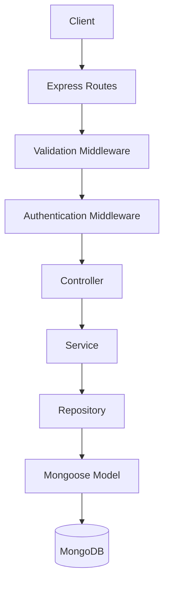
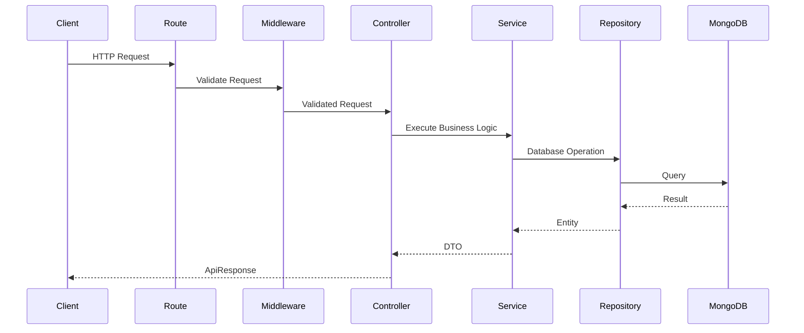
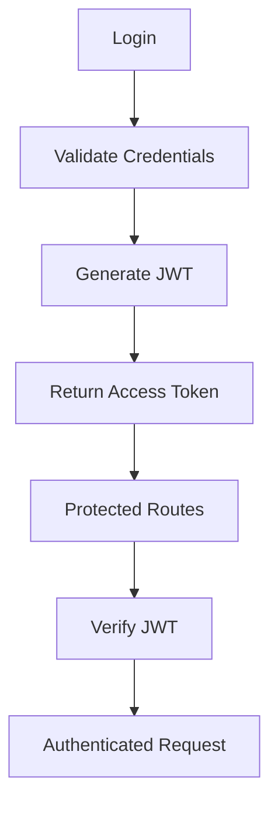
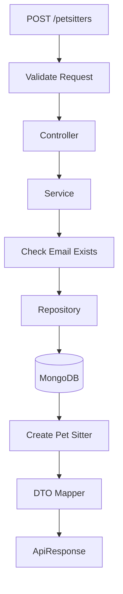
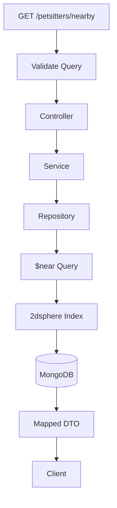
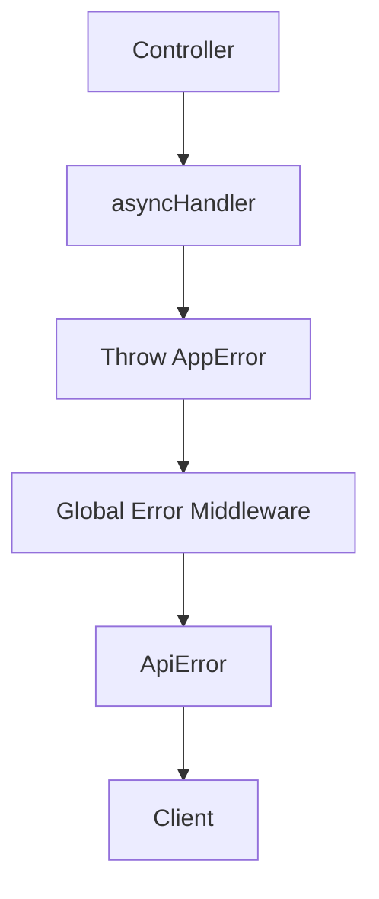

# WoofBnB Backend Architecture

## Overview

WoofBnB follows a **Layered Architecture** combined with the **Repository Pattern** to separate HTTP handling, business logic, and database access.

The objective is to keep the codebase maintainable, testable, and scalable as new modules are introduced.

---

# High-Level Architecture



---

# Request Lifecycle

Every request follows the same execution flow.



---

# Layer Responsibilities

## Routes

Responsibilities

- Define endpoints
- Register middlewares
- Forward request to controllers

Routes contain **no business logic**.

---

## Middlewares

Responsibilities

- Authentication
- Authorization
- Validation
- Global Error Handling

Middlewares execute before controllers.

---

## Controllers

Responsibilities

- Receive HTTP request
- Call service layer
- Return standardized API response

Controllers should remain thin.

They should never contain business logic or database queries.

---

## Services

Responsibilities

- Business rules
- Orchestrate repositories
- Convert entities into DTOs
- Throw application errors

Services never communicate directly with Express.

---

## Repositories

Responsibilities

- Communicate with MongoDB
- Perform CRUD operations
- Encapsulate Mongoose queries

Repositories know nothing about HTTP.

---

## Models

Responsibilities

- Database schema
- Indexes
- Constraints

Only persistence-related logic belongs here.

---

# Folder Structure

```
src
│
├── config
├── constants
├── middlewares
├── modules
│
│   ├── auth
│   │
│   ├── petsitter
│
├── scripts
├── utils
│
├── app.js
└── server.js
```

---

# Module Structure

Each feature follows the same layout.

```
module
│
├── controller
├── service
├── repository
├── model
├── validation
├── mapper
└── routes
```

This makes the application easy to scale.

---

# Authentication Flow



---

# Pet Sitter Registration Flow



---

# Nearby Search Flow



---

# GeoSpatial Search

Pet sitters are stored using MongoDB GeoJSON.

Example

```json
{
  "type": "Point",
  "coordinates": [77.209, 28.6139]
}
```

Coordinates follow the GeoJSON standard.

```
[longitude, latitude]
```

A **2dsphere index** is created on the location field to enable efficient nearby searches.

Queries use MongoDB's `$near` operator.

---

# Error Handling



---

# API Response Format

Every successful response follows a consistent structure.

```json
{
  "success": true,
  "statusCode": 200,
  "message": "...",
  "data": {},
  "timestamp": "..."
}
```

Error responses are also standardized.

---

# Design Principles

- Layered Architecture
- Repository Pattern
- Separation of Concerns
- Single Responsibility Principle
- Centralized Error Handling
- DTO Mapping
- Validation Before Business Logic
- Reusable Utilities
- Modular Feature-Based Structure

---

# Future Enhancements

- Image Uploads
- Pagination
- Search
- Filters
- Booking Module
- Reviews
- Payments
- Redis Caching
