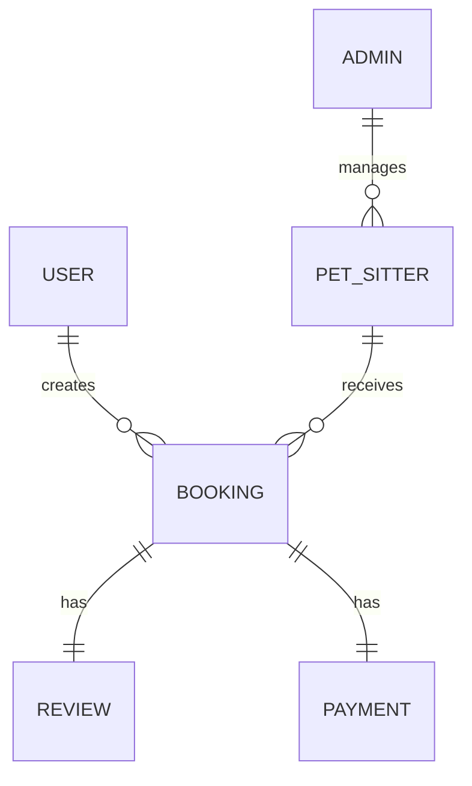

# Database Design

## Overview

WoofBnB uses **MongoDB** as the primary database.

The application currently consists of two collections:

- Admins
- Pet Sitters

Future collections:

- Users
- Bookings
- Reviews
- Payments

---

# Admin Collection

```
admins
```

| Field     | Type     |
| --------- | -------- |
| _id       | ObjectId |
| email     | String   |
| password  | String   |
| createdAt | Date     |
| updatedAt | Date     |

---

# Pet Sitters Collection

```
petsitters
```

| Field        | Type          |
| ------------ | ------------- |
| _id          | ObjectId      |
| name         | String        |
| email        | String        |
| phone        | String        |
| bio          | String        |
| address      | String        |
| location     | GeoJSON Point |
| workingHours | Object        |
| amenities    | Array<String> |
| profileImage | String        |
| createdAt    | Date          |
| updatedAt    | Date          |

---

# GeoJSON Structure

```json
{
  "type": "Point",
  "coordinates": [77.209, 28.6139]
}
```

Coordinates are stored as

```
[longitude, latitude]
```

---

# Indexes

## GeoSpatial Index

```javascript
petSitterSchema.index({
  location: "2dsphere",
});
```

Purpose

- Nearby search
- Radius queries
- Geospatial calculations

---

# Nearby Search

MongoDB uses

```
$near
```

Example

```javascript
{
 location: {
   $near: {
     $geometry: {
       type: "Point",
       coordinates: [lng, lat]
     },
     $maxDistance: radius
   }
 }
}
```

---

# Future Collections

## Bookings

| Field       |
| ----------- |
| userId      |
| petSitterId |
| bookingDate |
| bookingTime |
| status      |

---

## Reviews

| Field     |
| --------- |
| bookingId |
| rating    |
| comment   |

---

## Payments

| Field         |
| ------------- |
| bookingId     |
| amount        |
| paymentStatus |

---

# Relationships



---

# Design Decisions

- MongoDB
- Mongoose ODM
- GeoJSON
- 2dsphere Index
- Repository Pattern
- Feature-based Architecture
